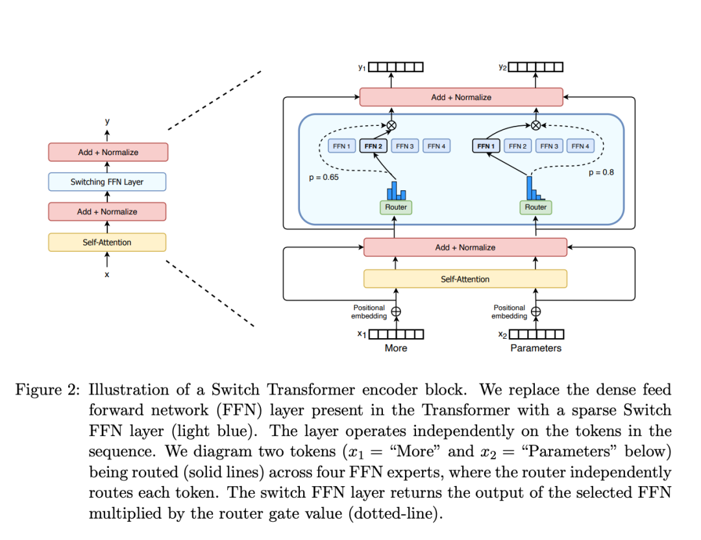
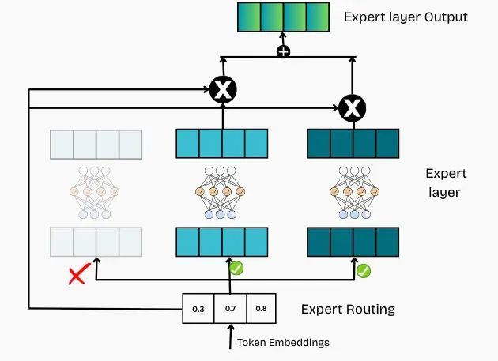
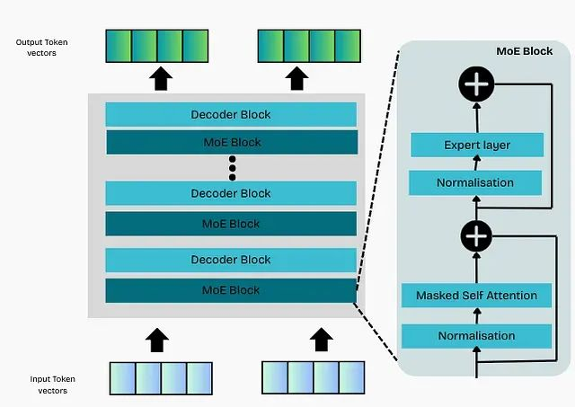

# 混合专家模型(MoE)
---
MoE架构特点：
- 相较于稠密模型，**预训练速度更快**
- 与具有相同参数数量的模型相比，具有更快的**推理速度**
- 需要**大量显存**，因为所有专家系统都需要加载到内存中
- 在**微调方面存在诸多挑战**，但**近期的研究**表明，对混合专家模型进行**指令调优具有很大的潜力**
## 一、MoE架构技术原理
混合专家模型(Mixed Expert Models，简称MoEs)作为一种基于Transformer架构模型，由两个关键部分组成：
- **稀疏MoE层**：这些层替代了传统Transformer模型中前馈网络(FFN)层。MoE层包含若干“**专家**”，每个专家本身是一个独立的神经网络。在实际应用中，这些专家通常是前馈网络 (FFN)，但它们也可以是更复杂的网络结构，甚至可以是MoE层本身，从而形成层级式的MoE结构。
- **门控网络或路由**：用于决定哪些令牌(token)被发送到哪些专家。有时，一个token甚至可以被发送到多个专家。token的路由方式是MoE使用中的一个关键点，因为路由器由学习的参数组成，并且与网络的其他部分一同进行预训练。

## 二、稀疏性
在传统的稠密模型中，所有的参数都会对所有输入数据进行处理。**稀疏性的概念采用了条件计算的思想**。稀疏性允许仅针对整个系统某些特定部分执行计算，这意味着并非所有参数都会在处理每个输入时被激活或使用，而是根据输入的特定特征或需求，只有部分参数集合被调用和运行。

然而稀疏性设置带来了额外的挑战，如在MoE中，尽管较大的批量大小通常有利于提高性能，但当数据通过激活的专家时，实际的批量大小可能会减少。比如，假设我们的输入批量包含10个token， 可能会有五个token被路由到同一个专家，而剩下的五个token分别被路由到不同的专家。这导致了批量大小的不均匀分配和资源利用效率不高的问题。

一个可学习的门控网络 (G) 决定将输入的哪一部分发送给哪些专家 (E):
$$y=\sum_{i=1}^nG(x)_iE_i(x)$$

一个典型的门控函数通常是一个带有softmax函数的简单网络。这个网络将学习将输入发送给哪个专家。

$$G_{\sigma}(x)=\operatorname{softmax}(x\cdot\mathbf{W}_g)$$

为保证专家间负载均衡，引入带噪声的**TopK**门控(Noisy Top-K Gating)。
1. 添加噪声
$$\mathbf{H}(x)_i=(x\cdot\mathbf{W}_g)_i+\operatorname{StandardNormal}()\cdot\operatorname{Softplus}\left((x\cdot\operatorname{W}_{noise})_i\right)$$
其中，$\operatorname{Softplus}(z)=log(1+e^z)$。

1. 选择保留前K个值
$$
\text{KeepTopK}(v, k)_i = \begin{cases} 
v_i & \text{if } v_i \text{ is in the top } k \text{ elements of } v, \\ 
-\infty & \text{otherwise.} 
\end{cases}
$$

1. 应用 Softmax 函数
$$G(x) = \text{Softmax}(\text{KeepTopK}(H(x), k))$$

通过使用较低的 k 值 (例如 1 或 2)，可以比激活多个专家时更快地进行训练和推理。不仅选择最顶尖的专家原因在于：基础路由方法存在专家使用不平衡的问题。随着训练进行，模型可能持续选择相同的少数专家，导致这些专家获得更多训练机会，进而在未来更容易被选中。这种现象被称为路由崩溃（routing collapse）。

## 三、混合专家模型中token的负载均衡
### 1. 辅助损失
在通常的混合专家模型 (MoE) 训练中，门控网络往往倾向于主要激活相同的几个专家。这种情况可能会自我加强，因为受欢迎的专家训练得更快，因此它们更容易被选择。为缓解这一问题，引入**辅助损失**，旨在鼓励给予所有专家相同的重要性。该机制通过添加奖励工作负载平均分配的损失项来实现专家使用的平衡。

为衡量各个专家的负载情况，定义第 \(i\) 个专家实际接收到的token比例为：

$$
f_i=\frac{1}{T}\sum_{t=1}^{T}\mathbb{1}(e_t=i)
$$

其中，\(T\) 表示当前批次中的token总数，\(e_t\) 表示第 \(t\) 个token最终被路由到的专家，\(\mathbb{1}(\cdot)\) 为指示函数。当第 \(t\) 个token被分配给专家 \(i\) 时，其值为 \(1\)，否则为 \(0\)。

同时，定义路由器分配给第 \(i\) 个专家的平均概率为：

$$
P_i=\frac{1}{T}\sum_{t=1}^{T}G(x_t)_i
$$

其中，\(G(x_t)_i\) 表示路由器对于第 \(t\) 个token选择专家 \(i\) 的概率。

基于这两个量，可以构造专家负载均衡的辅助损失：

$$
L_{\mathrm{aux}}
=
N\sum_{i=1}^{N}f_iP_i
$$

其中，\(N\) 为专家总数。

在理想情况下，每个专家接收到的token数量相同，同时路由器对各专家的平均选择概率也相同，即：

$$
f_i=P_i=\frac{1}{N}
$$

此时：

$$
L_{\mathrm{aux}}
=
N\sum_{i=1}^{N}
\frac{1}{N}\cdot\frac{1}{N}
=1
$$

如果路由器过度偏向某些专家，那么这些专家对应的 \(f_i\) 和 \(P_i\) 都会较大，使辅助损失增大。因此，在最小化该损失的过程中，模型会倾向于减少对过载专家的选择概率，并将更多token分配给其他专家，从而实现更均衡的专家利用率。

需要注意的是，\(f_i\) 是通过 Top-K 等离散路由操作得到的，通常不可微，因此辅助损失的梯度主要通过 \(P_i\) 传递到路由网络，进而调整路由器参数。

最终，MoE模型的训练损失可以写为：

$$
L=L_{\mathrm{task}}+\lambda L_{\mathrm{aux}}
$$

其中，\(L_{\mathrm{task}}\) 为模型原本的任务损失，例如语言模型中的交叉熵损失；\(L_{\mathrm{aux}}\) 为专家负载均衡辅助损失；\(\lambda\) 用于控制负载均衡损失在整体训练目标中的权重。

### 2. MoE层中的专家容量管理
**专家容量**定义为单个专家在一个批次中能够接收的最大token数量。当路由到某个专家的token数量超过其容量限制时，溢出的token将跳过该专家的处理，通过Transformer的残差连接直接传递到下一层。

因为所有张量的形状在编译时是静态确定的，无法提前知道多少token会分配给每个专家，因此需要一个固定的**容量因子**参数来控制专家容量。

当容量因子设置为1时，token在专家间平均分配。将容量因子设置为大于1的值为模型提供处理路由不均匀情况的缓冲空间，允许专家处理超过平均水平的token数量。但是较高的容量因子会增加内存消耗并可能降低系统效率。

研究表明，MoE模型通常在较低容量因子下表现良好，但需要关注因容量限制而丢弃的token数量，过多的token丢弃会影响模型性能。实际应用中，可以为训练和评估设置不同的容量因子。

## 四、MoE层输出生成机制
MoE层的最终输出计算过程包括以下步骤：路由器将每个token分配给一个或多个专家；各专家处理分配给它们的token；来自各专家的输出通过加权平均进行组合，权重由路由器对每个专家的置信度确定；对于每个token，最终结果是其所分配专家输出的加权和。

MoE研究中的一个新兴概念是同时使用共享专家（shared experts）和路由专家（routed experts）。共享专家接收所有token，而路由专家根据标准路由机制接收token。共享专家的目标是避免在多个专家间重复存储相同信息，通过集中存储通用知识来提高效率。通常，共享专家的数量少于路由专家，因为过多的共享专家会削弱模型的稀疏性和效率优势。

使用共享专家时，共享专家的输出与路由专家的输出进行简单相加，使模型能够结合通用信息（来自共享专家）和专门处理（来自路由专家）。

## 五、基于MoE层的仅解码器LLM整体架构
在标准仅解码器Transformer模型中，每个模块包含一个前馈网络。而在MoE架构中，通过在模块内部部署多个专家单元而非单个前馈网络来实现修改。每个专家都是原始前馈网络的独立副本。

MoE模块的所有组件，包括自注意力层、专家网络和路由机制，都通过梯度下降法进行联合训练。路由机制通过对token向量进行线性变换来决定专家分配，token通过选定的专家进行处理，专家输出被组合并传递到模型的下一层。

修改后的MoE模块结构包含以下核心组件：自注意力层、残差连接加归一化、为每个token选择专家的路由机制、包含多个独立前馈网络的专家层，以及应用于专家层输出的最终加法和归一化操作。Transformer的其他部分保持不变。

实际实现中，并非需要将每个模块都替换为MoE层。常见做法是仅修改每P个模块中的一个，其余模块保持标准结构。虽然某些模型在每一层都部署专家，但在实践中，每隔一个、三个或五个模块使用MoE层是更常见的方法。这种策略有助于控制模型的总参数数量。
