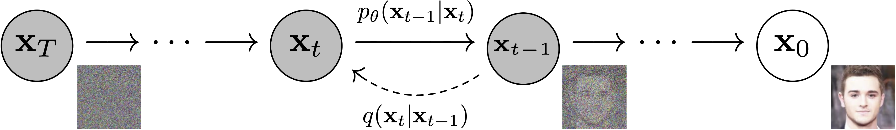

# 扩散模型
---
## 一、扩散模型与图像生成
扩散模型为生成模型中的一种。生成模型的目标是学习根据一定数量的训练样本生成数据。如图像或音频。扩散模型是一种特殊的VAE。VAE生成图像思路是：通过训练将图像变为向量，再用该向量生成图像，就应该得到一副与原图像一致的图像。VAE中，把图像变成向量的网络叫做编码器，把向量转换回图像的网络叫做解码器。其中，解码器就是负责生成图像的模型。

扩散模型核心在于，一个分布可以通过不断添加噪声变为另一个分布。放到图像生成任务里，就是来自训练集的图像可以通过不断添加噪声变成符合标准正态分布的图像。因此，模型图像生成的思路变为：
1. 不再训练一个可学习的编码器，而是把编码过程固定成不断添加噪声的过程
2. 不再把图像压缩成更短的向量，而是自始至终都对一个等大的图像做操作

解码器依然是一个可学习的神经网络，它的目的也同样是实现编码的逆操作。不过，既然现在编码过程变成了加噪，那么解码器就应该负责去噪。

## 二、扩散模型算法
### 1. 前向过程
在前向过程中，来自训练集的图像$\mathbf{x}_0$会被添加$T$次噪声，是的$\mathbf{x}_T$为符合标准正态分布。加噪声并非给上一时刻的图像加上噪声值，而是从一个均值与上一时刻图像相关的正态分布里采样处一副新图像。
$$\mathbf{x}_t\thicksim \mathcal{N}\left(\mu_t(\mathbf{x}_{t-1}),\sigma _t^2\mathbf{I}\right)$$

上式中，$\mathbf{x}_{t-1}$是上一时刻的图像，$\mathbf{x}_t$是这一时刻生成的图像，该图像是从一个均值与$\mathbf{x}_{t-1}$有关的正态分布中采样得到，为马尔可夫过程。

绝大多数扩散模型会将正态分布设置为：
$$\mathbf{x}_t\thicksim \mathcal{N}\left(\sqrt{1-\beta_t}\mathbf{x}_{t-1},\beta_t\mathbf{I}\right)$$

上式中，$\beta_t$是一个小于1的常数。

由正态分布性质，$\mathbf{x}_t$与$\mathbf{x}_0$有如下关系：

$$\mathbf{x}_t=\sqrt{\overline{\alpha}_t}\mathbf{x}_0+\sqrt{1-\overline{\alpha}_t}\epsilon,\ \epsilon\thicksim\mathcal{N}(0,\mathbf{I})$$

其中，$\alpha_t=1-\beta_t,\overline{\alpha}_t=\prod_{i=1}^t\alpha_i$。

在DDPM论文中，$\beta_t$从$\beta_1=10^{-4}$到$\beta_T=0.02$线性增长。因此，在不断迭代中，使得$\overline{\alpha}_t$不断趋于0，使$\mathbf{x}_T$满足标准正态分布。

### 2. 反向过程
反向过程中，我们希望能够取消加噪声操作，使一幅纯噪声图像变回数据集图像。

当$\beta_t$足够小时，每一步加噪声的逆操作也满足正态分布。
$$\mathbf{x}_{t-1}\thicksim\mathcal{N}(\widetilde{\mu}_t,\widetilde{\beta}_t\mathbf{I})$$
其中，当前时刻加噪声逆操作的均值$\widetilde{\mu}_t$和方差$\widetilde{\beta}_t$由当前时刻$t$、当前图像$\mathbf{x}_t$决定。因此，为了描述所有去噪声操作，神经网络应该输入$t$、$\mathbf{x}_t$，拟合当前的均值$\widetilde{\mu}_t$和方差$\widetilde{\beta}_t$。

经过推导，分布均值为：
$$\widetilde{\mu}_t=\frac{1}{\sqrt{\alpha_t}}(\mathbf{x}_t-\frac{1-\alpha_t}{\sqrt{1-\overline{\alpha}_t}}\epsilon_t)$$
分布的方差为：
$$\widetilde{\beta}_t=\frac{1-\overline{\alpha}_{t-1}}{1-\overline{\alpha}_t}\cdot\beta_t$$

由于$\beta_t$为常量，因此$\widetilde{\beta}_t$也是常量。所以训练去噪网络时，神经网络只要拟合$T$个均值即可。

对于损失函数，由于目标均值中仅有$\epsilon_t$未知，因此选择预测噪声$\epsilon_\theta(\mathbf{x}_t,t)$（其中$\theta$为可学习参数），使它和生成$\mathbf{x}_t$的噪声均方误差最小即可。因此误差函数可以写为：
$$L=\left\lVert \epsilon_t-\epsilon_\theta(\mathbf{x}_t,t)\right\rVert ^2$$
