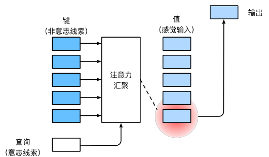
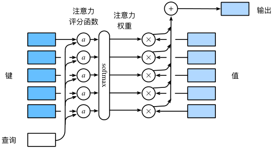

# 注意力机制
---
## 一、注意力机制
动物需要在复杂环境下有效关注值得注意的点。在心理学框架下，人类根据随意线索（意志线索）和不随意线索（非意志线索）选择注意点。

- 卷积、全连接、池化层只考虑不随意线索。
- 注意力机制则显示考虑随意线索：
    - 随意线索称之为查询（query）
    - 每个输入是一个值（value）和不随意线索（key）的对
    - 通过注意力池化层有偏向性选择某些输入

### 1. 非参注意力池化
对于给定数据$(x_i,y_i),\ i=1,\dots,n$，平均池化为最简单的方案：$f(x)=\frac{1}{n}\sum y_i$。

另一更优方案为采用**Nadaraya-Watson核回归**：
$$f(x)=\sum_{i=1}^n\frac{K(x-x_i)}{\sum_{j=1}^n K(x-x_j)}y_i$$

上式中，$x$为query，$x_i$为key，而$y_i$为value。

从上式出发可以进一步将注意力汇聚概括为：$$f(x)=\sum_{i}\alpha(x,x_i)y_i$$

使用高斯核$K(u)=\frac{1}{\sqrt{2\pi}}\exp(-\frac{u^2}{2})$，则有：
$$
\begin{aligned}
f(x)
&= \sum_{i=1}^n
\frac{\exp\left(-\frac{1}{2}(x-x_i)^2\right)}
{\sum_{j=1}^n \exp\left(-\frac{1}{2}(x-x_j)^2\right)} y_i \\
&= \sum_{i=1}^n \operatorname{softmax}\left(-\frac{1}{2}(x-x_i)^2\right) y_i
\end{aligned}
$$

### 2. 参数化的注意力池化
在非参注意力基础上加入可以学习的$w$
$$f(x)=\sum_{i=1}^n \operatorname{softmax}\left(-\frac{1}{2}((x-x_i)w)^2\right) y_i$$

## 二、注意力分数
对于
$$
\begin{aligned}
f(x)&=\sum_{i}\alpha(x,x_i)y_i\\
&=\sum_{i=1}^n \operatorname{softmax}\left(-\frac{1}{2}(x-x_i)^2\right) y_i
\end{aligned}
$$

上式中，$\alpha(x,x_i)$为注意力权重，而$-\frac{1}{2}(x-x_i)^2$则称为注意力分数。

### 1. 高维度拓展
假设 query $\mathbf{q} \in \mathbb{R}^{q}$，$m$ 对 key-value $(\mathbf{k}_1,\mathbf{v}_1),\dots,(\mathbf{k}_m,\mathbf{v}_m)$，这里 $\mathbf{k}_i \in \mathbb{R}^k,\ \mathbf{v}_i \in \mathbb{R}^v$。

则对注意力池化层有：

$$
f(\mathbf{q},(\mathbf{k}_1,\mathbf{v}_1),\dots,(\mathbf{k}_m,\mathbf{v}_m))
= \sum_{i=1}^m \alpha(\mathbf{q},\mathbf{k}_i)\mathbf{v}_i \in \mathbb{R}^v
$$

$$
\alpha(\mathbf{q},\mathbf{k}_i)
= \operatorname{softmax}(a(\mathbf{q},\mathbf{k}_i))
= \frac{\exp(a(\mathbf{q},\mathbf{k}_i))}{\sum_{j=1}^m \exp(a(\mathbf{q},\mathbf{k}_j))} \in \mathbb{R}
$$

其中 $a(\mathbf{q},\mathbf{k}_i)$ 为注意力分数。有两种常见方式进行高维度拓展.

### 2. Addictive Attention
通过使用**可学参数**：$
 \mathbf{W}_k \in \mathbb{R}^{h \times k}, \mathbf{W}_q \in \mathbb{R}^{h \times q}, \mathbf{v} \in \mathbb{R}^h 
$
$$
 a(\mathbf{k}, \mathbf{q}) = \mathbf{v}^T \tanh(\mathbf{W}_k \mathbf{k} + \mathbf{W}_q \mathbf{q}) 
$$

等价于将key和query合并后放入到一个隐藏大小为h输出大小为1的单隐藏层MLP。

### 3. Scaled Dot-Product Attention
如果query与key都是同样长度$\mathbf{q,k_i}\in\mathbb{R}^d$，则可以
$$a(\mathbf{q,k_i})=\langle \mathbf{q,k_i}\rangle /\sqrt{d} $$

对于向量化版本：
$$
\mathbf{Q} \in \mathbb{R}^{n \times d}, \quad \mathbf{K} \in \mathbb{R}^{m \times d}, \quad \mathbf{V} \in \mathbb{R}^{m \times v}
$$

- 注意力分数：
$$
a(\mathbf{Q}, \mathbf{K}) = \mathbf{Q}\mathbf{K}^T / \sqrt{d} \in \mathbb{R}^{n \times m}
$$

- 注意力池化：
$$
f = \operatorname{softmax}(a(\mathbf{Q}, \mathbf{K})) \mathbf{V} \in \mathbb{R}^{n \times v}
$$