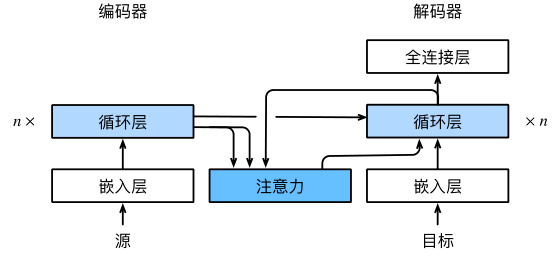
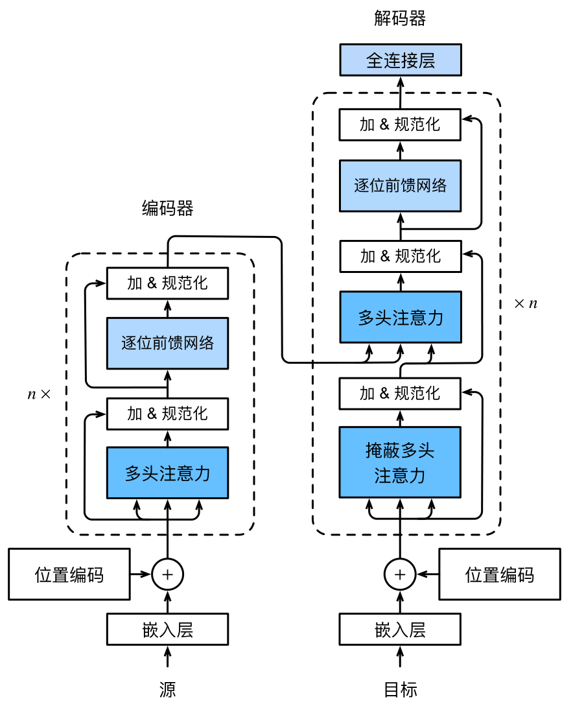
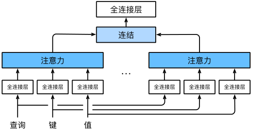

# 注意力机制
---
## 一、注意力机制
动物需要在复杂环境下有效关注值得注意的点。在心理学框架下，人类根据随意线索（意志线索）和不随意线索（非意志线索）选择注意点。

- 卷积、全连接、池化层只考虑不随意线索。
- 注意力机制则显示考虑随意线索：
    - 随意线索称之为查询（query）
    - 每个输入是一个值（value）和不随意线索（key）的对
    - 通过注意力池化层有偏向性选择某些输入

### 1. 非参注意力池化
对于给定数据$(x_i,y_i),\ i=1,\dots,n$，平均池化为最简单的方案：$f(x)=\frac{1}{n}\sum y_i$。

另一更优方案为采用**Nadaraya-Watson核回归**：
$$f(x)=\sum_{i=1}^n\frac{K(x-x_i)}{\sum_{j=1}^n K(x-x_j)}y_i$$

上式中，$x$为query，$x_i$为key，而$y_i$为value。

从上式出发可以进一步将注意力汇聚概括为：$$f(x)=\sum_{i}\alpha(x,x_i)y_i$$

使用高斯核$K(u)=\frac{1}{\sqrt{2\pi}}\exp(-\frac{u^2}{2})$，则有：
$$
\begin{aligned}
f(x)
&= \sum_{i=1}^n
\frac{\exp\left(-\frac{1}{2}(x-x_i)^2\right)}
{\sum_{j=1}^n \exp\left(-\frac{1}{2}(x-x_j)^2\right)} y_i \\
&= \sum_{i=1}^n \operatorname{softmax}\left(-\frac{1}{2}(x-x_i)^2\right) y_i
\end{aligned}
$$

### 2. 参数化的注意力池化
在非参注意力基础上加入可以学习的$w$
$$f(x)=\sum_{i=1}^n \operatorname{softmax}\left(-\frac{1}{2}((x-x_i)w)^2\right) y_i$$

## 二、注意力分数
对于
$$
\begin{aligned}
f(x)&=\sum_{i}\alpha(x,x_i)y_i\\
&=\sum_{i=1}^n \operatorname{softmax}\left(-\frac{1}{2}(x-x_i)^2\right) y_i
\end{aligned}
$$

上式中，$\alpha(x,x_i)$为注意力权重，而$-\frac{1}{2}(x-x_i)^2$则称为注意力分数。

### 1. 高维度拓展
假设 query $\mathbf{q} \in \mathbb{R}^{q}$，$m$ 对 key-value $(\mathbf{k}_1,\mathbf{v}_1),\dots,(\mathbf{k}_m,\mathbf{v}_m)$，这里 $\mathbf{k}_i \in \mathbb{R}^k,\ \mathbf{v}_i \in \mathbb{R}^v$。

则对注意力池化层有：

$$
f(\mathbf{q},(\mathbf{k}_1,\mathbf{v}_1),\dots,(\mathbf{k}_m,\mathbf{v}_m))
= \sum_{i=1}^m \alpha(\mathbf{q},\mathbf{k}_i)\mathbf{v}_i \in \mathbb{R}^v
$$

$$
\alpha(\mathbf{q},\mathbf{k}_i)
= \operatorname{softmax}(a(\mathbf{q},\mathbf{k}_i))
= \frac{\exp(a(\mathbf{q},\mathbf{k}_i))}{\sum_{j=1}^m \exp(a(\mathbf{q},\mathbf{k}_j))} \in \mathbb{R}
$$

其中 $a(\mathbf{q},\mathbf{k}_i)$ 为注意力分数。有两种常见方式进行高维度拓展.

### 2. 加性注意力
通过使用**可学参数**：$\mathbf{W}_k \in \mathbb{R}^{h \times k}, \mathbf{W}_q \in \mathbb{R}^{h \times q}, \mathbf{v} \in \mathbb{R}^h$

$$
 a(\mathbf{k}, \mathbf{q}) = \mathbf{v}^T \tanh(\mathbf{W}_k \mathbf{k} + \mathbf{W}_q \mathbf{q}) 
$$

等价于将key和query合并后放入到一个隐藏大小为h输出大小为1的单隐藏层MLP。

### 3. 缩放点积注意力
如果query与key都是同样长度$\mathbf{q,k_i}\in\mathbb{R}^d$，则可以
$$a(\mathbf{q,k_i})=\langle \mathbf{q,k_i}\rangle /\sqrt{d} $$

对于向量化版本：
$$
\mathbf{Q} \in \mathbb{R}^{n \times d}, \quad \mathbf{K} \in \mathbb{R}^{m \times d}, \quad \mathbf{V} \in \mathbb{R}^{m \times v}
$$

- 注意力分数：
$$
a(\mathbf{Q}, \mathbf{K}) = \mathbf{Q}\mathbf{K}^T / \sqrt{d} \in \mathbb{R}^{n \times m}
$$
此处$\sqrt{d}$为缩放因子稳定梯度，以避免点积结果的方差会变大 landscape，导致softmax函数进入梯度极小的区域。

- 注意力池化：
$$
f = \operatorname{softmax}(a(\mathbf{Q}, \mathbf{K})) \mathbf{V} \in \mathbb{R}^{n \times v}
$$

## 三、使用注意力机制的seq2seq
该机制动机在于，在机器翻译中，每个生成的词可能相关于源句中不同的词。seq2seq模型无法对此直接建模，需要加入注意力。

编码器每次词的输出作为key和value，解码器RNN对上一个词的输出是query，而注意力的输出和下一个词的词嵌入合并进入RNN。

## 四、自注意力和位置编码
### 1. 自注意力
给定序列$\mathbf{x}_1,\dots,\mathbf{x}_n,\forall\mathbf{x}_i\in\mathbb{R}^d$，自注意力池化层将$\mathbf{x}_i$当作key，value。query来对序列抽取特征得到$\mathbf{y}_1,\dots,\mathbf{y}_n$，这里
$$\mathbf{y}_i=f(\mathbf{x}_i,(\mathbf{x}_1,\mathbf{x}_1),\dots,(\mathbf{x}_n,\mathbf{x}))\in\mathbb{R}^d$$

### 2. 位置编码
与CNN/RNN不同，自注意力并没有记录位置信息。因此采用**位置编码**将位置信息注入到**输入**里：
- 假设长度为$n$的序列是$\mathbf{X}\in\mathbb{R}^{n\times d}$，那么使用位置编码矩阵$\mathbf{P}\in\mathbb{R}^{n\times d}$来输出$\mathbf{X+P}$作为自编码输入。
- $\mathbf{P}$的元素如下计算：
$$p_{i,2j}=\sin\left(\frac{i}{10000^{2j/d}}\right),\ p_{i,2j+1}=\cos\left(\frac{i}{10000^{2j/d}}\right)$$

#### (1) 绝对位置信息
在二进制表示中，较高比特位的交替频率低于较低比特位，只是位置编码通过使用三角函数在编码维度上降低频率。由于输出是浮点数，因此此类连续表示比二进制表示法更节省空间。

#### (2) 相对位置信息
除了捕获绝对位置信息之外，上述的位置编码还允许模型学习得到输入序列中相对位置信息。

对于位置位于$i+\delta$处的位置编码可以线性投影位置$i$处的位置编码来表示。记$\omega_j=1/10000^{2j/d}$，那么

$$
\begin{bmatrix}
\cos(\delta\omega_j) & \sin(\delta\omega_j) \\
-\sin(\delta\omega_j) & \cos(\delta\omega_j)
\end{bmatrix}
\begin{bmatrix}
p_{i,2j} \\
p_{i,2j+1}
\end{bmatrix}
=
\begin{bmatrix}
p_{i+\delta,2j} \\
p_{i+\delta,2j+1}
\end{bmatrix}
$$

## 五、Transformer
### 1. Transformer架构
Transformer基于编码器-解码器架构来处理序列对，并且是纯基于注意力。编码器和解码器都有n个transformer块，每个块中使用多头（自）注意力，基于位置的的前馈网络和层归一化。

### 2. 多头自注意力机制
#### (1)多头注意力
对同一key, value, query，希望抽取不同的信息，因此多头注意力使用$h$个独立的注意力池化，并合并各个头(head)输出得到最终输出。

给定query $\mathbf{q} \in \mathbb{R}^{d_q}$、key $\mathbf{k} \in \mathbb{R}^{d_k}$ 和value $\mathbf{v} \in \mathbb{R}^{d_v}$，每个注意力头 $\mathbf{h}_i$（$i = 1, \ldots, h$）的计算方法为：

$$
\mathbf{h}_i = f(\mathbf{W}_i^{(q)}\mathbf{q}, \mathbf{W}_i^{(k)}\mathbf{k}, \mathbf{W}_i^{(v)}\mathbf{v}) \in \mathbb{R}^{p_v}
$$

其中，可学习的参数包括 $\mathbf{W}_i^{(q)} \in \mathbb{R}^{p_q \times d_q}$、$\mathbf{W}_i^{(k)} \in \mathbb{R}^{p_k \times d_k}$ 和 $\mathbf{W}_i^{(v)} \in \mathbb{R}^{p_v \times d_v}$，以及代表注意力汇聚的函数 $f$。$f$ 可以为加性注意力或缩放点积注意力。

多头注意力的输出需要经过另一个线性转换，它对应着$h$个头连结后的结果，因此其可学习参数是 $\mathbf{W}_o \in \mathbb{R}^{p_o \times h p_v}$：

$$
\mathbf{W}_o
\begin{bmatrix}
\mathbf{h}_1 \\
\vdots \\
\mathbf{h}_h
\end{bmatrix}
\in \mathbb{R}^{p_o}.
$$

#### (2)多头自注意力
**Transformer采用多头自注意力机制**。对于自注意力机制，query、key 和 value 均来自同一个输入序列。给定输入序列$\mathbf{X}\in\mathbb{R}^{n\times d}$

可以直接将 $\mathbf{X}$ 同时作为 query、key 和 value，即

$$\mathbf{Q}=\mathbf{K}=\mathbf{V}=\mathbf{X}.$$

在多头自注意力中，为了使不同注意力头能够从不同的特征空间中抽取信息，第 $i$ 个注意力头使用独立的线性变换：

$$\mathbf{Q}_i=\mathbf{X}\mathbf{W}_i^{(q)},$$

$$\mathbf{K}_i=\mathbf{X}\mathbf{W}_i^{(k)},$$

$$\mathbf{V}_i=\mathbf{X}\mathbf{W}_i^{(v)},$$

其中

$$
\mathbf{W}_i^{(q)}\in\mathbb{R}^{d\times p_q},
\qquad
\mathbf{W}_i^{(k)}\in\mathbb{R}^{d\times p_k},
\qquad
\mathbf{W}_i^{(v)}\in\mathbb{R}^{d\times p_v}
$$

为可学习参数。

因此，第 $i$ 个注意力头可以表示为

$$
\mathbf{H}_i=f\left(
\mathbf{X}\mathbf{W}_i^{(q)},
\mathbf{X}\mathbf{W}_i^{(k)},
\mathbf{X}\mathbf{W}_i^{(v)}
\right).
$$

若采用缩放点积注意力，则有

$$
\mathbf{H}_i
=
\operatorname{softmax}
\left(
\frac{
\mathbf{Q}_i\mathbf{K}_i^T
}{
\sqrt{p_k}
}
\right)
\mathbf{V}_i.
$$

最后，将 $h$ 个注意力头的输出进行连接，并通过线性变换得到多头自注意力的输出：

$$
\mathbf{Y}
=
\operatorname{Concat}
\left(
\mathbf{H}_1,\dots,\mathbf{H}_h
\right)
\mathbf{W}_o.
$$

因此，多头自注意力的特点是：不同注意力头的 query、key 和 value 都来源于同一个输入序列 $\mathbf{X}$，但分别通过独立的可学习矩阵进行线性映射。

### 3. 基于位置的前馈网络(Positionwise FFN)
基于位置的前馈网络将输入形状由$(b,n,d)$变换为$(bn,d)$。其中：
- \(b\)：batch size，一次送进模型多少个样本
- \(n\)：sequence length，一个样本里有多少个token
- \(d\)：embedding dimension，每个token用多少维向量表示

再通过作用两个全连接层，输出形状由$(bn,d)$变化回$(b,n,d)$，等价于两层核窗口为1的一维卷积层。

### 4. 残差连接与层归一化(Add & norm)
为了防止网络加深时出现梯度消失或退化问题，每个子层（Attention 和 FFN）的外围都包裹了残差连接与层归一化。

$$
\mathbf{y}
=
\operatorname{LayerNorm}
\left(
\mathbf{x}
+
\operatorname{Sublayer}(\mathbf{x})
\right)
$$

其中，残差连接将子层输入与子层输出直接相加：

$$
\mathbf{z}
=
\mathbf{x}
+
\operatorname{Sublayer}(\mathbf{x})
$$

残差连接可以保留原始输入信息，使子层主要学习相对于输入的增量，同时有利于深层网络中的梯度传播。

对于一个 token 的特征表示：

$$
\mathbf{z}
=
[z_1,z_2,\ldots,z_d]
$$

LayerNorm 会在该 token 的特征维度上进行归一化。首先计算均值：

$$
\mu
=
\frac{1}{d}
\sum_{i=1}^{d} z_i
$$

再计算方差：

$$
\sigma^2
=
\frac{1}{d}
\sum_{i=1}^{d}
(z_i-\mu)^2
$$

随后进行标准化：

$$
\hat{z}_i
=
\frac{z_i-\mu}
{\sqrt{\sigma^2+\epsilon}}
$$

其中，$\epsilon$ 是人为设定的一个较小常数，用于防止分母为 $0$ 或过小，从而提高数值稳定性。

最后通过可学习参数 $\gamma$ 和 $\beta$ 对归一化结果进行缩放和平移：

$$
y_i
=
\gamma_i\hat{z}_i+\beta_i
$$

因此，LayerNorm 的完整形式可以写为：

$$
\operatorname{LayerNorm}(\mathbf{z})
=
\gamma
\odot
\frac{\mathbf{z}-\mu}
{\sqrt{\sigma^2+\epsilon}}
+
\beta
$$

其中，$\odot$ 表示逐元素乘法。

若输入张量形状为：

$$
\mathbf{X}
\in
\mathbb{R}^{B\times N\times D}
$$

则 LayerNorm 对每个 token 的 $D$ 个特征独立进行归一化，输入输出形状均保持不变：

$$
(B,N,D)
\rightarrow
(B,N,D)
$$

因此，Transformer 中的 “Add & Norm” 可以理解为：先通过残差连接保留原始表示并加入子层学习到的新信息，再通过 LayerNorm 稳定特征的数值分布。

### 5. 有掩码的多头自注意力
Decoder 的输入是当前已经生成的 Token 序列（在训练时则是 target 序列整体右移一个位置，即 Shifted Right）。在训练时，为了实现并行化，往往会把整个目标句子一次性输入给 Decoder。但Decoder对序列中一个元素输出时，不应该考虑该元素之后的元素。这可以通过掩码实现，即在计算$\mathbf{x}_i$输出时，假装当前序列长度为$i$。

通过引入一个上三角掩码矩阵（Upper Triangular Mask Matrix）$\mathbf{M}$来实现这一点。掩码矩阵定义为
$$
M_{ij} = \begin{cases} 
0 & \text{if } j \leq i \\ 
-\infty & \text{if } j > i 
\end{cases}
$$

使用掩码后注意力分数计算变为$\operatorname{softmax}\left(\mathbf{Q}\mathbf{K}^T / \sqrt{d}+\mathbf{M}\right)\mathbf{V}$

### 6. 交叉注意力机制
解码器中，采用交叉注意力机制，其Q, K, V来源为：
- **Query (\(Q\))**：来自 **Decoder** 上一个子层 (**Masked Attention**) 的输出。代表“我现在手里掌握的信息，我想查点什么”。
- **Key (\(K\))** 和 **Value (\(V\))**：来自 **Encoder** 的最终输出矩阵 \(Y\)。代表“源文本中所有的上下文线索”。

### 7. 预测
预测第$t+1$个输出时，解码器中输入前$t$个预测值。在自注意力中，前$t$个预测值作为key和value，第$t$个预测值还作为query。

