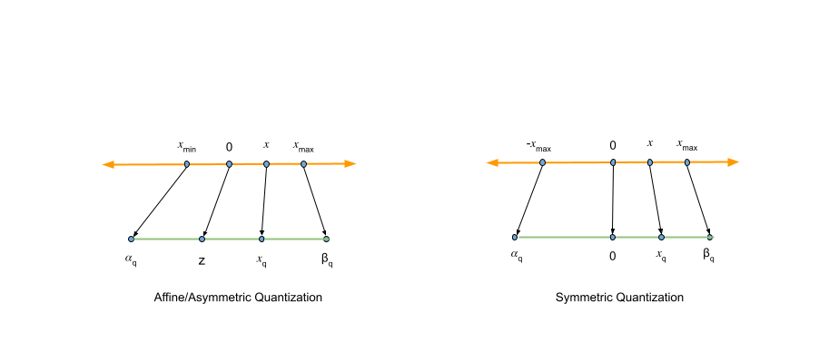
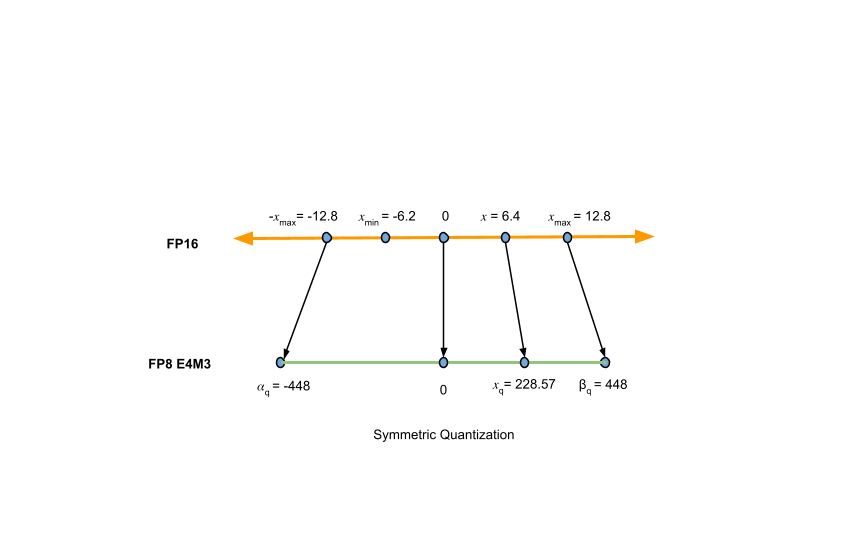

# 稀疏、剪枝、量化
---
## 一、量化
量化技术通过降低模型参数（如权重和激活值）的精度（例如从FP32降至FP8），有效应对了内存占用、推理速度和能耗等方面的挑战。相比原始模型，这种精度调整能够显著减小模型体积并降低计算开销，从而加快推理速度并减少功耗。然而，量化也可能带来一定程度的精度损失。

### 1. 量化数据类型
数据类型（例如 FP32、FP16、BF16 和 FP8）直接影响模型所需的计算资源，进而决定其运行速度与效率。模型参数可用多种浮点格式表示，常见的包括 FP32、FP16、BF16 和 FP8。通常，浮点数采用 n 位来存储数值，并将这些位划分为三个组成部分（IEEE 754）：
- **符号**：该位表示数值的符号，0 代表正数，1 代表负数。
- **指数**：该部分对指数进行编码，表示以底数（在二进制系统中通常为 2）为基数的幂次，决定了数值的表示范围。
- **尾数**：该部分表示数值的有效数字，其长度在很大程度上决定了数据的精度。

由于指数和尾数所占用的位数可能不同，数据类型有时会进一步细分。例如，FP8 中的 E4M3 表示使用 4 位表示指数，3 位表示尾数。

一种较为简便的方法是**量化模型权重**，以降低内存占用。其中，**模型激活**是另一个关键部分，它指的是模型在推理过程中各层操作所产生的中间输出。尽管这些激活值具有动态性，并不显式地存储在模型中，但在量化过程中仍起着至关重要的作用。

对于基于 Transformer 的解码器模型，推理阶段需考虑的另一个关键组件是 **KV 缓存**。KV 缓存的大小与序列长度、网络层数以及注意力头的数量密切相关。

总之，在当前基于 Transformer 的模型中，可以对三个关键要素进行量化：模型权重、模型激活以及 KV 缓存（仅限于解码器模型）。

### 2. 量化算法
量化过程涉及确定零点和缩放系数的不同方法，由此衍生出两种主要的量化类型：仿射（非对称）量化和对称量化。

#### (1) 仿射量化
仿射或非对称量化由两个关键参数定义：比例系数$s$和零点$z$比例系数，为浮点数，决定了量化器的步长大小。零点，与量化值的数据类型相同，确保实际值零在量化过程中能够被精确映射。引入零点的主要原因是，神经网络算子的高效实现通常依赖于在边界处进行零填充的数组，因此需要保证量化方案能准确表示零值。

确定参数后，量化公式如下：
$$x_q=\operatorname{clip}\left(\operatorname{round}\left(\frac{x}{s}+z\right),\alpha_q,\beta_q\right)$$
其中：
- $x$是原值
- $x_q$是量化值
- $s$是比例系数，为正实数
- $z$是零点
- $\alpha_q,\beta_q$定义量化表示的范围
- round将所防止转换为最近的量化表示
- clip确保值保持在量化表示的范围内

从量化值中恢复近似的全精度值，则：
$$x\approx x'=s\cdot(x_q-z)$$

在量化与去量化过程中，不可避免地会产生四舍五入误差和截断误差，这些误差是量化过程本身固有的特性。

#### (2) 对称量化
对称量化是对一般非对称量化情况的简化形式。当将零点固定为 0 时，该量化方式可有效减少计算开销，因为它消除了大量加法运算。其量化与去量化公式如下：
$$x_q=\operatorname{clip}\left(\operatorname{round}\left(\frac{x}{s}\right),\alpha_q,\beta_q\right)$$

$$x\approx x'=s\cdot x_q$$

由于非对称量化相较于对称量化并未带来明显的精度提升，因此后续将重点支持对称量化方案，因其结构更简单、实现更高效。此外，NVIDIA TensorRT 和 Model Optimizer 等主流工具均采用对称量化。

#### (3) AbsMax算法
比例系数在量化过程中有关键作用。一种常用的量化方式是AbsMax量化，其比例系数$s$计算方式如下：
$$s=\frac{\max(\lvert x_{max} \rvert,\lvert x_{min}\rvert)\cdot 2}{\beta_q-\alpha_q}$$

该值取决于实际输入数据的范围以及目标量化表示的范围。

### 3. 量化粒度
量化粒度，即量化参数在张量元素之间共享的方式。更具体地说，这指的是在 AbsMax 量化中计算原始数据的$x_{max}$和$x_{min}$值时所采用的粒度级别。以下是三种常用策略：
- 逐张量（或逐层）量化：张量中的所有数值均采用同一组量化参数进行量化。这种方法实现简单，内存效率较高，但可能带来较大的量化误差，尤其是在数据分布沿不同维度变化较大的情况下。
- 逐通道量化：各个通道分别使用独立的量化参数，通常应用于卷积操作中的通道维度。该方法能够将异常值的影响限制在其所属的通道内，避免波及整个张量，从而有效降低量化误差。
- 分块（或分组）量化：将张量划分为多个较小的块或组，每个块使用各自的量化参数。这种方法提供了更细粒度的控制，特别适用于张量内部不同区域数值分布差异较大的场景。

### 4. 量化方法
量化模型权重相对简单，因为权重是静态的，不依赖于数据，在大多数情况下无需额外数据。与之不同，激活函数的值动态依赖于输入数据的分布，而不同输入之间的数据分布可能存在显著差异，从而影响理想的缩放系数。在预训练模型上进行此类校准的过程称为**训练后量化**（PTQ）。

在 PTQ 过程中，会在每一层的激活输出中插入观察者，利用代表性数据对模型进行量化和推理。观察者负责收集激活值，并采用预设算法确定相应的扩展系数。对于 AbsMax 量化方法，扩展系数基于激活输出中的最大绝对值计算得出，该值表示为$y_{max}=\max(\lvert y_0 \rvert,\dots,\lvert y_N \rvert)$，其中$y_i$为数据样本$d_i$的激活响应。随后基于此值推导出对应的缩放系数。

#### (1) 训练后量化
PTQ 有两种主要方法：一种是仅对权重进行量化，另一种是对权重和激活函数同时进行量化。

在仅权重量化中，我们可以获取已训练模型的权重，并直接对这些权重进行量化。由于权重是已知且固定的，因此无需额外数据。该过程通过计算比例因子，将权重映射到较低精度的数值，可选择是否使用零点参数。

为了量化权重和激活值，需要使用具有代表性的输入数据，因为激活值只能通过在实际输入上运行模型才能获取。收集激活值的统计信息，并据此确定相应的缩放因子和零点值的过程称为**校准**。在校准过程中，模型的权重保持不变，利用输入数据计算量化的参数，即缩放因子和零点。根据校准发生的时间不同，权重与激活值的量化可分为两种主要方法：静态量化与动态量化。

- 静态量化：该方法通过校准数据集预先计算量化参数，参数确定后即保持固定，并可重复应用于后续的所有推理过程。
- 动态量化：该方法在推理过程中实时计算量化参数，因此不同输入可能产生不同的量化参数，且无需依赖校准数据集。

#### (2) 量化感知训练
量化感知训练（QAT）是一种旨在缓解模型量化过程中常见性能下降问题的技术。与在训练完成后进行量化的后训练量化（PTQ）不同，QAT 将量化效应直接融入训练过程。具体而言，在前向和反向传播中模拟低精度计算，使模型参数能够学习并适应由量化引入的误差，例如舍入和截断误差。

在QAT期间，模型通过引入“假量化”模块来模拟低精度运算行为，同时保持实际数据类型不变。这些模块对模型的权重和激活值进行量化后再进行去量化，使模型能够感知量化带来的影响，同时维持梯度更新过程中的高精度计算。通常情况下，在QAT过程中，“假量化”模块会被冻结，并对模型权重进行微调。

为了解决量化函数不可微的问题（例如训练过程中的四舍五入操作），量化感知训练（QAT）采用了直通估计器（STE）。STE 在反向传播过程中将这些不可微函数的梯度近似为 1，从而在存在非可微运算的情况下，仍能实现有效的模型训练。

## 二、剪枝
模型剪枝 (Model Pruning) 是一种用于减少神经网路模型参数数量和计算量的技术。它通过识别和去除在训练过程中对模型性能影响较小的参数或连接，从而实现模型的精简和加速。

通常，模型剪枝可分为两类：结构化剪枝 (Structed Pruning) 与非结构化剪枝 (Unstructed Pruning)。

结构化剪枝和非结构化剪枝主要区别在于剪枝目标和由此产生的网络结构。结构化剪枝根据特定规则删除连接或层结构，同时保留整体网络结构。而非结构化剪枝会剪枝各个参数，从而产生不规则的稀疏结构。

### 1. 非结构化剪枝方法
非结构化剪枝通过删除特定参数而不考虑其内部结构来简化LLM。这种方法针对LLM中的单个权重或神经元进行，通常通过将阈值以下参数归零。但此方法忽略了LLM整体结构，导致不规则的稀疏模型，这种不规则性需要专门的压缩技术来有效存储和计算剪枝后的模型。

非结构化剪枝通常涉及对LLM进行大量重新训练以重新获得准确性。

### 2. 结构化剪枝方法
结构化剪枝通过删除整个结构组件，如神经元、通道或层，来简化LLM。这种方法同时针对整组权重，具有降低模型复杂性和内存使用量的有点，同时保持整体LLM结构完整。

1. filter-wise

一个卷积核被剪枝，那么其前一个Feature Map 和 下一个Feature Map 都会发生相应的变化。

在第 `i` 层卷积中， 其中第2、5个卷积核被剪掉(卷积核数量减少，每个卷积核的shape不变)； 当`i - 1`层的featuremap经过第`i`层feature map,其中的第2、5个channel也相应的被去除。为了匹配第`i`层featuremap通道维度产生的变化，第`i+1`层的卷积中的每个卷积核的第2、5个channel 的权重被去除(卷积核数量不变，但每个卷积的shape发生变化)。

从第`i`个卷积层剪掉n个卷积核的算法过程如下：
- 1. 计算每个卷积核的权重绝对值之和
- 2. 根据值大小排序
- 3. 将最小的n个卷积核及对应的feature map剪掉，下一个卷积层中相关的卷积核也要移除
- 4. 生成了第`i`层和第`i+1`层新的权重矩阵，剩余的权重参数被复制到新模型中

2. Channel-wise

`conv-layer`的每个channel的重要成都可以和batchnorm层关联，如果某个channel后的batchnorm层中对应的scaling factor足够小，则说明该channel重要程度低，可以被忽略。

batchnorm公式如下，其中$\gamma$表示channel scaling factors：
$$\hat{z} = \frac{z_{in} - \mu_\beta}{\sqrt{\delta_\beta^2 + \epsilon}} ; z_{out} = \gamma \hat{z} + \beta$$

为了增加稀疏程度，方便对channel进行剪枝，训练时需要对每个batchnom层的scaling factor增加`L1`的约束。channel-wise和filter-wise既有区别也有联系，两者使用的剪枝评判方法不同，但最终都会体现在对卷积核或卷积核中某些layer的剪枝。

3. Group-wise

`Group-wise`就是对通道的分组剪枝，对通道进行分组剪枝其实已经是一个改进的方法了。但是它也有一个明显的弊端，即它移除的是某一层中所有的filters相同位置上的权重。但是，每个filters中无效的权重位置可能不同，所以这个方法解决不了这一点。因此提出group wise剪枝。

### 3. 剪枝标准
#### (1) 权重大小标准
一个非常直观且非常有效的标准是修剪绝对值（或“幅度”）最小的权重。实际上，在权重衰减的约束下，那些对函数没有显着贡献的函数在训练期间会缩小幅度。因此，多余的权重被定义为是那些绝对值较小的权重。尽管它很简单，但幅度标准仍然广泛用于最新的方法 ，使其成为该领域的主要内容。

对于结构化剪枝，一种直接的方法是根据过滤器的范数（例如 L1 或 L2）对过滤器进行排序。如果这种方法非常简单，人们可能希望将多组参数封装在一个度量中：例如，一个卷积过滤器、它的偏差和它的批量归一化参数，或者甚至是并行层中的相应过滤器，其输出随后被融合。

一种方法是在不需要计算这些参数的组合范数的情况下，在要修剪的每组图层之后为每个特征图插入一个可学习的乘法参数。当这个参数减少到零时，有效地修剪了负责这个通道的整套参数，这个参数的大小说明了所有参数的重要性。因此，该方法包括修剪较小量级的参数 。

#### (2) 梯度幅度剪枝
梯度幅度剪枝方法的最新的实现实际上是在小批量训练数据上累积梯度，并根据该梯度与每个参数的相应权重之间的乘积进行修剪。该标准也可以应用于上述参数方法。

#### (3) 全局或局部剪枝
要考虑的最后一个方面是所选标准是否是全局应用于网络的所有参数或过滤器，或者是否为每一层独立计算。虽然多次证明全局修剪可以产生更好的结果，但它可能导致层崩溃 。避免这个问题的一个简单方法是采用逐层局部剪枝，即在使用的方法不能防止层崩溃时，在每一层剪枝相同的速率。