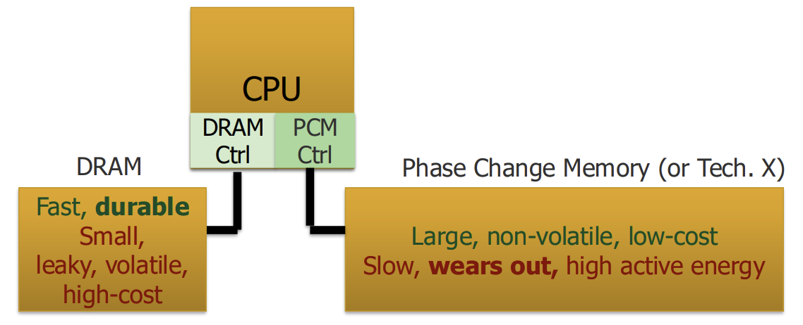
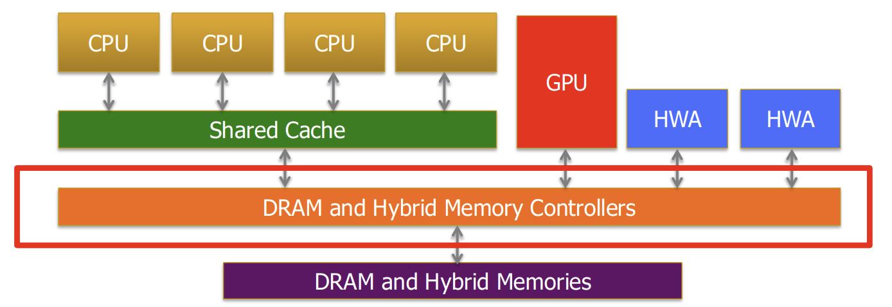

# Computer Architecture笔记
---
本笔记基于ETH-Zurich计算机体系结构课程，具体参考具体参考该[网站](https://safari.ethz.ch/architecture/fall2024/doku.php?id=start)，其中体系结构相关基础知识可参考[DDCA](DDCA笔记.md)相关笔记。未经允许，不得转载。

## 一、内存系统前沿概览
现代多数重要工作都是数据密集型，需要快速高效地处理大量数据。然而当下数据本身也在同时快速增长。计算需求在增长，但内存需求增长更快。

### 1. DRAM缩放限制
DRAM通过电容储存/释放电荷从而实现存储功能。因此，其电容容量必须足够大，才能确保检测的可靠性。其控制晶体管应足够大，以确保低漏电流和高保持时间。此外，由于电荷泄漏不可避免，因此需要定期刷新DRAM存储。这带来的问题在于电容不能过小，否则保持时间过小，导致需要频繁刷新DRAM从而导致能耗增大。此外，密度更高的芯片具有更高的故障率，因此当增加存储芯片密度时，应当考虑到其不能正常工作的可能性也会增加。因此对于一定尺度以下DRAM，缩放被极大程度限制。由于DRAM缩放的放缓，因此很难显著提高容量和能效。

DRAM单元存在保留时间问题，然而DRAM 不同存储单元的保持时间存在较大差异。RAIDR (ISCA 2012)对商用DDR3 DRAM的实验表明，绝大多数单元的保持时间超过256ms，仅有极少数单元保持时间不足256ms，极少数甚至低于128ms。因此，现行DRAM通常按照JEDEC标准采用统一的64ms刷新周期，以保证所有单元的数据可靠性。基于这一特性，可以考虑针对保持时间较短的单元保持较高刷新频率，而对保持时间较长的单元降低刷新频率，从而降低DRAM能耗。

人们可以在DRAM中人为地引入可预测的错误，最为典型的是Rowhammer problem。在DRAM中，频繁打开或关闭某一行时，需要高频率激活和预充电，此时在相邻行中会引发错误，本质是DRAM单元之间电磁干扰。频繁开关的DRAM行称为锤击行，经历错误的行称为受害行。这是DRAM中一种干扰错误，称为读取干扰。当DRAM更为密集时，这一错误更容易发生，这也限制了DRAM的缩放。

### 2. 混合内存
由于DRAM缩放受到限制，因此主流趋势是采用混合主存(Hybrid main memory)，通过硬件和软件负责管理数据的分配与迁移，以充分发挥多种技术的优势。由此带来的问题在于主存需要更加智能的控制器。

参考[DDCA笔记](DDCA笔记.md)，当多个内核访问共享主内存时，它们会相互干扰，不受控的干扰会导致许多问题。此外，由于异构代理单元不同，如CPU对延迟容忍度较低，而GPU则可以通过线程间切换等操作换来一定容忍，但对于吞吐量更为敏感，从而意味着在内存控制角度二者需求不同。因此这也一定程度上意味着需要对内存控制单元进行额外设计，分配不同存储单元。

此外，混合主存也涉及内存容错性。不同应用程序具有不同的错误脆弱性，因此如果可以知晓程序数据容错性，则可以更只能地映射数据，将更加脆弱的数据映射到可靠的内存，而容错的数据可以映射到更低成本内存。这种内存成为异构可靠性内存。

### 3. Expressive (Memory) Interface
软件向硬件提供关键程序信息，如数据结构、访问模式和数据类型。硬件通过得到数据结构和访问模式，就可以进行更好的数据防止和更准确的预取。通过了解数据类型，从而设计更好的数据压缩。

其核心在于通过实现跨层抽象，然后通过跨层抽象跨接口，将信息从程序传递到硬件，并在硬件中做出与应用程序相关的决策。

## 二、内存中心计算
目前以处理器为中心主要有三大系统趋势：
1. 数据访问是一个主要瓶颈。
2. 能耗为关键限制因素。
3. 数据移动能耗主导了计算能耗。

因此，在此基础上，需要范式转变：
1. 在数据移动量最小的情况下进行计算
2. 在合理的位置（即数据所在之处）进行计算
3. 使计算架构更加以数据为中心

### 1. PIM
PIM依据计算特性大致可分为：
1. Process using memory：通过利用内存结构的操作特性进行计算。
2. Process near memory：（目前）将计算逻辑和内存分别进行设计，并将逻辑与内存更紧密地集成在一起

PIM可以依据所使用技术分类，如：
- Flash, DRAM, SRAM, RRAM, MRAM, FeRAM, PCM, 3D, ...

PIM在系统级别实现位置也有所不同：
- Sensor, Cold Storage, Hard Disk, SSD, Main Memory, Cache, Register File, Memory Controller, Interconnect, ...

以上三者决定了PIM类型，并且可以在系统中组合多种PIM类型。

#### (1) Processing using DRAM
以DRAM为例进行PIM设计，并在较低代价下使其支持：
- 批量按位 AND, OR, NOT, MAJ
- 批量按位 COPY 与 INIT/ZERO
- 真随机数生成；物理不可克隆函数
- 基于查找表的更复杂的计算

这一实现核心思想在于利用DRAM模拟计算能力，即通过激活多行以实现计算与数据移动。

##### [1] 数据复制与初始化

