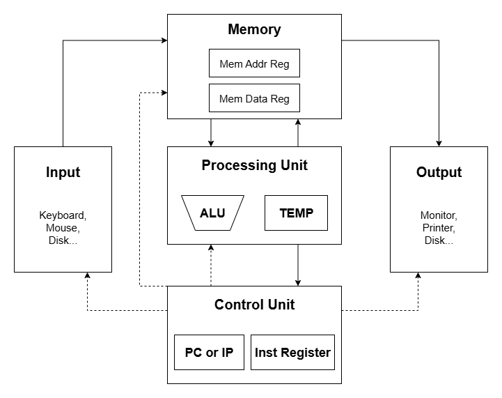

# DDCA笔记
---
本笔记基于ETH-Zurich数字设计与计算机体系结构（DDCA）课程，具体参考该[网站](https://safari.ethz.ch/ddca/spring2025/doku.php?id=start)。未经允许，不得转载。
## 一、冯·诺伊曼模型
### 1. 计算机定义
计算机主要由三部分组成：
- 计算单元（Computation）
- 通信单元（Communication）
- 存储与内存单元（Storage/memory）

### 2. 计算机基本组件
- **程序**：指令的集合
- **指令**：程序中最小的工作单元
- **指令集**：计算机被设计为能够执行的所有可能指令。

### 3. 冯诺伊曼模型
冯诺伊曼模型主要由以下五部分组成：
1. 存储器 Memory：存储程序与数据
2. 处理单元 Processing unit
3. 输入单元 Input
4. 输出单元 Output
5. 控制单元 Control unit


### 4. Memory
#### (1) 基本概念
- Memory同时存储数据与程序，在Memory中二者并无区别。
- Memory包含bits，bits逻辑上可以按照字节与字进行分组。
- 地址空间（Address space）：内存中唯一可识别位置的总数。
#### (2) 内存寻址
- 可寻址性（Addressability）：每个地址能存储数据位数。
    - 字寻址内存：每个**数据字**都有唯一地址。
    - 字节可寻址内存：每个**数据字节**都有唯一地址。
- 大端序 (Big Endian) & 小端序 (Small Endian)：
    - 大端序：字的排序是**最高有效字节**位于较低地址。
    - 小端序：字的排序是**最低有效字节**位于较低地址。
#### (3) 访问内存
通常使用两个寄存器来访问内存：
- Memory Address Register(MAR)
- Memory Data Register(MDR)

对于读操作，通常分为以下两步：
1. 将目标地址载入MAR。
2. 对应存储位置数据通过内存中的电路传输至MDR。

对于写操作，通常分为以下两步：
1. 将目标地址载入MAR，同时将要写入数据存入MDR。
2. 激活写使能信号，使MDR中所存数据写入MAR指定的地址。

### 5. Processing Unit
处理单元用于执行实际运算，可以包含多个功能模块。

#### (1) Arithmetic and Logic Unit (ALU)
算术逻辑单元负责计算与逻辑运算，处理的数据单位称为字（word）。

#### (2) Fast Temporary Storage
- **内存大但速度慢。**
- 计算机提供了一小块存储空间，紧邻ALU。
    - 目的：**存储临时值以便稍后快速访问**。内存访问速度远低于加法、乘法或除法等运算。
- 这种临时存储通常为一组寄存器，称为==寄存器堆（Register File）==。本质为可由指令寻址的小型存储器以存储中间结果。
- 通常一个寄存器存储一个字。

### 6. Control Unit
- 控制单元按步骤有序执行程序中的每一条指令。

- 控制单元通过 **指令寄存器(IR)** 来追踪正在处理的指令，IR存储该指令二进制码。

- 控制单元通过 **程序计数器(PC)** 来追踪下一条执行的指令，该寄存器存储下一条待处理指令的地址。

### 7. 冯诺伊曼模型特性
#### (1) 存储程序
指令以线性数组形式存储在内存中，指令和数据共享统一的内存空间。**内存中指令和数据本质上没有区别，存储值的解释取决于控制信号。**

#### (2) 顺序指令处理
一次仅处理一条指令，PC用于标识当前指令，并通过递增实现顺序推进，除了控制转移指令。

## 二、指令集架构（ISA）
### 1. 指令&指令集架构
指令是计算机执行的最基本单元。
- 机器语言：计算机可读的表示形式，由0和1组成。
- 汇编语言：人类可读的表达形式。

指令由两部分组成，操作码（opcode）与操作数（oprands）。这两部分在指令格式或指令编码中明确规定。
- Opcode：规定要执行的操作
- Oprands：指定操作对象

指令集架构为软件指令与硬件之间的接口以及硬件执行的内容。
ISA规定了如下内容：
- 内存组织：
    - 地址空间 (MIPS: $2^{32}$)
    - 可寻址性 (MIPS: 8bits)
- 寄存器集合：
    - 32 registers in MIPS
- 指令集：
    - 操作码
    - 数据类型
    - 寻址模式
    - 指令长度、格式和编码方式

### 2. 指令类型
指令主要分为三种类型：
- **运算指令**：在ALU中执行操作。
- **数据移动指令**：负责内存读写操作。
- **控制流指令**：改变执行顺序。
### 3. 运算指令
以加法指令为例：
```C
a = b + c;
```
其可以写为
```asm
add a, b, c
```
在MIPS架构中，假设寄存器分配如下：
```asm
b = $s1
c = $s2
a = $s0
```
则指令可以写为
```asm
add $s0,$s1,$s2
```
MIPS有众多运算指令：
- 许多是R-type指令，如：add，and，nor，xor ...
- I-type指令
- F-type指令，即浮点运算指令

### 4. 数据移动指令
此处以load word指令为例
对于C语言：
```C
a = A[2];
```
在MIPS架构中，加载1个字宽度指令为
```asm
lw $s3, 8($s0)
```
需要注意的是，字节地址计算为：**word_address * bytes/word**
在MIPS架构中，1word = 4bytes

### 5. 控制流指令
控制指令允许程序不按顺序执行，它们可以在执行阶段加载来改变PC，覆盖递增后的PC值。

在MIPS中，指令如下：
```asm
j target
```
其格式如下，为J-Type类型：

- 2 = opcode
- target = target address
- $$PC\leftarrow PC'[31:28]\ |\ signed-extend(target) * 4$$
    > 需要解释的是，由于指令需要按字对齐，target实际上为字长指令，所以应当乘以4以得到实际地址，然后将结果拼接在PC'高4位后。

此外还包含有条件分支语句，用于做出决策。在LC-3等架构中，采用标志位，通过检测标志位方式实现跳转。

MIPS等实现方式相反。以 `beq` 指令为例。
```asm
beq $s0, $s1, offset
```
该指令通过检查两个寄存器值是否相等，当相等时则有
$$PC\leftarrow PC' + signed-extend(target) * 4$$

### 6. Instruction (Processing) Cycle
指令处理周期主要由以下6部分组成：
1. 取指
2. 译码
3. 计算地址
4. 取操作数
5. 执行
6. 存储结果

并非所有指令都要完整经历6个阶段，且并非所有ISA均是如此。

#### (1) 取指
这个阶段从内存中获取指令并存入IR中。完整描述如下：
1. 将PC值存入MAR，并自增PC的值
2. 访存，将结果返回到MDR寄存器
3. 将MDR值存入IR中

#### (2) 译码
此阶段解析指令，识别指令类型并确定后续操作。此外，它还会生成后续操作指令，即一组控制信号，用于指令周期后续阶段处理已识别的指令。

#### (3) 计算地址
这个阶段会计算所需访问的内存地址。

#### (4) 取操作数
此阶段会取得处理指令所需的源操作数。

#### (5) 执行
此阶段会执行指令。

#### (6) 存储结果
此阶段将结果写入指定目标位置。当存储结果完成后，新的指令周期就从取指阶段重新开始。

### 7. 操作码（opcode）
可以定义一组大小不等的操作码，因此应当有所权衡取舍：
- 硬件复杂性 & 软件复杂性
- Latency of simple & complex instructions

### 8. 指令格式
#### (1) R-Type in MIPS
R型指令指对寄存器进行运算的指令。

- 0 = opcode
- rs, rt = 源寄存器
- rd = 目标寄存器
- shamt = shift amount (only shift operations)
- funct = operation in R-type instructions

#### (2) I-Type in MIPS

- immediate = 立即数

#### (3) J-Type in MIPS


### 9. 数据类型
一种ISA支持一种或多种数据类型。以MIPS为例，其支持如下类型：
- 二进制补码整数
- 无符号整数
- 浮点数

同样，这里应当由权衡取舍。

有更多数据类型的优点：
- 更好地将高级编程结构映射到硬件层面。
- 硬件可以直接处理变成语言中的数据类型 -> 更少的指令数目与更精简的代码体积。

有更多数据类型的缺点：
- 微架构相关设计更多。

### 10. 语义鸿沟
语义鸿沟衡量指令和数据类型与高级编程语言的贴近程度。由此可以得到：
```
复杂指令 + 数据类型 -> 更小的语义鸿沟

建议指令 + 数据类型 -> 更大的语义鸿沟
```


#### (1) Principle: Indirection
可以将一种指令集架构（ISA）转换为另一种不同的“实现”指令集架构（ISA）。其本质是对底层进行抽象，增加一个间接层。


但需要注意的是间接层会带来额外复杂性与功耗。

### 11. 寻址模式
在LC-3架构中，有5种寻址模式：
- 立即数寻址
- 寄存器寻址
- 3种内存寻址模式：
    - 基址+偏移量寻址
    - 间接寻址
    - PC相对寻址

在MIPS种，有伪直接寻址，但没有间接寻址。

#### (1) PC相对寻址
PC相对寻址的地址计算是通过取PC程序计数器（即指令地址），实际为下一条顺序指令的地址。在LC-3体系结构下其计算方法如下：
```
Memory[PC' + signed-extend(PCoffset9)]
```
在LC-3体系结构中，由于PC偏移量位9位，所以其地址跳转范围位-256~255，因此无法访问离指令太远的地址。

#### (2) 间接寻址
间接寻址类似指针，在LC-3体系结构下其地址计算方式如下：
```
Memory[Memory[PC' + signed-extend(PCoffset9)]]
```

#### (3) 基址+偏移量寻址
基址+偏移量寻址在LC-3体系结构下其地址计算方式如下：
```
Memory[BaseR + sign-extend[offset6]]
```

在MIPS中，lw与sw使用基址+偏移量寻址方式。由于MIPS指令较长，其偏移量活立即数可以更大，为16位，符号拓展后为32位。

#### (4) 立即数寻址
立即数寻址在LC-3体系结构中对应加载指令为 `LEA`，其地址计算方式如下：
```
LEA: DR <- PC' + sign-extend(PCoffset9)
```
其本质上是将PC相对地址直接加载到目标寄存器，不经过内存访问。

在MIPS架构下，有 `lui` 指令，将16位立即数加载到寄存器高16位，并将低16位置零。

### 12. 寄存器数量
寄存器数量影响以下两个方面：
- 编码寄存器地址所需二进制位数
- 快速存储器中保存的值的数目
- 寄存器文件的大小、访问时间、功耗

更多的寄存器可以让编译器或汇编器进行更优的寄存器分配优化，减少保存恢复操作，理论上提升性能。但同时导致指令体积增大，进而影响性能。同时使寄存器文件增大，影响功耗与延迟等。

## 三、数据流执行模型
### 1. 指令获取与执行
在数据流模型中，指令按数据流顺序获取与执行。即当它的操作数准备就绪时，输入数据生成后，才获取并执行该指令。因此在这一架构中不存在程序计数器。指令顺序由数据流依赖关系决定，即：
- 每条指令都会指定接收方
- 当所有操作数就位时，指令就会被抓取并执行，即触发。

这意味着可能由大量指令会同时触发。

### 2. 数据流执行模型 vs 冯诺伊曼模型
以下列代码为例：
```C
v = a + b;
w = b * 2;
x = v - w;
y = v + w;
z = x * y;
```
在冯诺伊曼模型中为顺序执行，如代码所展示的那样。

而其表示为Data Flow模型如下图所示。


## 四、微架构
### 1. 微架构定义
微架构指底层硬件实际执行指令的具体实现方式。微架构可以任意顺序执行指令，只需展示结果时遵守ISA规定语义即可。

### 2. 冯诺伊曼模型
当今所有主流ISA均采用冯诺伊曼模型。

微架构层面执行的模型与冯诺伊曼模型截然不同。微架构往往采用如流水线指令执行，多指令并行，采用乱序执行，且指令存储器与数据存储器分离。

**==但微架构层面的不同设计不会暴露给软件层面。==** 其执行结果依旧遵循ISA要求

### 3. ISA vs Microarchitecture
1. ISA
    软件与硬件达成共识的交互规范。
2. Microarchitecture
    指令集架构具体实现方式，对软件不可见。
3. Microprocessor
    通常包含指令集架构、微架构和电路设计。

### 4. Single-cycle vs Multi-cycle machines

单周期与多周期机在微架构层面均实现冯诺伊曼体系结构语义。

1. Single-cycle machines
每条指令占用一个时钟周期，所有状态更新均在状态结束时进行。但能实现的最慢指令决定了周期时间。

2. Multi-cycle machines
将指令分解为多个周期或阶段，在指令执行器件可以进行状态更新，但架构状态的更新时在指令执行结束时进行的。时钟周期由**最慢阶段**决定。