# DDCA笔记
---
本笔记基于ETH-Zurich数字设计与计算机体系结构（DDCA）课程，具体参考该[网站](https://safari.ethz.ch/ddca/spring2025/doku.php?id=start)。未经允许，不得转载。
## 一、冯·诺依曼模型
### 1. 计算机定义
计算机主要由三部分组成：
- 计算单元（Computation）
- 通信单元（Communication）
- 存储与内存单元（Storage/memory）

### 2. 计算机基本组件
- **程序**：指令的集合
- **指令**：程序中最小的工作单元
- **指令集**：计算机被设计为能够执行的所有可能指令。

### 3. 冯诺依曼模型
冯诺依曼模型主要由以下五部分组成：
1. 存储器 Memory：存储程序与数据
2. 处理单元 Processing unit
3. 输入单元 Input
4. 输出单元 Output
5. 控制单元 Control unit


### 4. Memory
#### (1) 基本概念
- Memory同时存储数据与程序，在Memory中二者并无区别。
- Memory包含bits，bits逻辑上可以按照字节与字进行分组。
- 地址空间（Address space）：内存中唯一可识别位置的总数。
#### (2) 内存寻址
- 可寻址性（Addressability）：每个地址能存储数据位数。
    - 字寻址内存：每个**数据字**都有唯一地址。
    - 字节可寻址内存：每个**数据字节**都有唯一地址。
- 大端序 (Big Endian) & 小端序 (Small Endian)：
    - 大端序：字的排序是**最高有效字节**位于较低地址。
    - 小端序：字的排序是**最低有效字节**位于较低地址。
#### (3) 访问内存
通常使用两个寄存器来访问内存：
- Memory Address Register(MAR)
- Memory Data Register(MDR)

对于读操作，通常分为以下两步：
1. 将目标地址载入MAR。
2. 对应存储位置数据通过内存中的电路传输至MDR。

对于写操作，通常分为以下两步：
1. 将目标地址载入MAR，同时将要写入数据存入MDR。
2. 激活写使能信号，使MDR中所存数据写入MAR指定的地址。

### 5. Processing Unit
处理单元用于执行实际运算，可以包含多个功能模块。

#### (1) Arithmetic and Logic Unit (ALU)
算术逻辑单元负责计算与逻辑运算，处理的数据单位称为字（word）。

#### (2) Fast Temporary Storage
- **内存大但速度慢。**
- 计算机提供了一小块存储空间，紧邻ALU。
    - 目的：**存储临时值以便稍后快速访问**。内存访问速度远低于加法、乘法或除法等运算。
- 这种临时存储通常为一组寄存器，称为==寄存器堆（Register File）==。本质为可由指令寻址的小型存储器以存储中间结果。
- 通常一个寄存器存储一个字。

### 6. Control Unit
- 控制单元按步骤有序执行程序中的每一条指令。

- 控制单元通过 **指令寄存器(IR)** 来追踪正在处理的指令，IR存储该指令二进制码。

- 控制单元通过 **程序计数器(PC)** 来追踪下一条执行的指令，该寄存器存储下一条待处理指令的地址。

### 7. 冯诺依曼模型特性
#### (1) 存储程序
指令以线性数组形式存储在内存中，指令和数据共享统一的内存空间。**内存中指令和数据本质上没有区别，存储值的解释取决于控制信号。**

#### (2) 顺序指令处理
一次仅处理一条指令，PC用于标识当前指令，并通过递增实现顺序推进，除了控制转移指令。

## 二、指令集架构（ISA）
### 1. 指令&指令集架构
指令是计算机执行的最基本单元。
- 机器语言：计算机可读的表示形式，由0和1组成。
- 汇编语言：人类可读的表达形式。

指令由两部分组成，操作码（opcode）与操作数（oprands）。这两部分在指令格式或指令编码中明确规定。
- Opcode：规定要执行的操作
- Oprands：指定操作对象

指令集架构为软件指令与硬件之间的接口以及硬件执行的内容。
ISA规定了如下内容：
- 内存组织：
    - 地址空间 (MIPS: $2^{32}$)
    - 可寻址性 (MIPS: 8bits)
- 寄存器集合：
    - 32 registers in MIPS
- 指令集：
    - 操作码
    - 数据类型
    - 寻址模式
    - 指令长度、格式和编码方式

### 2. 指令类型
指令主要分为三种类型：
- **运算指令**：在ALU中执行操作。
- **数据移动指令**：负责内存读写操作。
- **控制流指令**：改变执行顺序。
### 3. 运算指令
以加法指令为例：
```C
a = b + c;
```
其可以写为
```asm
add a, b, c
```
在MIPS架构中，假设寄存器分配如下：
```asm
b = $s1
c = $s2
a = $s0
```
则指令可以写为
```asm
add $s0,$s1,$s2
```
MIPS有众多运算指令：
- 许多是R-type指令，如：add，and，nor，xor ...
- I-type指令
- F-type指令，即浮点运算指令

### 4. 数据移动指令
此处以load word指令为例
对于C语言：
```C
a = A[2];
```
在MIPS架构中，加载1个字宽度指令为
```asm
lw $s3, 8($s0)
```
需要注意的是，字节地址计算为：**word_address * bytes/word**
在MIPS架构中，1word = 4bytes

### 5. 控制流指令
控制指令允许程序不按顺序执行，它们可以在执行阶段加载来改变PC，覆盖递增后的PC值。

在MIPS中，指令如下：
```asm
j target
```
其格式如下，为J-Type类型：
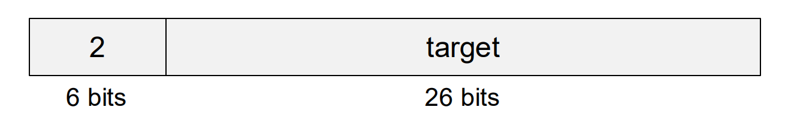
- 2 = opcode
- target = target address
- $$PC\leftarrow PC'[31:28]\ |\ signed-extend(target) * 4$$
    以Verilog代码表示如下：
    ```verilog
    PC = {PC'[31:28], immediate, 2'b00}
    ```
    > 需要解释的是，由于指令需要按字对齐，target实际上为字长指令，所以应当乘以4以得到实际地址，然后将结果拼接在PC'高4位后。

此外还包含有条件分支语句，用于做出决策。在LC-3等架构中，采用标志位，通过检测标志位方式实现跳转。

MIPS等实现方式相反。以 `beq` 指令为例。
```asm
beq $s0, $s1, offset
```
该指令通过检查两个寄存器值是否相等，当相等时则有
```verilog
PC = PC' + {immediate, 2'b00}
```

### 6. Instruction (Processing) Cycle
指令处理周期主要由以下6部分组成：
1. 取指
2. 译码
3. 计算地址
4. 取操作数
5. 执行
6. 存储结果

并非所有指令都要完整经历6个阶段，且并非所有ISA均是如此。

#### (1) 取指
这个阶段从内存中获取指令并存入IR中。完整描述如下：
1. 将PC值存入MAR，并自增PC的值
2. 访存，将结果返回到MDR寄存器
3. 将MDR值存入IR中

#### (2) 译码
此阶段解析指令，识别指令类型并确定后续操作。此外，它还会生成后续操作指令，即一组控制信号，用于指令周期后续阶段处理已识别的指令。

#### (3) 计算地址
这个阶段会计算所需访问的内存地址。

#### (4) 取操作数
此阶段会取得处理指令所需的源操作数。

#### (5) 执行
此阶段会执行指令。

#### (6) 存储结果
此阶段将结果写入指定目标位置。当存储结果完成后，新的指令周期就从取指阶段重新开始。

### 7. 操作码（opcode）
可以定义一组大小不等的操作码，因此应当有所权衡取舍：
- 硬件复杂性 & 软件复杂性
- Latency of simple & complex instructions

### 8. 指令格式
#### (1) R-Type in MIPS
R型指令指对寄存器进行运算的指令。
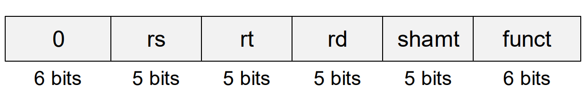
- 0 = opcode
- rs, rt = 源寄存器
- rd = 目标寄存器
- shamt = shift amount (only shift operations)
- funct = operation in R-type instructions

#### (2) I-Type in MIPS
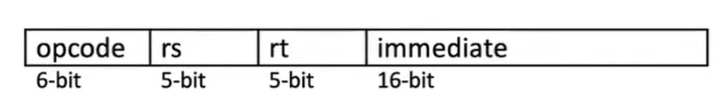

- immediate = 立即数

#### (3) J-Type in MIPS
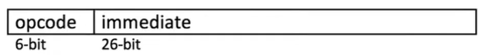

### 9. 数据类型
一种ISA支持一种或多种数据类型。以MIPS为例，其支持如下类型：
- 二进制补码整数
- 无符号整数
- 浮点数

同样，这里应当由权衡取舍。

有更多数据类型的优点：
- 更好地将高级编程结构映射到硬件层面。
- 硬件可以直接处理变成语言中的数据类型 -> 更少的指令数目与更精简的代码体积。

有更多数据类型的缺点：
- 微架构相关设计更多。

### 10. 语义鸿沟
语义鸿沟衡量指令和数据类型与高级编程语言的贴近程度。由此可以得到：
```
复杂指令 + 数据类型 -> 更小的语义鸿沟

建议指令 + 数据类型 -> 更大的语义鸿沟
```
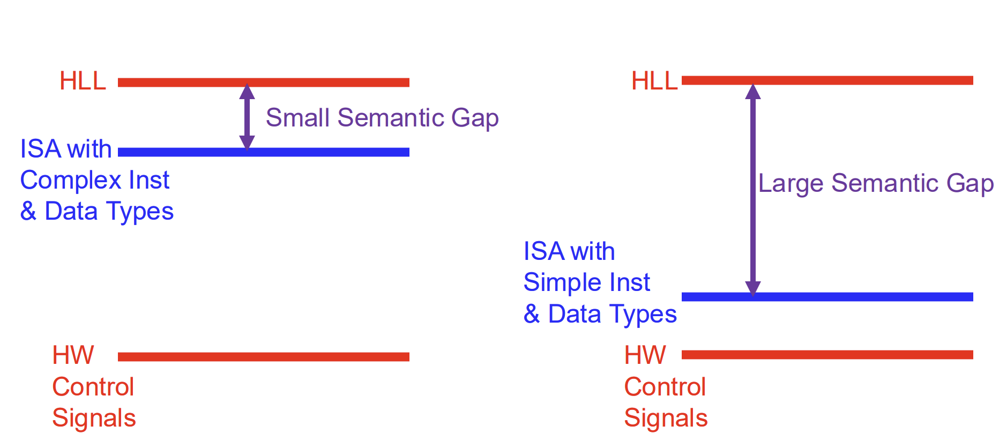

#### (1) Principle: Indirection
可以将一种指令集架构（ISA）转换为另一种不同的“实现”指令集架构（ISA）。其本质是对底层进行抽象，增加一个间接层。
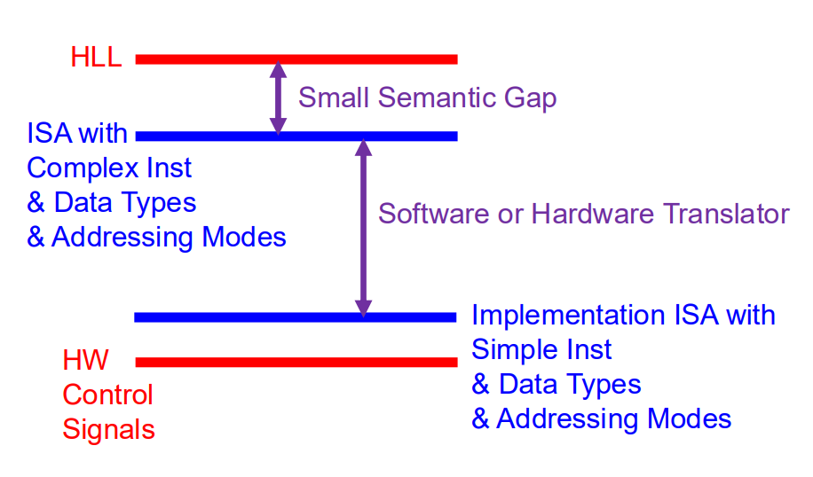

但需要注意的是间接层会带来额外复杂性与功耗。

### 11. 寻址模式
在LC-3架构中，有5种寻址模式：
- 立即数寻址
- 寄存器寻址
- 3种内存寻址模式：
    - 基址+偏移量寻址
    - 间接寻址
    - PC相对寻址

在MIPS种，有伪直接寻址，但没有间接寻址。

#### (1) PC相对寻址
PC相对寻址的地址计算是通过取PC程序计数器（即指令地址），实际为下一条顺序指令的地址。在LC-3体系结构下其计算方法如下：
```
Memory[PC' + signed-extend(PCoffset9)]
```
在LC-3体系结构中，由于PC偏移量位9位，所以其地址跳转范围位-256~255，因此无法访问离指令太远的地址。

#### (2) 间接寻址
间接寻址类似指针，在LC-3体系结构下其地址计算方式如下：
```
Memory[Memory[PC' + signed-extend(PCoffset9)]]
```

#### (3) 基址+偏移量寻址
基址+偏移量寻址在LC-3体系结构下其地址计算方式如下：
```
Memory[BaseR + sign-extend[offset6]]
```

在MIPS中，lw与sw使用基址+偏移量寻址方式。由于MIPS指令较长，其偏移量活立即数可以更大，为16位，符号拓展后为32位。

#### (4) 立即数寻址
立即数寻址在LC-3体系结构中对应加载指令为 `LEA`，其地址计算方式如下：
```
LEA: DR <- PC' + sign-extend(PCoffset9)
```
其本质上是将PC相对地址直接加载到目标寄存器，不经过内存访问。

在MIPS架构下，有 `lui` 指令，将16位立即数加载到寄存器高16位，并将低16位置零。

### 12. 寄存器数量
寄存器数量影响以下两个方面：
- 编码寄存器地址所需二进制位数
- 快速存储器中保存的值的数目
- 寄存器堆的大小、访问时间、功耗

更多的寄存器可以让编译器或汇编器进行更优的寄存器分配优化，减少保存恢复操作，理论上提升性能。但同时导致指令体积增大，进而影响性能。同时使寄存器堆增大，影响功耗与延迟等。

## 三、数据流执行模型
### 1. 指令获取与执行
在数据流模型中，指令按数据流顺序获取与执行。即当它的操作数准备就绪时，输入数据生成后，才获取并执行该指令。因此在这一架构中不存在程序计数器。指令顺序由数据流依赖关系决定，即：
- 每条指令都会指定接收方
- 当所有操作数就位时，指令就会被抓取并执行，即触发。

这意味着可能由大量指令会同时触发。

### 2. 数据流执行模型 vs 冯诺依曼模型
以下列代码为例：
```C
v = a + b;
w = b * 2;
x = v - w;
y = v + w;
z = x * y;
```
在冯诺依曼模型中为顺序执行，如代码所展示的那样。

而其表示为Data Flow模型如下图所示。
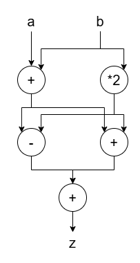

## 四、微架构
### 1. 微架构定义
微架构指底层硬件实际执行指令的具体实现方式。微架构可以任意顺序执行指令，只需展示结果时遵守ISA规定语义即可。

### 2. 冯诺依曼模型
当今所有主流ISA均采用冯诺依曼模型。

微架构层面执行的模型与冯诺依曼模型截然不同。微架构往往采用如流水线指令执行，多指令并行，采用乱序执行，且指令存储器与数据存储器分离。

**==但微架构层面的不同设计不会暴露给软件层面。==** 其执行结果依旧遵循ISA要求

### 3. ISA vs Microarchitecture
1. ISA
    软件与硬件达成共识的交互规范。
2. Microarchitecture
    指令集架构具体实现方式，对软件不可见。
3. Microprocessor
    通常包含指令集架构、微架构和电路设计。

### 4. Single-cycle vs Multi-cycle machines

单周期与多周期机在微架构层面均实现冯诺依曼体系结构语义。

1. Single-cycle machines
每条指令占用一个时钟周期，所有状态更新均在状态结束时进行。但能实现的最慢指令决定了周期时间。

2. Multi-cycle machines
将指令分解为多个周期或阶段，在指令执行器件可以进行状态更新，但架构状态的更新时在指令执行结束时进行的。时钟周期由**最慢阶段**决定。实际上每个阶段都可能需要多个时钟周期来完成。

### 5. 指令处理引擎
其主要由两个部分组成：
1. 数据通路：由处理和转换数据信号的硬件元件组成。
    - 对数据进行操作的功能单元
    - 用于实现数据在功能单元间流动的硬件结构
    - 存储数据的存储单元
2. 控制逻辑：指挥数据通路各组件如何处理数据。

在单周期机器中，必须在同一个时钟周期内生成控制信号和数据信号的操作，所以控制信号的生成会存在一定延迟。

在多周期机器中，可以在当前周期内生成下一个周期所需要的控制信号，从而避免控制和数据处理形成串行瓶颈。这种设计能提升并行性，因为可以让控制处理的延迟、控制信号的生成与数据路径操作重叠执行。

### 6. 性能分析
**单条指令执行时间**是作为性能分析的一个重要指标。
```
{CPI} * {clock cycle time}
```
==CPI== : Cycles Per Instruction

程序执行时间位所有指令执行时间之和。

1. 单周期微架构性能表现
    CPI = 1
    Clock cycle time = long
2. 多周期微架构性能表现
    CPI = 不同指令CPI不同，且平均CPI较小
    Clock cycle time = short

### 7. 单周期微架构（基于MIPS）
#### (1) 数据与控制输入
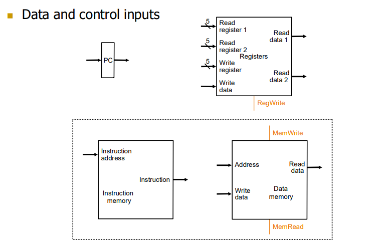

为确保操作能在一个周期内完成，做以下假设：。
1. 内存与寄存器堆都是单周期的
2. 读取数据端口的组合逻辑输出内存内容和对应输入地址的组合函数。
3. 同步写入，目标地址会在时钟上升沿且写使能信号有效时更新。

#### (2) 指令处理
在单周期微架构中指令处理由五个步骤组成：
1. 从寄存器中取出指令（Instruction fetch, **IF**）
2. 读寄存器并译码指令（Instruction decode and register operand fetch, **ID/RF**）
3. 执行操作或计算地址（Execute/Evaluate memory address, **EX/AG**）
4. 访问存储器操作数（Memory operand fetch, **MEM**）
5. 存储/写回结果（Store/writeback result, **WB**）

#### (3) 算数和逻辑指令单周期数据通路
由于算数与逻辑指令多为R型与I型指令，因此先考虑R型指令格式，其格式如下：


考虑数据通路，具体如下：

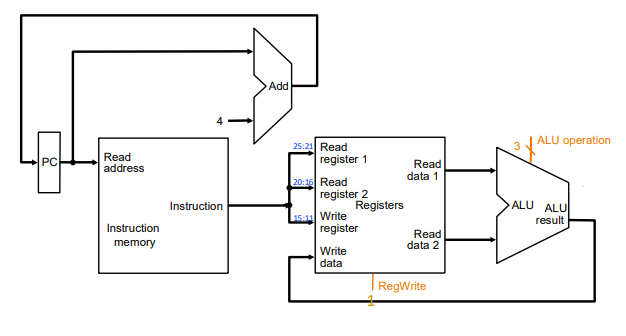
其中，ALU所执行的运算类型由 `funct` 决定。

接下来考虑I型指令。其格式如下：


其操作类似，但是应当注意立即数的处理部分。为处理立即数，应当添加符号拓展模块，此外，为保证数据正常流通，应当加入数据选择器。其数据通路如下：

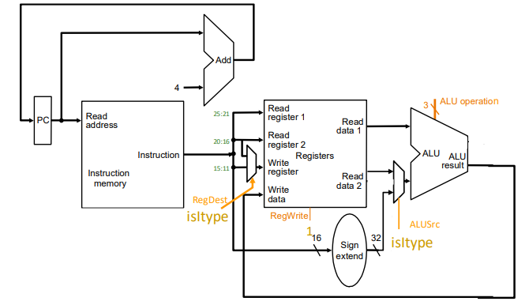

#### (4) 数据移动指令单周期数据通路
对于数据移动指令多为I型指令，格式如下：


考虑load指令，如 `lw`，与store指令，如 `sw`，则由如下数据通路：

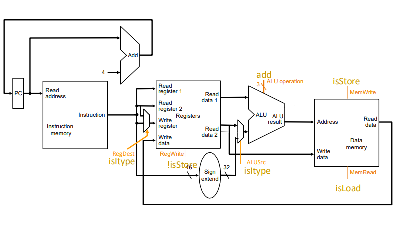

然而考虑算数和逻辑指令，为同时支持二者，需要在电路中添加MUX。

#### (5) 控制流令单周期数据通路
控制流指令为J型指令与I型指令。对于无条件跳转，其为J型指令，格式如下：


对于J型指令实现，需要注意的是
```verilog
PC' = PC + 4;
PC = {PC'[31:28], immediate, 2'b00};
```

对于有条件跳转，其为I型指令，格式如下：


#### (6) 完整数据通路与控制逻辑
1. 完整数据通路
    综上所述，完整数据通路如下图所示：
    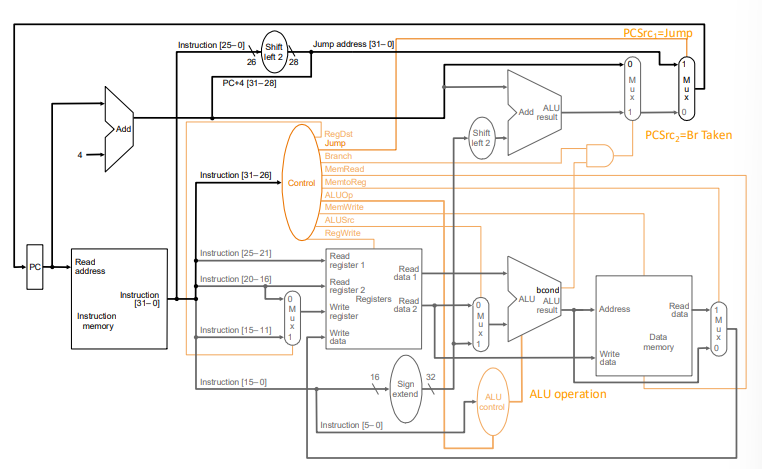

2. 控制逻辑
    对于控制逻辑，其中一种就是设计单周期硬连线控制，将其作为指令位的组合逻辑函数，主要参考指令格式，并依据opcode产生控制信号。

    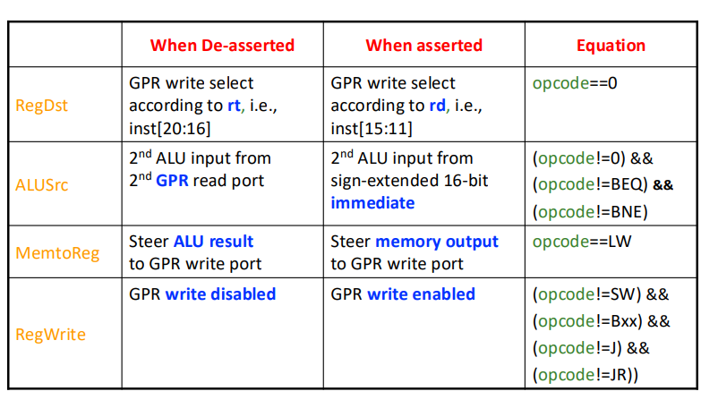

    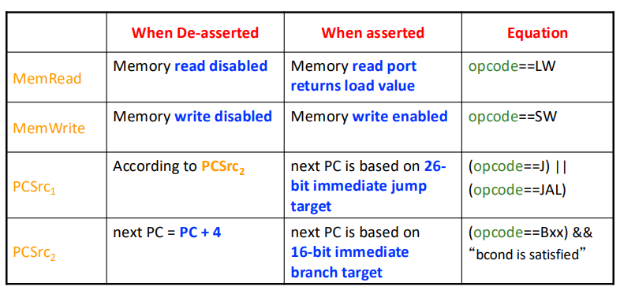

    此外，可以使用存储这些位的内存结构，基于操作码的内存结构，索引访问内存，而控制存储器会提供所有控制位。

    两种控制信号生成方式均可被采用，现有处理器会同时使用两种控制结构，最终选择取决于结构的延迟时间以及关键路径上控制信号所占比重。

### 8. 单周期微架构评估
其CPI = 1，但始终周期取决于最慢指令处理所需时间。然而现实中，内存访问很慢，因此使得单周期微架构时钟周期变得过长，无法优化高频指令执行效率。此外，单周期架构受限于自身，对于复杂指令处理非常困难。

### 9. （微）架构设计原则
1. 关键路径设计
    - 理想情况下需要获得高频率，寻找并降低最大组合逻辑延迟
    - 如果路径耗时过长，将其拆分为多个周期处理
2. 常见场景设计原则
    - 应将时间和资源投入到最关键的地方
3. 平衡设计
    - 指令和数据流在硬件组件之间保持平衡
    - 为消除瓶颈而设计：根据工作负载平衡硬件配置

### 10. 系统设计原则
1. **Keep it simple**
2. Keep it low cost

### 11. 多周期微架构（基于MIPS）
1. 目标：
    **让每条指令仅占用其实际需要的时间。**
2. 方式：
    - 时钟周期时间与指令处理时间相互独立
    - 每条指令按需占用多个时钟周期
3. 缺陷
    - 并发性限制
    - 每个时钟周期结束需要存储中间结果

#### (1) 多周期微架构实现
多周期微架构实现其核心思想为讲指令处理步骤视为一个状态机，且状态序列最终会回到取指令状态。

一个状态的确定取决于该状态下激活的控制信号，而下一状态的控制信号由现有状态决定。

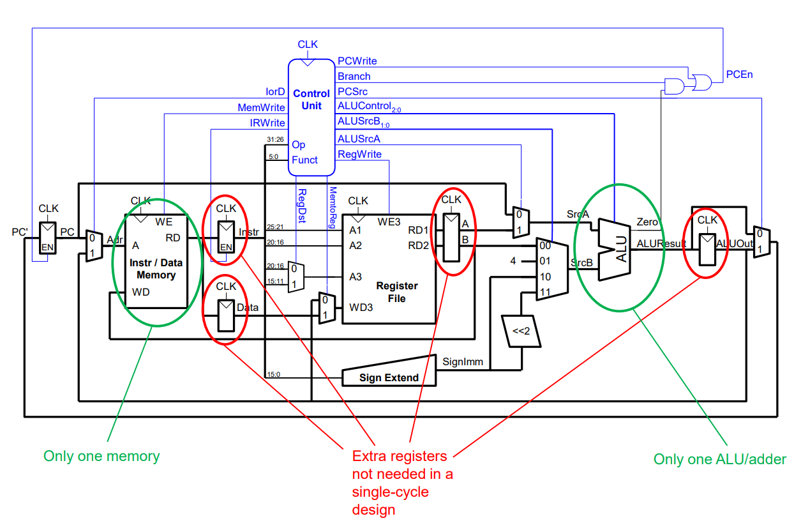

#### (2) 多周期控制逻辑
控制逻辑本质上是要构建一个有限状态机。

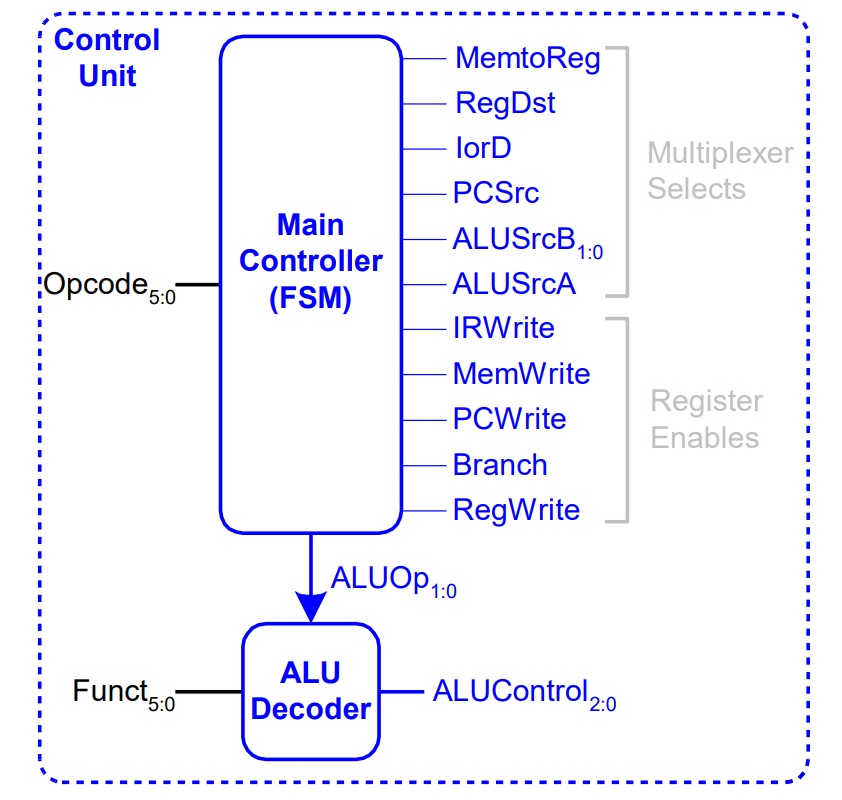

通过不同状态设置不同控制信号实现控制逻辑。

对于内存读写等需要多周期的操作，需要在读写过程中保持在当前状态不发生状态跳转。此时内存需要想控制逻辑提供若干位信号用于决定下一个状态。

### 12. 流水线技术
#### (1) 流水线技术基础理论
其核心思想是，当某条指令在占用某个处理阶段资源时，同时利用该指令未占用的闲置资源来处理其他指令，从而提高并发性。

通过讲指令处理周期分为不同的处理阶段，并确保由足够多的硬件资源在每隔阶段处理一条指令，完成该阶段所有操作，并在每隔阶段处理不同的指令。

流水线所带来的好处是提高了指令处理的吞吐量，从而降低CPI。但流水线也必然导致更多的硬件。

#### (2) 理想流水线 vs 实际流水线
流水线核心目标是用最小成本提升吞吐量。

理想情况下，应当多次重复相同的操作，各个操作之间彼此独立，且能将操作均匀划分为子操作。理想情况下，对一个操作分为平均k步，则吞吐量 `Tput = k/T`。

然而在实际流水线中，由于寄存器延时S，即使平均分为k步，吞吐量为 `Tput = 1/(T/k+S)`。此外由于处理粒度的存在，实际上不可能真正做到平均分配。

此外，考虑成本情况下，假设流水线分配后不改变组合逻辑成本，令其为R，但对于寄存器，假设其成本为R，则总成本增长为 `Cost = G + Rk`。寄存器本质上增加了硬件成本，对于多级流水线，寄存器成本将占据主导。

#### (3) 流水线技术指令处理流程
通过划分单周期微架构为多个操作，从而实现流水线。此处采用五级流水线进行实现。

1. 从寄存器中取出指令（Instruction fetch, **IF**）
2. 读寄存器并译码指令（Instruction decode and register operand fetch, **ID/RF**）
3. 执行操作或计算地址（Execute/Evaluate memory address, **EX/AG**）
4. 访问存储器操作数（Memory operand fetch）
5. 存储/写回结果（Store/writeback result, **WB**）

采用流水线设计时，所有流水线阶段都需要一个时钟周期，所以流水线的时钟周期必须足够长以满足最慢的操作。

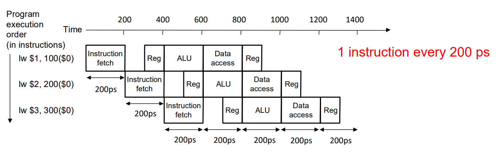

#### (5) 流水线寄存器
为存储中间结果并达成并行需求，需要在不同操作间添加流水线寄存器以存储。后续所有要用到的寄存器值，都应保存在流水线寄存器中。**应当确保所有资源都不会同时被多个阶段同时使用。**

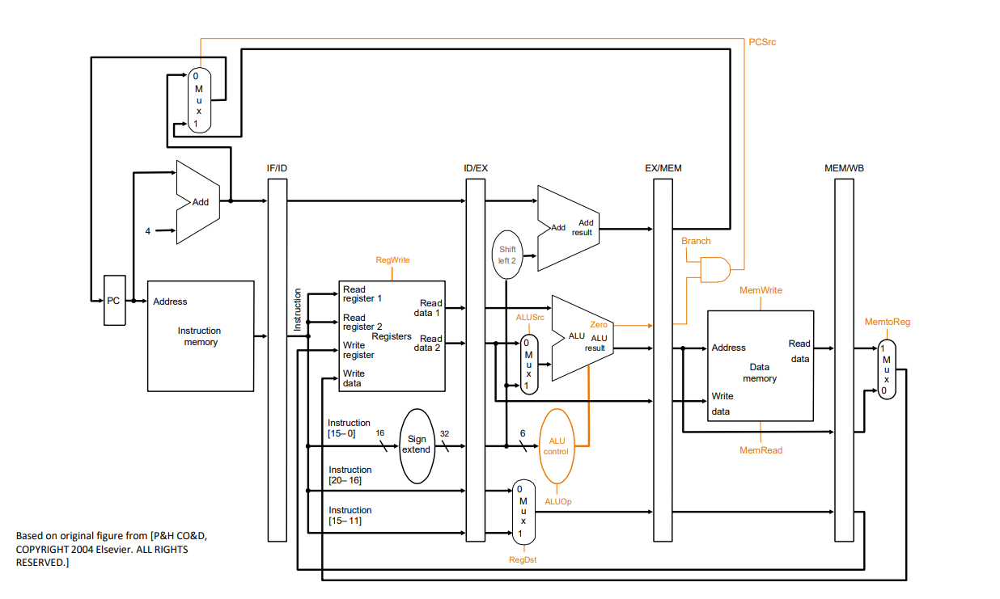

#### (6) 流水线控制点
流水线控制点设置基本采用单周期设计，保持完全相同的控制点设置。但流水线中不会同时使用所有控制信号，在流水线中，控制信号会根据阶段在不同周期被激活。因此存在以下两种选择：
1. 进行一次译码，采用与单周期处理器相同的逻辑，然后将信号缓存直到被使用。
2. 携带部分未解码指令，在后续阶段在本地完成译码。

#### (7) 流水线设计问题
由于不同的指令所需要的阶段不同，不同流水线阶段具有不同的延迟（多周期），**且指令之间可能存在依赖关系**，因此流水线往往不是理想化的。

在出现干扰流水线的事件时，应当确保流水线保持正确、畅通且满载，需要注意以下问题：
- 依赖关系：
    1. 数据
    2. 控制
- 处理资源竞争
- 处理高延迟（多周期）操作

此外流水线中应当包含异常处理与中断的处理。

#### (8) 流水线停顿
停顿指流水线停止前进的状态。引起流水线停滞主要有以下三个因素：
1. 资源竞争
2. 指令间依赖：
    - 数据依赖（冒险）
    - 控制依赖（冒险）
3. 长延迟（多周期）操作

#### (9) 依赖及其处理
依赖又称为冒险（hazard），主要有两种类型，依次为数据依赖（冒险）与控制依赖（冒险）。

有时将资源竞争称为资源依赖（冒险）。

##### [1] 资源冒险
资源冒险发生于两个流水线依赖需要相同硬件资源。

一种解决方案是复制该资源并提高吞吐量。另一种是检测资源争用，并暂停其中一个争用阶段，这一方案的关键在于暂停阶段的选择。

如果观察流水线，RF与WB阶段似乎存在资源竞争，但通过仔细设计，寄存器堆可以在同一周期同时读出和写入：
- 写操作发生于第一个半周期
- 读操作发生于第二个半周期
- 读/写寄存器完成仅需半周期

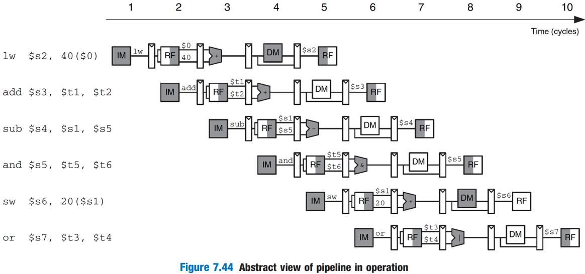

##### [2] 数据冒险
###### 1) 数据冒险分类
数据冒险主要分为三类：
1. Flow dependence (真正数据冒险，先写后读)
2. Anti dependence (先读后写)
3. Output dependence (先读后写)

对于以上三种数据冒险，都需要确保程序的语义正确。必须始终遵守流依赖关系，因为它们构成了对值的真实依赖。反向依赖和输出依赖存在是由于架构寄存器数量有限。

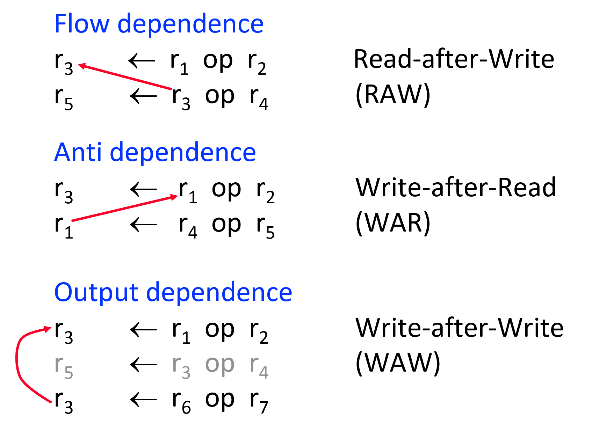

WAR 与 WAW 主要出现在乱序执行过程中，对于经典流水线不会出现问题。

Anti dependence和Output dependence较易解决，只需按照程序顺序且仅在最后阶段写回目的寄存器。

###### 2) 数据冒险基本解决方案
对于flow dependence，总共有六种基本解决方法：
1. 检测并等待寄存器堆中出现有效值。此时会发生流水线停顿，并产生气泡。
2. 检测指令并前递/旁路数据至依赖指令。
3. 在软件层面上检测并消除依赖关系。
4. 检测并将其移开，以便执行独立指令。
5. 预测所需值，进行“推测性”执行，并进行验证。
6. 细粒度多线程

###### 3) 数据冒险检测
互锁（Interlocking）：在流水线处理器中检测指令间的数据依赖，从而保证指令能够正确执行的一种机制。

互锁存在两种机制，分别为基于软件互锁与基于硬件互锁。

为检测数据冒险，引入记分牌机制（Scoreboarding）：
- 在寄存器堆中的每一个寄存器关联一个有效位。
- 当处于译码阶段的指令会检查他所有的源寄存器目标是否有效：
    - 有效：不需要停顿，说明不存在依赖。
    - 无效：需要让该指令停顿。

这一机制优势是实现简单，只需为每一个寄存器提供一个1 bit寄存器。然而劣势是需要存储所有类型冒险，不仅仅是flow dependence。

此外，可以通过组合依赖检查逻辑，其会检查在流水线后续阶段中的某条指令，是否将要写入当前正在译码的指令的某个源寄存器。其优势是无需因为 anti 与 output dependence 而产生停顿。但其逻辑相较计分板机制更为复杂，且随着流水线变得更深、以及处理器能够同时执行更多指令（更宽），相关的控制逻辑也会变得更加复杂，如后续超标量执行。

注意到在通信的数据值可用之前，可以检测到两条指令之间的依赖关系，因此可以产生多种解决方案以下为两种方案：
1. 立刻停顿冒险指令
2. 仅在必要时停顿冒险指令，通过数据前递/旁路解决数据冒险

###### 4) 数据前递/旁路
部分数据冒险情况中，如以下指令：
```asm
add $s0, $1s2, $s3
and $t0, $s0, $s1
```
冒险指令所需要数据可以直接从流水线中更后面的阶段提供，而不必只能从寄存器堆中读取。

因此可以添加额外依赖判断逻辑与数据前递路径，使产生有效值后立刻提将该值供给冒险指令。

其优势是冒险指令可以继续在流水线中向前推进，知道需要该值的阶段再获取数，从而减少流水线停顿。

###### 5) 数据冒险具体解决方案概念与实现
1. 停顿
    为实现流水线停顿，禁用 PC 和 IF/ID 锁存，确保卡住的指令保持在其当前阶段。

    在发生停滞的指令之后的执行阶段中插入“无效”指令/空指令（称为“气泡”）

    此外也可以选择插入足够的非依赖指令，以确保依赖指令所需数据在依赖指令执行时有效。这一优化往往发生在编译器层面。

2. 数据前递
    数据前递策略为一旦值可用，立即将其传递给依赖指令。这一策略类似数据流架构思路。数据前递使流水线更贴近数据流执行原则。

    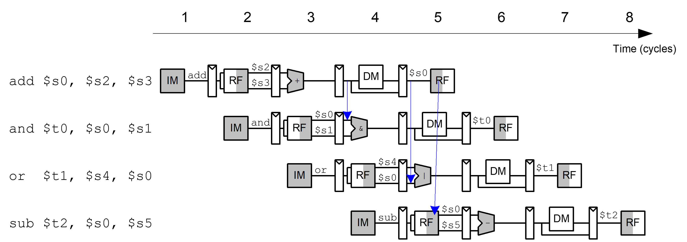

    具体电路实现如下：

    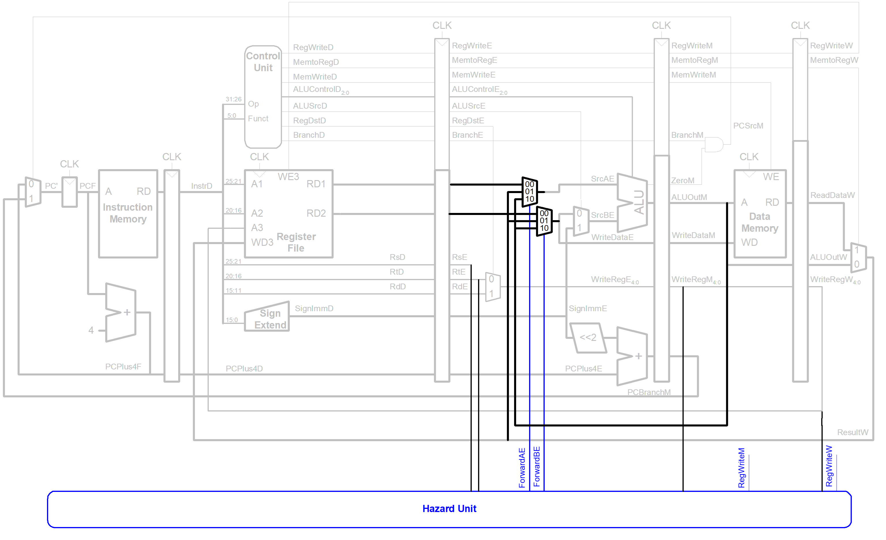

    但需要注意的时并非所有情况下都可以使用数据前递。例如如下所示：
    ```asm
    lw $s0, 40($s0)
    and $t0, $s0, $s1
    ```
    其图形化表示如下所示：

    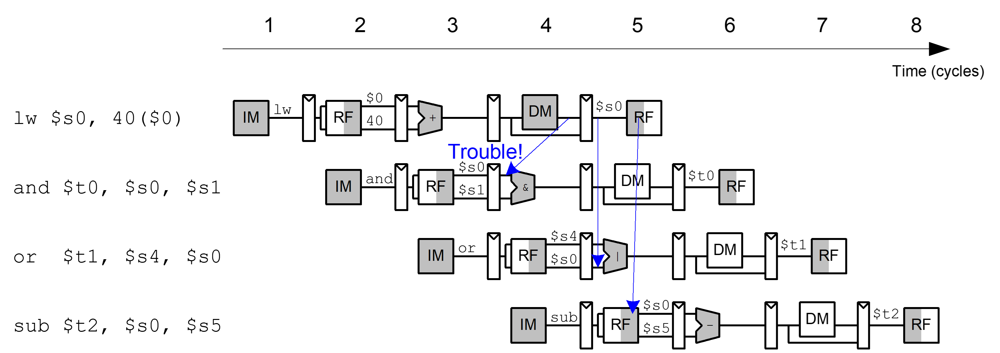

    此时 `lw` 指令直到 MEM 阶段结束才完成数据读取，其数据有效。

    如果强行进行数据前递，则必然增加关键路径长度，违反基本设计原则。因此对于类似情况，应当选择停顿以解决。

基于以上论述，停顿与前递完整电路如下图所示：

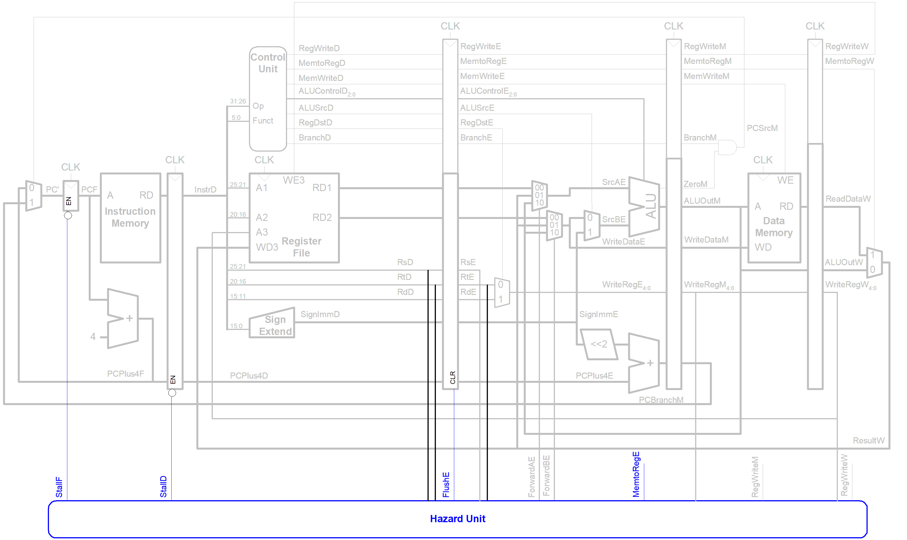

因此当 `lw` 指令引起停顿时：
- StallD与StallIF被置高，使IF/ID流水线寄存器的值保留。
- FlushE置高，清空ID/EXE流水线寄存器，从而引入一个气泡。

##### [3] 控制冒险
如果考虑控制流指令如指令 `j` 与指令 `beq`，会发现程序并不总是顺序执行的。事实上，我们应当考虑如何判断当前所取的指令是否为控制流指令。

###### 1) 分支预测
以 `beq` 为例：
- 条件分支直到流水线第四阶段才完成解析。
- 在分支解析之前，PC会先获取分支后的指令。这即分支预测简单示例：
    - 总是预测应当选取下一条顺序指令执行。
    - 这一预测策略称为“始终预测为不跳转”预测策略
    - 如果分支被执行，则清除（无效化）“未执行路径”的指令
- 分支预测错误代价
    - 当分支预测错误时，流水线中需要被清除的指令的数量。
    - 优化方法：如果能够更早地确定分支是否发生，就可以减少需要清除的指令数量，这一方法称为**提前分支判定**。

具体图例如下图所示，其分支预测错误代价为3条指令：
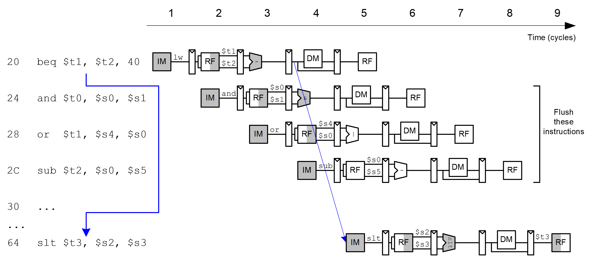

为减少分支预测错误代价，以下为流水线提前分支预测电路图：
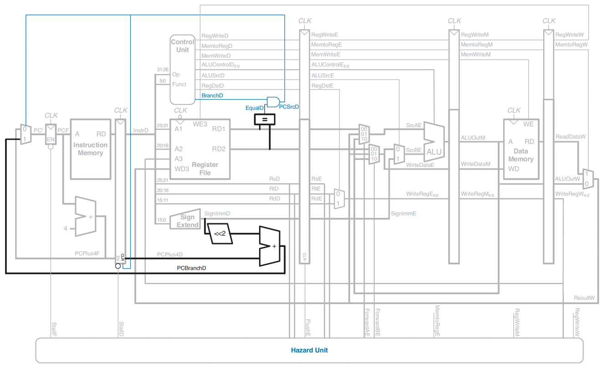

通过这一电路设计，其分支预测错误代价为1条指令。

这一电路设计优势在于减少分支预测错误代价，进而减小CPI (cycles per instruction)。然而其代价是潜在增大了时钟周期，且增加额外硬件，且大概率无法被其他指令复用。

此外，为保证运算寄存器值的正确性，应当考虑前文所述数据冒险，进行数据前递或停顿，具体电路如下所示。

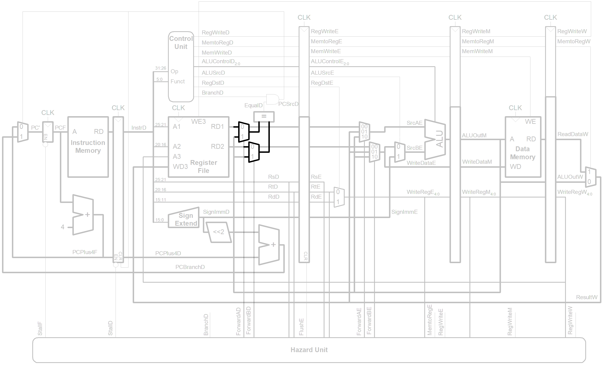

因此，综合以上所有因素，完整电路图如下图所示：

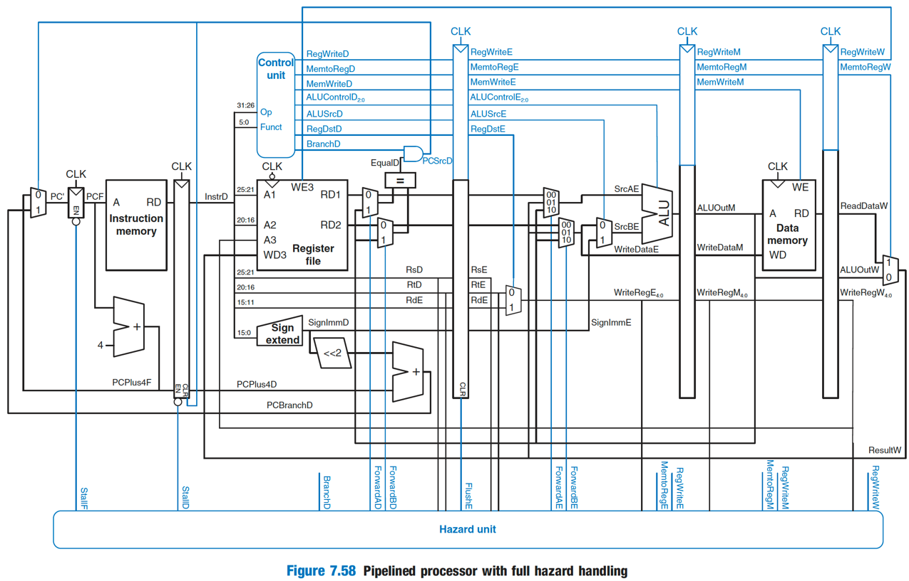

###### 2) 更智能的分支预测
可以进行猜测分支是否会被执行，主要基于以下两种方案：
- 通常会选择向后分支（循环会迭代多次）
- 记录分支是否曾被选择的历史信息可以提高预测的准确性

#### (10) 多周期处理
在流水线执行阶段，并非所有指令耗时相同的系统是可行的，因为可以通过将指令分发到多个不同的功能单元。

通过这种方式，可以在前一条长延迟指令完成执行之前，让独立指令在其他功能单元上开始执行。

然而这一行为带来如何仲裁结果写入的问题。例如，对于长延迟指令如乘法指令，假设需要四个时钟周期完成，在这一指令执行期间执行下一条指令，假设为加法指令，假设仅仅需要一个时钟周期，则加法指令执行完成，将结果写回寄存器堆时，乘法指令并未完成，此时违反冯诺依曼模型顺序指令的语义，应当针对类似情况做出额外设计。

这一原则需要严格遵守的核心原因是异常处理机制的存在。

### 13. 异常与中断
异常与中断本质上都是程序执行中的意外中断。

对于程序内部执行问题称为**异常**，例如溢出引发的异常。而发生外部突发事件需要处理器进行处理，这些称为**中断**。

二者触发机制不同，但都需要停止当前程序的运行，并将架构状态保存以确保数据不会丢失。最后需要转移状态或切换到其他控制流程，进行异常/中断处理。

二者处理时机也有所不同。异常在被检测到且确认时非推测性时处理，而中断则可以在方便的时候处理，具体何时处理取决于中断优先级。

且异常是在进程上下文中处理的，所以可以使用try-catch捕获异常，并修复异常处理中的特殊情况。而中断处理的上下文是整个系统，主要由操作系统处理。

#### (1) 精确异常/中断
为遵循冯诺依曼模型顺序语义，当异常与中断准备被处理时，由PC、内存和寄存器组成的架构状态必须保持一致或精确。

因此，当某条指令引发异常时，程序顺序中所有先前的指令都必须完全执行完毕（retired）。而后续指令不应该被retired，也就是不能更新架构状态。

退休 (retire / commit) 指完成执行并更新架构状态。

#### (2) 检测与处理流水线异常
当最旧的指令准备退休并被检测出引发了异常时，控制逻辑将完成：
1. 确保架构状态精确
2. 清空流水线中所有后续指令
3. 按照ISA规定保存PC与寄存器
4. 控制逻辑将取指引擎重定向到相应的异常或中断处理例程

由此可以看出，采用精确异常一方面源于冯诺依曼模型规定，另一方面是为方便定位异常发生位置，便于软件调试。此外，这一架构可以轻松实现异常恢复、重启进程。

### 14. 确保精确异常/中断
为了确保精确异常/中断，在多周期处理的流水线中，应当防止前文所述问题的出现。问题解决方案由以下几种：
1. 使每次EXE阶段占用周期数相同
    这确实解决了问题，但显然这会导致快速指令和最慢的指令耗时相同。
2. 重排序缓冲区

#### (1) 重排序缓冲区 (reorder buffer)
其核心理念是乱序执行完整指令，但在将结果更新到架构状态前重新排序。

在硬件层面，其通过环形队列实现。

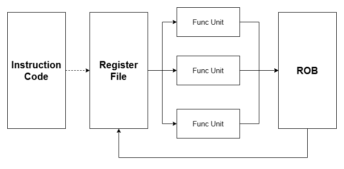

- 当指令被解码时，会在重排序缓冲区中预留下一个顺序条目。
- 当指令执行完毕，它会将结果写入重排序缓冲区对应条目。
- 当某条指令时重排序缓冲区中最老的指令时，且它已无异常地完成执行，控制逻辑就会将该指令结果从ROB移入寄存器堆。

数据在ROB中存储格式如下图所示。


因此为实现ROB，需要以下条件：
- 所有必要信息来正确地将指令按顺序重新排序。
- 如果指令能无异常退休，则就在它成为机器种最旧指令时，用指令结果更新架构状态。
- 如果指令退休前需要处理异常或终端，就精确处理异常中断。

然而后续指令需要重排序缓冲区值的情况未被考虑在内。显然可以选择停顿流水线，但更好的选择显然是直接从ROB种读取数值。

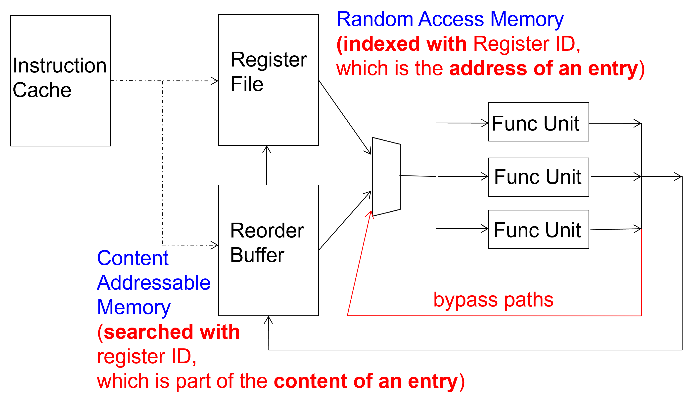

寄存器堆是通过寄存器ID进行索引的，该ID就是条目的地址，实际对应硬件为RAM。此处假设RAM采用记分牌机制。

ROB组织结构不同，是按照程序顺序排列的指令序列，实际对应硬件为内容可寻址存储器。它需要寄存器ID进行**搜寻**，而寄存器ID则是作为条目**内容**的一部分。

因此当处理冒险，查找ROB时，都需要和目标寄存器ID字段进行比较器匹配，且必须确保条目与数值有效，并且是这条指令前对该寄存器的**最新定义**。基于此进而可以实现寄存器重命名。

#### (2) 简化ROB
显然ROB访问极其消耗硬件资源，需要进行简化，因此引入定向访问。
- 首先访问寄存器堆
    - 如果寄存器无效，则寄存器中会存储ROB的ID，该缓冲项包含或将包含该寄存器的值。
    - **寄存器与重排序缓冲区条目的映射**：当有正在执行的指令正在写入该寄存器时，寄存器文件会将该寄存器映射到重排序缓冲区的一个条目上。因此寄存器堆文件应当包含tag，其中tag在寄存器值无效时存储对应缓存块ID。
- 其次访问ROB

#### (3) 寄存器通过重排序缓冲区重命名
Output和anti dependence并非真正的依赖，他们之所以存在源于ISA中寄存器ID的不足。

其解决方案是将寄存器ID重命名为ROB条目，该条目将保存寄存器值，最终生成该寄存器的位置。
- 寄存器ID -> ROB条目ID
- 架构寄存器ID -> 物理寄存器ID
- 完成重命名后，使用重排序缓冲区条目ID来引用寄存器。

#### (4) Traddeoff
1. 优势：
   - 在概念上简单，便于支持精确的异常处理;
   - 可消除虚假依赖;
2. 劣势：
    - 需要访问重排序缓冲区才能获取尚未写入寄存器文件的结果;
    - 增加硬件复杂度

### 15. 乱序执行（动态指令调度）
考察下列指令：
```asm
MUL $3, $1, $2
ADD $3, $3, $1
ADD $4, $6, $7
MUL $5, $6, $8
ADD $7, $9, $9
```
由于源寄存器不可用，所以加法指令无法派发而产生停顿。然而这也导致后续独立指令也无法派发。

#### (1) 避免调度停顿
为避免调度停顿，采用乱序派发方式进行。参考数据流结构，实际实现乱序派发方式即在控制流机器内部构建数据流引擎。

此外，可以在编译阶段将指令重新排序，或进行数值预测，或采用细粒度多线程，从而避免停顿发生。

#### (2) 乱序执行 (OoO)
乱序执行核心思想在于将未就绪的指令从独立指令路径中移开，本质上是增加硬件缓冲区。

在等待区，指令会持续检测源数值的状态，当指令所有源数据值有效是，会触发给执行单元。

这样做最大的好处是能容忍延迟，当某条指令耗时较长时，并不会导致流水线停滞，独立指令可以继续执行并完成。

#### (3) 乱序执行条件
1. 确保遵守正确的数据值语义，即数值使用者必须与生产者建立关联。
    - 寄存器重命名：寄存器ID将被替换为ROB ID或**保留站条目ID**。
2. 设置指令缓冲区直到他们准备好执行。
    - 通过保留站实现
3. 当指令被缓冲时，它们需要跟踪源数值的准备状态。
    - 产生数值的指令在数值生成时广播一个标签或寄存器名称。
    - 等待该标签的指令会将其源标签与广播标签进行比对，当标签匹配，则源数值变为就绪状态。
4. 当一条指令所有源数值准备就绪时，需要将指令分派到功能单元 (**FU**)。
    - 当所有源准备就绪，指令被唤醒。
    - 当多条指令被唤醒，需要选择一条指令送入FU。

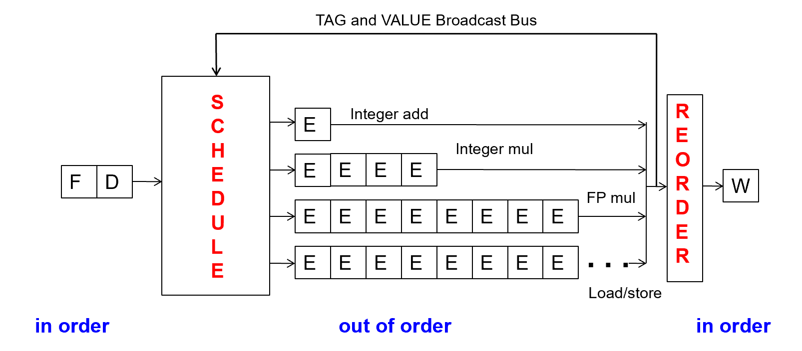

OoO有以下两个关键部分：
- 保留站RS（即调度窗口）
    - 包含有效位，tag以及value
- ROB

在上述过程中，广播标签，捕获数据，唤醒指令显然会成为关键路径。应当尝试使用流水线与预测技术加以缩短。

#### (4) 精确异常处理的乱序执行
使用重排序缓冲区在指令提交到架构状态前进行重排序。

指令完成执行时会更新寄存器别名表（**前端寄存器堆**），该寄存器堆中包含寄存器有效位，寄存器Tag，以及寄存器值。当指令退休时，它会更新另一个架构寄存器堆。**换言之，架构寄存器堆总是按照程序顺序更新。**

发生异常时，将清空流水线，将架构寄存器堆复制到前端寄存器堆中。

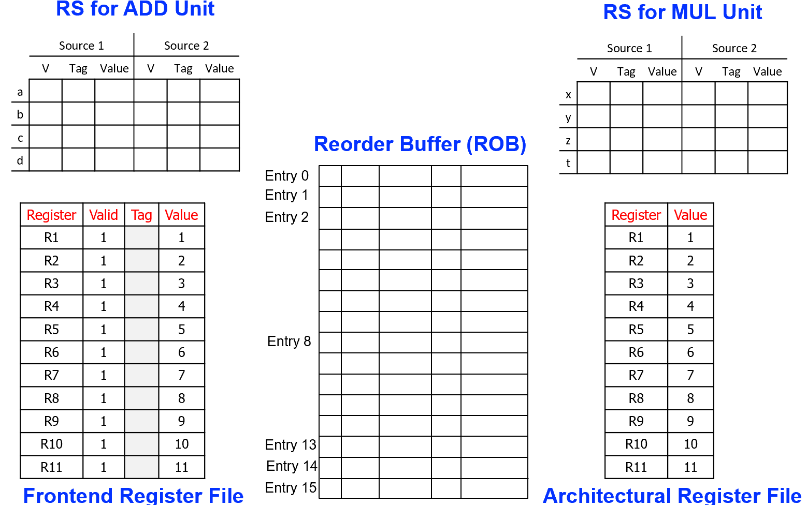

然而上述寄存器堆中显然Value被大量复制，结构规模相对较大，较为浪费空间。因此可以选择将数值整合到物理寄存器堆中，进行value集中管理，其他部分保存对应指针。

因此具有精确异常的现代乱序执行架构采用以下架构：
- ROB以支持指令按序提交。
- 采用单一物理寄存器堆存储所有寄存器
    - 包括推测寄存器和架构寄存器
    - 整型和浮点型寄存器仍然保持分离
- 两个寄存器映射表存储指向物理寄存器堆的指针
    - 前端寄存器映射表：重命名
    - 架构寄存器映射表：维护架构状态或精确状态
- 保留站寄存器
    - 保留站寄存器不再存储具体数值，而是物理寄存器ID
    - 广播传输目标物理寄存器ID

#### (5) 乱序执行内存存储与取出
寄存器与内存有以下根本性区别：
- 寄存器依赖是静态可知的，但对于内存操作需要执行指令才能获取地址，因此无法预知指令所指向的内存地址。
- 寄存器状态所占空间极小，而内存状态所占空间大。
- 寄存器状态对于其他线程/处理器不可见，而内存状态在线程/处理器间共享。

##### [1] 内存依赖处理
在乱序执行机器上运行指令时，还必须正确处理内存依赖关系。

由于内存地址直到加载/存储指令执行时才能确定，因此会带来以下问题：
- 内存地址难以重命名。
- 判断加载和存储操作的依赖关系必须在它们部分执行后进行。
- 当一条 **加载/存储** 指令地址准备就绪时，可能存在地址未知的更 **老/新** 的 **存储/加载** 指令在系统中。

对于加载指令地址就绪时，存在更老的存储指令地址未知，这一问题称为**未知地址**问题。

为解决这一问题，采用的策略是如果加载指令依赖于任何未知地址的存储指令，可以用更复杂的预测其进行预测。

##### [2] 存储与加载间数据前递
对于加载指令，如果其依赖于存储指令，则需要进行依赖判断，当依赖存在时则需要进行前递。为此需要特殊结构，称为 **加载队列（LQ）** 与 **存储队列（SQ）**。

当加载指令得到其地址时，搜索SQ判断是否存在依赖的存储操作。当存储指令得到其地址时，搜索LQ查看是否有依赖它的指令。

因此当存储指令完成执行时，它会将其地址与数据写入SQ条目中。

当后续加载指令产生地址时，它将：
- 用其地址搜索SQ
- 使用地址访问内存
- 从写入该地址的最早的较旧指令中获取值（该指令来自 ROB 或内存）

上述过程需要额外逻辑称为**存储到加载转发逻辑**。需要注意的是，由于存储与加载指令都有大小范围，因此比较过程应该比较范围是否有重叠，这显然使比较逻辑更加复杂。

#### (6) 乱序执行优劣
- 优点
    - 延迟容忍度：允许独立指令在存在高延迟操作的情况下执行并完成
    - 不规则并行：动态查找并利用程序中的并行操作
- 缺点
    - 高复杂度
    - 更多的硬件资源

### 16. 超标量执行
N路超标量指每个周期能获取、解码、执行和提交N条指令。因此需要由硬件来执行并发获取指令间的依赖检查。

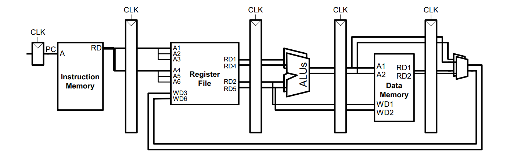

对于超标量执行，其对于冒险的处理与标量处理基本相同。

超标量处理提供了更高的吞吐量与IPC。但由于需要对并发指令进行依赖检查而导致硬件复杂度上升。且在超标量架构中，寄存器重命名会变得更加复杂。最终导致形成关键路径，导致时钟周期变长。

### 17. 分支预测
分支预测核心思想是为了处理系统中的控制依赖问题。

#### (1) 细颗粒度多线程
为解决分支控制问题，一种思路是每个时钟周期都从不同且相互独立的线程获取指令，确保同一线程的指令不会同时在流水线中执行。

因此硬件具有多线程上下文（每个线程都有独立的程序计数器和寄存器组）。线程间彼此独立。在同一线程中，直到前一个分支指令完成之前，不会获取下一条指令。

采用这一策略无需处理线程内的控制和数据依赖关系，且可以实现多线程级吞吐量。但单线程性能可能受到影响，且需要额外逻辑来维护线程上下文。

#### (2) 分支预测
分支预测核心思想时预测下一条取指地址，以便能在下一周期使用。

因此分支预测需要在取指阶段预测三个要素：
1. 判断当前取指是否为分支指令
2. 确定分支方向（主要为条件分支）
3. 预测分支目标地址

观察发现目标地址在动态实例间保持不变。因此可以存储之前实例的目标地址，并通过PC进行访问，即分支目标缓冲器（BTB）。

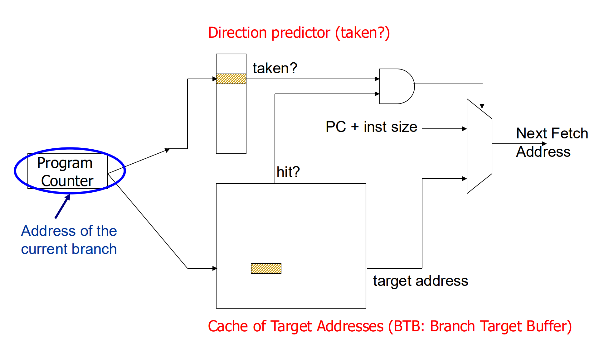

#### (3) 静态分支预测
静态分支预测通过编译时进行预测。

1. 假设分支不发生
    此类分支预测总是预测程序按顺序执行，但准确率较低。

2. 假设分支总是发生
    与假设分支不发生相反，总是预测分支法案生跳转，在条件分支中，正确率相对于总是假设不发生有所提高。不存在跳转方向预测。

3. 向后分支发生，向前分支不发生 (BTFN)
    由于向后跳转往往出现在循环中，因此向后跳转总是预测发生，其他的则总是预测不发生。

4. **Profile-based**
    这一方案核心思路是编译器通过性能分析来确定每个分支的可能方向，并将该方向编码为分支指令格式中的提示位。
    - 好处是可以针对每隔分支单独设置，当性能分析真实反映代码实际执行情况时具有高准确性。
    - 缺陷是需要分支指令格式中包含提示位，且预测准确度取决于输入集代表性。

5. Program-based
    其核心是运用基于程序分析的启发式方法，由编译器静态预测分支方向。例如，总是预测小于等于0分支不会执行，因为这在多数程序中往往代表错误值。或者对于循环，总是预测进入循环的分支会被执行。

6. Programmer-based
    程序员在编写代码时，需要预判分支是否被执行。

所有技术都可以结合使用。为了满足动态特性，可以选择动态编译器持续重编译代码，可以让静态预测更具动态性，但显然会带来额外的性能开销。

#### (4) 动态分支预测
其本质时根据硬件在运行时动态收集的信息预测分支行为。

其优势在于：
1. 可以根据分支执行历史进行预测。
2. 可以适应分支行为的动态变化。
3. 可以完全不需要静态分析。

其劣势在于:
1. 复杂性增加

##### [1] Last Time Predictor
其基本思路是：让分支采取和上次执行时相同的方向。

对于循环分支的最后一次和第一次迭代总会预测错误，其正确率为$\frac{N-2}{N}$。因此这一策略对于大迭代次数循环分支非常有利。

但显而易见的是，如果分支总是于上次行为相反，则这一预测方法就会失效，如：
```
TNTNTNTNTN
```
其预测准确率将会变为0%。

这一策略的实现可以选择将方向预测器于BTB结合，即BTB中额外存储上一次分支指令是否跳转。

##### [2] Two-Bit Counter Based Prediction
传统预测器会过快地在执行和不执行之间切换，即使某个分支多数情况下都是执行或不执行的。

因此未预测器添加**滞后性**，这样预测结果不会因为单个不同结果就改变。因此可以为执行或不执行各设置两个状态，而不是各一个状态。

每个分支关联一个两位计数器，多出的以为提供了滞后性，强预测不会因为单个不同结果就改变。

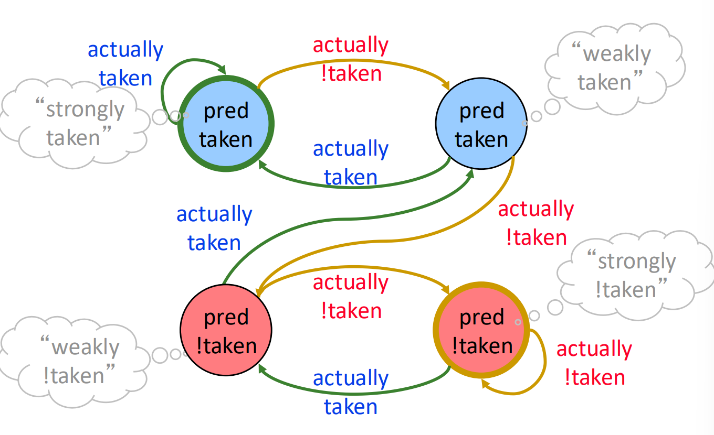

因此强预测不会因为单个不同结果而改变。

因此，对于循环，假设其初始为弱预测执行，则其正确率为$\frac{N-1}{N}$。对于分支总是于上次行为相反，其正确率有所增加，如：
```
TNTNTNTNTN
```
其正确率增加至50%。

##### [3] Two-level Prediction (二级分支预测)
1. 分支结果可以与其他分支结果相关联，这一现象被称为全局分支相关性。
2. 分支结果可能与同一分支历史结果相关，而不仅仅是上一次分支结果，这也被称为局部分支相关性。

###### 1) 全局分支相关性
当执行一系列分支时会产生结果，而最近执行的分支结果，会与下一个分支的结果相关联。如：
```C
if (cond1)
...
if (cond1 && cond2)
```
或是
```C
branchY: if (cond1) a = 2;
branchX: if (a == 0)
```

为汇总全局分支结果信息，可以通过位向量进行信息压缩，称之为全局历史寄存器。它通过0和1记录所有分支的跳转历史轨迹。

