# DDCA笔记
---
本笔记基于ETH-Zurich数字设计与计算机体系结构（DDCA）课程，具体参考该[网站](https://safari.ethz.ch/ddca/spring2025/doku.php?id=start)。未经允许，不得转载。
## 一、冯·诺依曼模型
### 1. 计算机定义
计算机主要由三部分组成：
- 计算单元（Computation）
- 通信单元（Communication）
- 存储与内存单元（Storage/memory）

### 2. 计算机基本组件
- **程序**：指令的集合
- **指令**：程序中最小的工作单元
- **指令集**：计算机被设计为能够执行的所有可能指令。

### 3. 冯诺依曼模型
冯诺依曼模型主要由以下五部分组成：
1. 存储器 Memory：存储程序与数据
2. 处理单元 Processing unit
3. 输入单元 Input
4. 输出单元 Output
5. 控制单元 Control unit
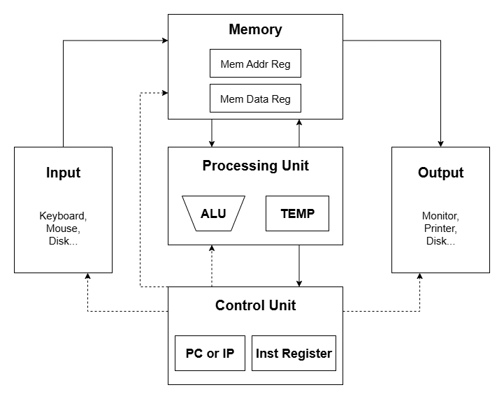

### 4. Memory
#### (1) 基本概念
- Memory同时存储数据与程序，在Memory中二者并无区别。
- Memory包含bits，bits逻辑上可以按照字节与字进行分组。
- 地址空间（Address space）：内存中唯一可识别位置的总数。
#### (2) 内存寻址
- 可寻址性（Addressability）：每个地址能存储数据位数。
    - 字寻址内存：每个**数据字**都有唯一地址。
    - 字节可寻址内存：每个**数据字节**都有唯一地址。
- 大端序 (Big Endian) & 小端序 (Small Endian)：
    - 大端序：字的排序是**最高有效字节**位于较低地址。
    - 小端序：字的排序是**最低有效字节**位于较低地址。
#### (3) 访问内存
通常使用两个寄存器来访问内存：
- Memory Address Register(MAR)
- Memory Data Register(MDR)

对于读操作，通常分为以下两步：
1. 将目标地址载入MAR。
2. 对应存储位置数据通过内存中的电路传输至MDR。

对于写操作，通常分为以下两步：
1. 将目标地址载入MAR，同时将要写入数据存入MDR。
2. 激活写使能信号，使MDR中所存数据写入MAR指定的地址。

### 5. Processing Unit
处理单元用于执行实际运算，可以包含多个功能模块。

#### (1) Arithmetic and Logic Unit (ALU)
算术逻辑单元负责计算与逻辑运算，处理的数据单位称为字（word）。

#### (2) Fast Temporary Storage
- **内存大但速度慢。**
- 计算机提供了一小块存储空间，紧邻ALU。
    - 目的：**存储临时值以便稍后快速访问**。内存访问速度远低于加法、乘法或除法等运算。
- 这种临时存储通常为一组寄存器，称为==寄存器堆（Register File）==。本质为可由指令寻址的小型存储器以存储中间结果。
- 通常一个寄存器存储一个字。

### 6. Control Unit
- 控制单元按步骤有序执行程序中的每一条指令。

- 控制单元通过 **指令寄存器(IR)** 来追踪正在处理的指令，IR存储该指令二进制码。

- 控制单元通过 **程序计数器(PC)** 来追踪下一条执行的指令，该寄存器存储下一条待处理指令的地址。

### 7. 冯诺依曼模型特性
#### (1) 存储程序
指令以线性数组形式存储在内存中，指令和数据共享统一的内存空间。**内存中指令和数据本质上没有区别，存储值的解释取决于控制信号。**

#### (2) 顺序指令处理
一次仅处理一条指令，PC用于标识当前指令，并通过递增实现顺序推进，除了控制转移指令。

## 二、指令集架构（ISA）
### 1. 指令&指令集架构
指令是计算机执行的最基本单元。
- 机器语言：计算机可读的表示形式，由0和1组成。
- 汇编语言：人类可读的表达形式。

指令由两部分组成，操作码（opcode）与操作数（oprands）。这两部分在指令格式或指令编码中明确规定。
- Opcode：规定要执行的操作
- Oprands：指定操作对象

指令集架构为软件指令与硬件之间的接口以及硬件执行的内容。
ISA规定了如下内容：
- 内存组织：
    - 地址空间 (MIPS: $2^{32}$)
    - 可寻址性 (MIPS: 8bits)
- 寄存器集合：
    - 32 registers in MIPS
- 指令集：
    - 操作码
    - 数据类型
    - 寻址模式
    - 指令长度、格式和编码方式

### 2. 指令类型
指令主要分为三种类型：
- **运算指令**：在ALU中执行操作。
- **数据移动指令**：负责内存读写操作。
- **控制流指令**：改变执行顺序。
### 3. 运算指令
以加法指令为例：
```C
a = b + c;
```
其可以写为
```asm
add a, b, c
```
在MIPS架构中，假设寄存器分配如下：
```asm
b = $s1
c = $s2
a = $s0
```
则指令可以写为
```asm
add $s0,$s1,$s2
```
MIPS有众多运算指令：
- 许多是R-type指令，如：add，and，nor，xor ...
- I-type指令
- F-type指令，即浮点运算指令

### 4. 数据移动指令
此处以load word指令为例
对于C语言：
```C
a = A[2];
```
在MIPS架构中，加载1个字宽度指令为
```asm
lw $s3, 8($s0)
```
需要注意的是，字节地址计算为：**word_address * bytes/word**
在MIPS架构中，1word = 4bytes

### 5. 控制流指令
控制指令允许程序不按顺序执行，它们可以在执行阶段加载来改变PC，覆盖递增后的PC值。

在MIPS中，指令如下：
```asm
j target
```
其格式如下，为J-Type类型：
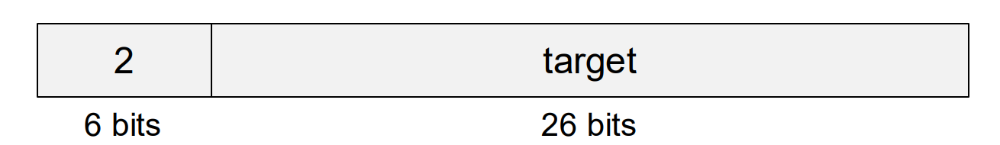
- 2 = opcode
- target = target address
- $$PC\leftarrow PC'[31:28]\ |\ signed-extend(target) * 4$$
    以Verilog代码表示如下：
    ```verilog
    PC = {PC'[31:28], immediate, 2'b00}
    ```
    > 需要解释的是，由于指令需要按字对齐，target实际上为字长指令，所以应当乘以4以得到实际地址，然后将结果拼接在PC'高4位后。

此外还包含有条件分支语句，用于做出决策。在LC-3等架构中，采用标志位，通过检测标志位方式实现跳转。

MIPS等实现方式相反。以 `beq` 指令为例。
```asm
beq $s0, $s1, offset
```
该指令通过检查两个寄存器值是否相等，当相等时则有
```verilog
PC = PC' + {immediate, 2'b00}
```

### 6. Instruction (Processing) Cycle
指令处理周期主要由以下6部分组成：
1. 取指
2. 译码
3. 计算地址
4. 取操作数
5. 执行
6. 存储结果

并非所有指令都要完整经历6个阶段，且并非所有ISA均是如此。

#### (1) 取指
这个阶段从内存中获取指令并存入IR中。完整描述如下：
1. 将PC值存入MAR，并自增PC的值
2. 访存，将结果返回到MDR寄存器
3. 将MDR值存入IR中

#### (2) 译码
此阶段解析指令，识别指令类型并确定后续操作。此外，它还会生成后续操作指令，即一组控制信号，用于指令周期后续阶段处理已识别的指令。

#### (3) 计算地址
这个阶段会计算所需访问的内存地址。

#### (4) 取操作数
此阶段会取得处理指令所需的源操作数。

#### (5) 执行
此阶段会执行指令。

#### (6) 存储结果
此阶段将结果写入指定目标位置。当存储结果完成后，新的指令周期就从取指阶段重新开始。

### 7. 操作码（opcode）
可以定义一组大小不等的操作码，因此应当有所权衡取舍：
- 硬件复杂性 & 软件复杂性
- Latency of simple & complex instructions

### 8. 指令格式
#### (1) R-Type in MIPS
R型指令指对寄存器进行运算的指令。
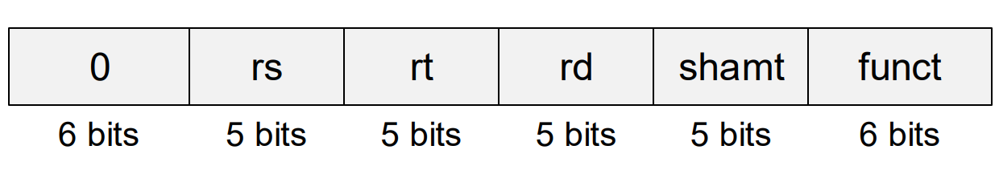
- 0 = opcode
- rs, rt = 源寄存器
- rd = 目标寄存器
- shamt = shift amount (only shift operations)
- funct = operation in R-type instructions

#### (2) I-Type in MIPS
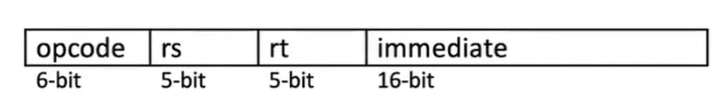

- immediate = 立即数

#### (3) J-Type in MIPS
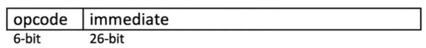

### 9. 数据类型
一种ISA支持一种或多种数据类型。以MIPS为例，其支持如下类型：
- 二进制补码整数
- 无符号整数
- 浮点数

同样，这里应当由权衡取舍。

有更多数据类型的优点：
- 更好地将高级编程结构映射到硬件层面。
- 硬件可以直接处理变成语言中的数据类型 -> 更少的指令数目与更精简的代码体积。

有更多数据类型的缺点：
- 微架构相关设计更多。

### 10. 语义鸿沟
语义鸿沟衡量指令和数据类型与高级编程语言的贴近程度。由此可以得到：
```
复杂指令 + 数据类型 -> 更小的语义鸿沟

建议指令 + 数据类型 -> 更大的语义鸿沟
```
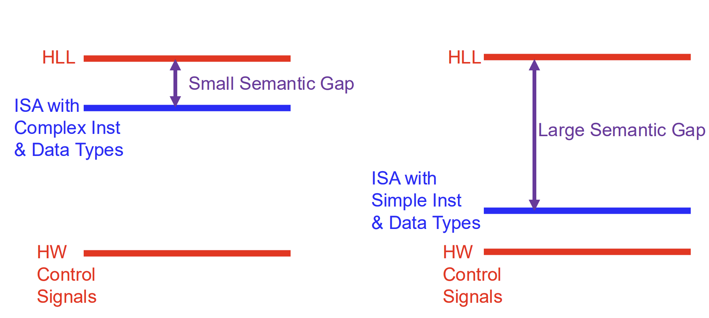

#### (1) Principle: Indirection
可以将一种指令集架构（ISA）转换为另一种不同的“实现”指令集架构（ISA）。其本质是对底层进行抽象，增加一个间接层。
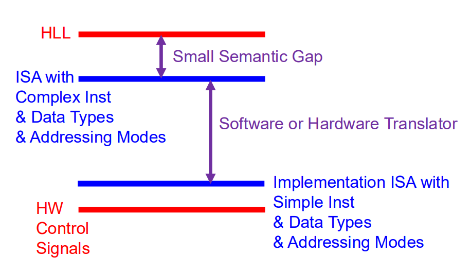

但需要注意的是间接层会带来额外复杂性与功耗。

### 11. 寻址模式
在LC-3架构中，有5种寻址模式：
- 立即数寻址
- 寄存器寻址
- 3种内存寻址模式：
    - 基址+偏移量寻址
    - 间接寻址
    - PC相对寻址

在MIPS种，有伪直接寻址，但没有间接寻址。

#### (1) PC相对寻址
PC相对寻址的地址计算是通过取PC程序计数器（即指令地址），实际为下一条顺序指令的地址。在LC-3体系结构下其计算方法如下：
```
Memory[PC' + signed-extend(PCoffset9)]
```
在LC-3体系结构中，由于PC偏移量位9位，所以其地址跳转范围位-256~255，因此无法访问离指令太远的地址。

#### (2) 间接寻址
间接寻址类似指针，在LC-3体系结构下其地址计算方式如下：
```
Memory[Memory[PC' + signed-extend(PCoffset9)]]
```

#### (3) 基址+偏移量寻址
基址+偏移量寻址在LC-3体系结构下其地址计算方式如下：
```
Memory[BaseR + sign-extend[offset6]]
```

在MIPS中，lw与sw使用基址+偏移量寻址方式。由于MIPS指令较长，其偏移量活立即数可以更大，为16位，符号拓展后为32位。

#### (4) 立即数寻址
立即数寻址在LC-3体系结构中对应加载指令为 `LEA`，其地址计算方式如下：
```
LEA: DR <- PC' + sign-extend(PCoffset9)
```
其本质上是将PC相对地址直接加载到目标寄存器，不经过内存访问。

在MIPS架构下，有 `lui` 指令，将16位立即数加载到寄存器高16位，并将低16位置零。

### 12. 寄存器数量
寄存器数量影响以下两个方面：
- 编码寄存器地址所需二进制位数
- 快速存储器中保存的值的数目
- 寄存器堆的大小、访问时间、功耗

更多的寄存器可以让编译器或汇编器进行更优的寄存器分配优化，减少保存恢复操作，理论上提升性能。但同时导致指令体积增大，进而影响性能。同时使寄存器堆增大，影响功耗与延迟等。

## 三、数据流执行模型
### 1. 指令获取与执行
在数据流模型中，指令按数据流顺序获取与执行。即当它的操作数准备就绪时，输入数据生成后，才获取并执行该指令。因此在这一架构中不存在程序计数器。指令顺序由数据流依赖关系决定，即：
- 每条指令都会指定接收方
- 当所有操作数就位时，指令就会被抓取并执行，即触发。

这意味着可能由大量指令会同时触发。

### 2. 数据流执行模型 vs 冯诺依曼模型
以下列代码为例：
```C
v = a + b;
w = b * 2;
x = v - w;
y = v + w;
z = x * y;
```
在冯诺依曼模型中为顺序执行，如代码所展示的那样。

而其表示为Data Flow模型如下图所示。
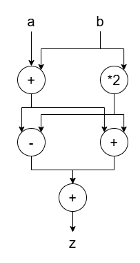

## 四、微架构
### 1. 微架构定义
微架构指底层硬件实际执行指令的具体实现方式。微架构可以任意顺序执行指令，只需展示结果时遵守ISA规定语义即可。

### 2. 冯诺依曼模型
当今所有主流ISA均采用冯诺依曼模型。

微架构层面执行的模型与冯诺依曼模型截然不同。微架构往往采用如流水线指令执行，多指令并行，采用乱序执行，且指令存储器与数据存储器分离。

**==但微架构层面的不同设计不会暴露给软件层面。==** 其执行结果依旧遵循ISA要求

### 3. ISA vs Microarchitecture
1. ISA
    软件与硬件达成共识的交互规范。
2. Microarchitecture
    指令集架构具体实现方式，对软件不可见。
3. Microprocessor
    通常包含指令集架构、微架构和电路设计。

### 4. Single-cycle vs Multi-cycle machines

单周期与多周期机在微架构层面均实现冯诺依曼体系结构语义。

1. Single-cycle machines
每条指令占用一个时钟周期，所有状态更新均在状态结束时进行。但能实现的最慢指令决定了周期时间。

2. Multi-cycle machines
将指令分解为多个周期或阶段，在指令执行器件可以进行状态更新，但架构状态的更新时在指令执行结束时进行的。时钟周期由**最慢阶段**决定。实际上每个阶段都可能需要多个时钟周期来完成。

### 5. 指令处理引擎
其主要由两个部分组成：
1. 数据通路：由处理和转换数据信号的硬件元件组成。
    - 对数据进行操作的功能单元
    - 用于实现数据在功能单元间流动的硬件结构
    - 存储数据的存储单元
2. 控制逻辑：指挥数据通路各组件如何处理数据。

在单周期机器中，必须在同一个时钟周期内生成控制信号和数据信号的操作，所以控制信号的生成会存在一定延迟。

在多周期机器中，可以在当前周期内生成下一个周期所需要的控制信号，从而避免控制和数据处理形成串行瓶颈。这种设计能提升并行性，因为可以让控制处理的延迟、控制信号的生成与数据路径操作重叠执行。

### 6. 性能分析
**单条指令执行时间**是作为性能分析的一个重要指标。
```
{CPI} * {clock cycle time}
```
==CPI== : Cycles Per Instruction

程序执行时间位所有指令执行时间之和。

1. 单周期微架构性能表现
    CPI = 1
    Clock cycle time = long
2. 多周期微架构性能表现
    CPI = 不同指令CPI不同，且平均CPI较小
    Clock cycle time = short

### 7. 单周期微架构（基于MIPS）
#### (1) 数据与控制输入
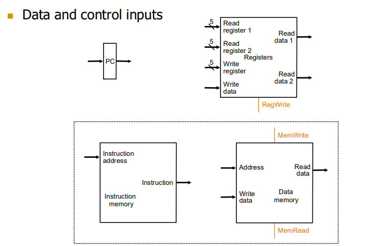

为确保操作能在一个周期内完成，做以下假设：。
1. 内存与寄存器堆都是单周期的
2. 读取数据端口的组合逻辑输出内存内容和对应输入地址的组合函数。
3. 同步写入，目标地址会在时钟上升沿且写使能信号有效时更新。

#### (2) 指令处理
在单周期微架构中指令处理由五个步骤组成：
1. 从寄存器中取出指令（Instruction fetch, **IF**）
2. 读寄存器并译码指令（Instruction decode and register operand fetch, **ID/RF**）
3. 执行操作或计算地址（Execute/Evaluate memory address, **EX/AG**）
4. 访问存储器操作数（Memory operand fetch, **MEM**）
5. 存储/写回结果（Store/writeback result, **WB**）

#### (3) 算数和逻辑指令单周期数据通路
由于算数与逻辑指令多为R型与I型指令，因此先考虑R型指令格式，其格式如下：


考虑数据通路，具体如下：

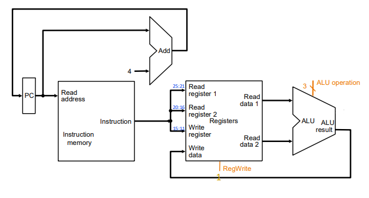
其中，ALU所执行的运算类型由 `funct` 决定。

接下来考虑I型指令。其格式如下：


其操作类似，但是应当注意立即数的处理部分。为处理立即数，应当添加符号拓展模块，此外，为保证数据正常流通，应当加入数据选择器。其数据通路如下：

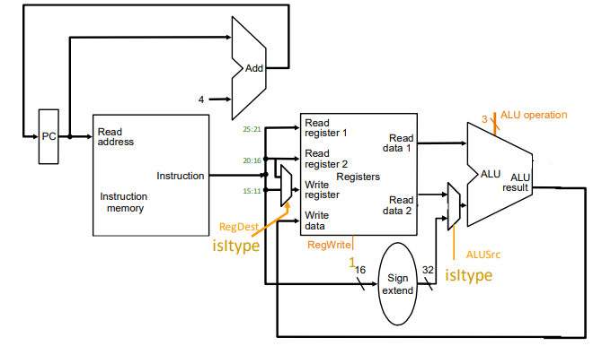

#### (4) 数据移动指令单周期数据通路
对于数据移动指令多为I型指令，格式如下：


考虑load指令，如 `lw`，与store指令，如 `sw`，则由如下数据通路：

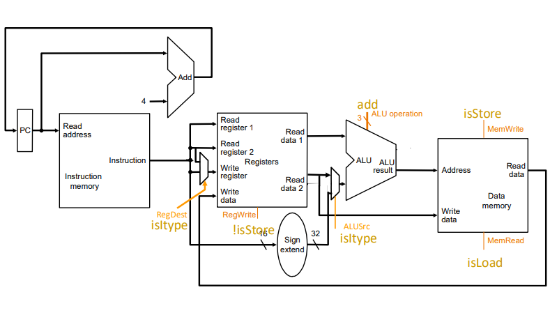

然而考虑算数和逻辑指令，为同时支持二者，需要在电路中添加MUX。

#### (5) 控制流令单周期数据通路
控制流指令为J型指令与I型指令。对于无条件跳转，其为J型指令，格式如下：


对于J型指令实现，需要注意的是
```verilog
PC' = PC + 4;
PC = {PC'[31:28], immediate, 2'b00};
```

对于有条件跳转，其为I型指令，格式如下：


#### (6) 完整数据通路与控制逻辑
1. 完整数据通路
    综上所述，完整数据通路如下图所示：
    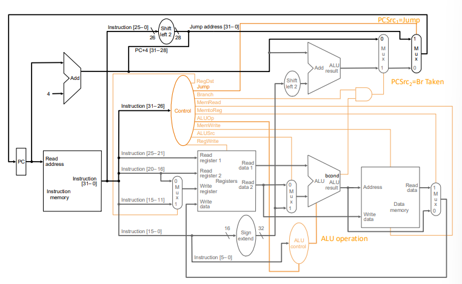

2. 控制逻辑
    对于控制逻辑，其中一种就是设计单周期硬连线控制，将其作为指令位的组合逻辑函数，主要参考指令格式，并依据opcode产生控制信号。

    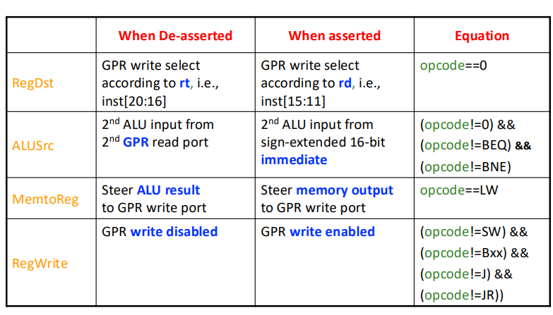

    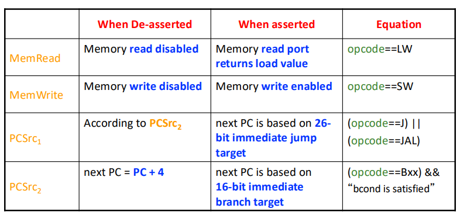

    此外，可以使用存储这些位的内存结构，基于操作码的内存结构，索引访问内存，而控制存储器会提供所有控制位。

    两种控制信号生成方式均可被采用，现有处理器会同时使用两种控制结构，最终选择取决于结构的延迟时间以及关键路径上控制信号所占比重。

### 8. 单周期微架构评估
其CPI = 1，但始终周期取决于最慢指令处理所需时间。然而现实中，内存访问很慢，因此使得单周期微架构时钟周期变得过长，无法优化高频指令执行效率。此外，单周期架构受限于自身，对于复杂指令处理非常困难。

### 9. （微）架构设计原则
1. 关键路径设计
    - 理想情况下需要获得高频率，寻找并降低最大组合逻辑延迟
    - 如果路径耗时过长，将其拆分为多个周期处理
2. 常见场景设计原则
    - 应将时间和资源投入到最关键的地方
3. 平衡设计
    - 指令和数据流在硬件组件之间保持平衡
    - 为消除瓶颈而设计：根据工作负载平衡硬件配置

### 10. 系统设计原则
1. **Keep it simple**
2. Keep it low cost

### 11. 多周期微架构（基于MIPS）
1. 目标：
    **让每条指令仅占用其实际需要的时间。**
2. 方式：
    - 时钟周期时间与指令处理时间相互独立
    - 每条指令按需占用多个时钟周期
3. 缺陷
    - 并发性限制
    - 每个时钟周期结束需要存储中间结果

#### (1) 多周期微架构实现
多周期微架构实现其核心思想为讲指令处理步骤视为一个状态机，且状态序列最终会回到取指令状态。

一个状态的确定取决于该状态下激活的控制信号，而下一状态的控制信号由现有状态决定。

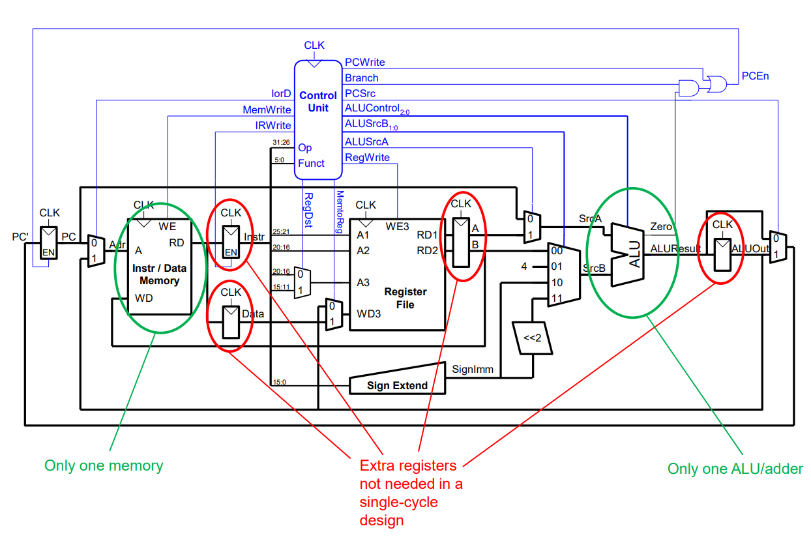

#### (2) 多周期控制逻辑
控制逻辑本质上是要构建一个有限状态机。

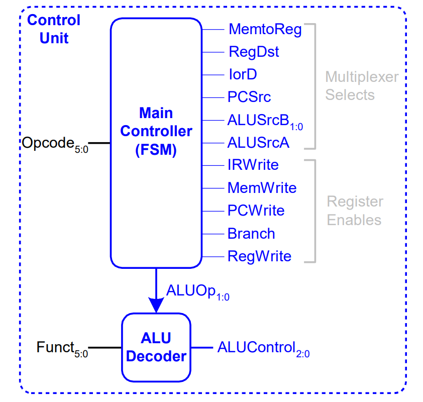

通过不同状态设置不同控制信号实现控制逻辑。

对于内存读写等需要多周期的操作，需要在读写过程中保持在当前状态不发生状态跳转。此时内存需要想控制逻辑提供若干位信号用于决定下一个状态。

### 12. 流水线技术
#### (1) 流水线技术基础理论
其核心思想是，当某条指令在占用某个处理阶段资源时，同时利用该指令未占用的闲置资源来处理其他指令，从而提高并发性。

通过讲指令处理周期分为不同的处理阶段，并确保由足够多的硬件资源在每隔阶段处理一条指令，完成该阶段所有操作，并在每隔阶段处理不同的指令。

流水线所带来的好处是提高了指令处理的吞吐量，从而降低CPI。但流水线也必然导致更多的硬件。

#### (2) 理想流水线 vs 实际流水线
流水线核心目标是用最小成本提升吞吐量。

理想情况下，应当多次重复相同的操作，各个操作之间彼此独立，且能将操作均匀划分为子操作。理想情况下，对一个操作分为平均k步，则吞吐量 `Tput = k/T`。

然而在实际流水线中，由于寄存器延时S，即使平均分为k步，吞吐量为 `Tput = 1/(T/k+S)`。此外由于处理粒度的存在，实际上不可能真正做到平均分配。

此外，考虑成本情况下，假设流水线分配后不改变组合逻辑成本，令其为R，但对于寄存器，假设其成本为R，则总成本增长为 `Cost = G + Rk`。寄存器本质上增加了硬件成本，对于多级流水线，寄存器成本将占据主导。

#### (3) 流水线技术指令处理流程
通过划分单周期微架构为多个操作，从而实现流水线。此处采用五级流水线进行实现。

1. 从寄存器中取出指令（Instruction fetch, **IF**）
2. 读寄存器并译码指令（Instruction decode and register operand fetch, **ID/RF**）
3. 执行操作或计算地址（Execute/Evaluate memory address, **EX/AG**）
4. 访问存储器操作数（Memory operand fetch）
5. 存储/写回结果（Store/writeback result, **WB**）

采用流水线设计时，所有流水线阶段都需要一个时钟周期，所以流水线的时钟周期必须足够长以满足最慢的操作。

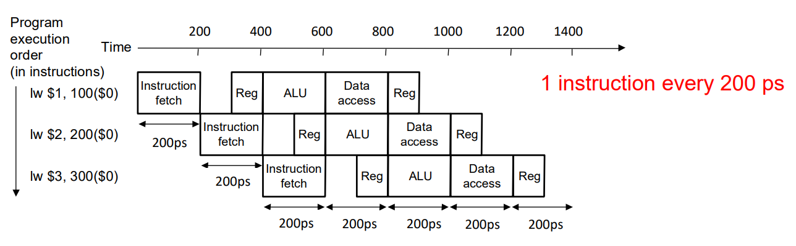

#### (5) 流水线寄存器
为存储中间结果并达成并行需求，需要在不同操作间添加流水线寄存器以存储。后续所有要用到的寄存器值，都应保存在流水线寄存器中。**应当确保所有资源都不会同时被多个阶段同时使用。**

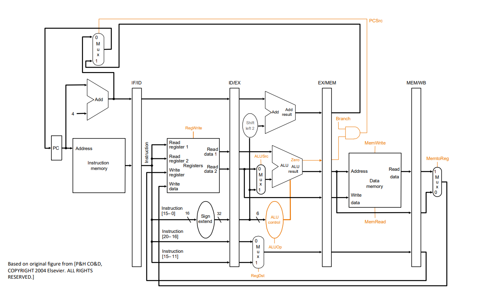

#### (6) 流水线控制点
流水线控制点设置基本采用单周期设计，保持完全相同的控制点设置。但流水线中不会同时使用所有控制信号，在流水线中，控制信号会根据阶段在不同周期被激活。因此存在以下两种选择：
1. 进行一次译码，采用与单周期处理器相同的逻辑，然后将信号缓存直到被使用。
2. 携带部分未解码指令，在后续阶段在本地完成译码。

#### (7) 流水线设计问题
由于不同的指令所需要的阶段不同，不同流水线阶段具有不同的延迟（多周期），**且指令之间可能存在依赖关系**，因此流水线往往不是理想化的。

在出现干扰流水线的事件时，应当确保流水线保持正确、畅通且满载，需要注意以下问题：
- 依赖关系：
    1. 数据
    2. 控制
- 处理资源竞争
- 处理高延迟（多周期）操作

此外流水线中应当包含异常处理与中断的处理。

#### (8) 流水线停顿
停顿指流水线停止前进的状态。引起流水线停滞主要有以下三个因素：
1. 资源竞争
2. 指令间依赖：
    - 数据依赖（冒险）
    - 控制依赖（冒险）
3. 长延迟（多周期）操作

#### (9) 依赖及其处理
依赖又称为冒险（hazard），主要有两种类型，依次为数据依赖（冒险）与控制依赖（冒险）。

有时将资源竞争称为资源依赖（冒险）。

##### [1] 资源冒险
资源冒险发生于两个流水线依赖需要相同硬件资源。

一种解决方案是复制该资源并提高吞吐量。另一种是检测资源争用，并暂停其中一个争用阶段，这一方案的关键在于暂停阶段的选择。

如果观察流水线，RF与WB阶段似乎存在资源竞争，但通过仔细设计，寄存器堆可以在同一周期同时读出和写入：
- 写操作发生于第一个半周期
- 读操作发生于第二个半周期
- 读/写寄存器完成仅需半周期

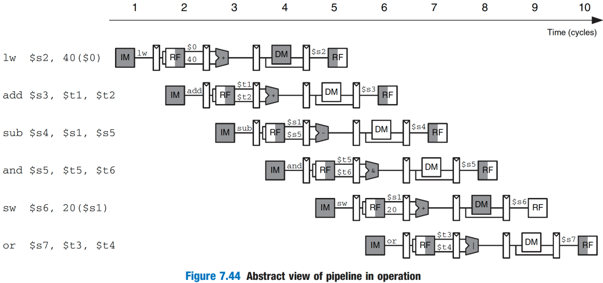

##### [2] 数据冒险
###### 1) 数据冒险分类
数据冒险主要分为三类：
1. Flow dependence (真正数据冒险，先写后读)
2. Anti dependence (先读后写)
3. Output dependence (先读后写)

对于以上三种数据冒险，都需要确保程序的语义正确。必须始终遵守流依赖关系，因为它们构成了对值的真实依赖。反向依赖和输出依赖存在是由于架构寄存器数量有限。

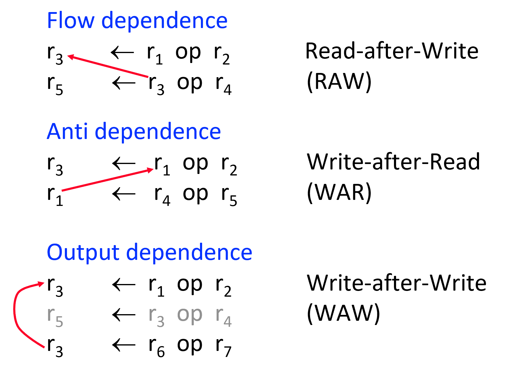

WAR 与 WAW 主要出现在乱序执行过程中，对于经典流水线不会出现问题。

Anti dependence和Output dependence较易解决，只需按照程序顺序且仅在最后阶段写回目的寄存器。

###### 2) 数据冒险基本解决方案
对于flow dependence，总共有六种基本解决方法：
1. 检测并等待寄存器堆中出现有效值。此时会发生流水线停顿，并产生气泡。
2. 检测指令并前递/旁路数据至依赖指令。
3. 在软件层面上检测并消除依赖关系。
4. 检测并将其移开，以便执行独立指令。
5. 预测所需值，进行“推测性”执行，并进行验证。
6. 细粒度多线程

###### 3) 数据冒险检测
互锁（Interlocking）：在流水线处理器中检测指令间的数据依赖，从而保证指令能够正确执行的一种机制。

互锁存在两种机制，分别为基于软件互锁与基于硬件互锁。

为检测数据冒险，引入记分牌机制（Scoreboarding）：
- 在寄存器堆中的每一个寄存器关联一个有效位。
- 当处于译码阶段的指令会检查他所有的源寄存器目标是否有效：
    - 有效：不需要停顿，说明不存在依赖。
    - 无效：需要让该指令停顿。

这一机制优势是实现简单，只需为每一个寄存器提供一个1 bit寄存器。然而劣势是需要存储所有类型冒险，不仅仅是flow dependence。

此外，可以通过组合依赖检查逻辑，其会检查在流水线后续阶段中的某条指令，是否将要写入当前正在译码的指令的某个源寄存器。其优势是无需因为 anti 与 output dependence 而产生停顿。但其逻辑相较计分板机制更为复杂，且随着流水线变得更深、以及处理器能够同时执行更多指令（更宽），相关的控制逻辑也会变得更加复杂，如后续超标量执行。

注意到在通信的数据值可用之前，可以检测到两条指令之间的依赖关系，因此可以产生多种解决方案以下为两种方案：
1. 立刻停顿冒险指令
2. 仅在必要时停顿冒险指令，通过数据前递/旁路解决数据冒险

###### 4) 数据前递/旁路
部分数据冒险情况中，如以下指令：
```asm
add $s0, $1s2, $s3
and $t0, $s0, $s1
```
冒险指令所需要数据可以直接从流水线中更后面的阶段提供，而不必只能从寄存器堆中读取。

因此可以添加额外依赖判断逻辑与数据前递路径，使产生有效值后立刻提将该值供给冒险指令。

其优势是冒险指令可以继续在流水线中向前推进，知道需要该值的阶段再获取数，从而减少流水线停顿。

###### 5) 数据冒险具体解决方案概念与实现
1. 停顿
    为实现流水线停顿，禁用 PC 和 IF/ID 锁存，确保卡住的指令保持在其当前阶段。

    在发生停滞的指令之后的执行阶段中插入“无效”指令/空指令（称为“气泡”）

    此外也可以选择插入足够的非依赖指令，以确保依赖指令所需数据在依赖指令执行时有效。这一优化往往发生在编译器层面。

2. 数据前递
    数据前递策略为一旦值可用，立即将其传递给依赖指令。这一策略类似数据流架构思路。数据前递使流水线更贴近数据流执行原则。

    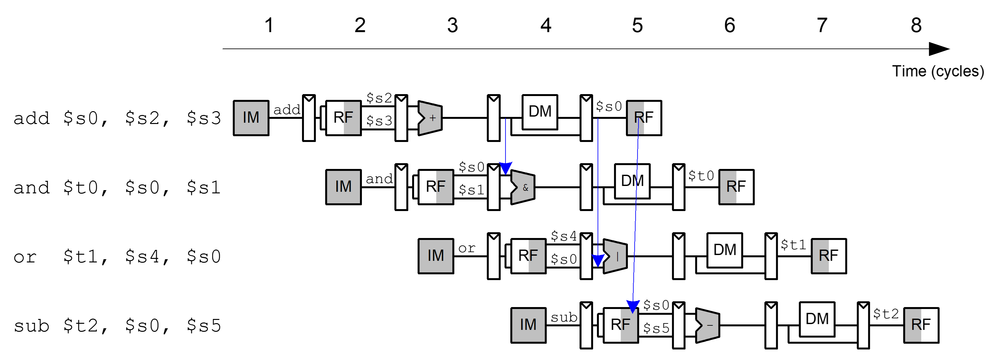

    具体电路实现如下：

    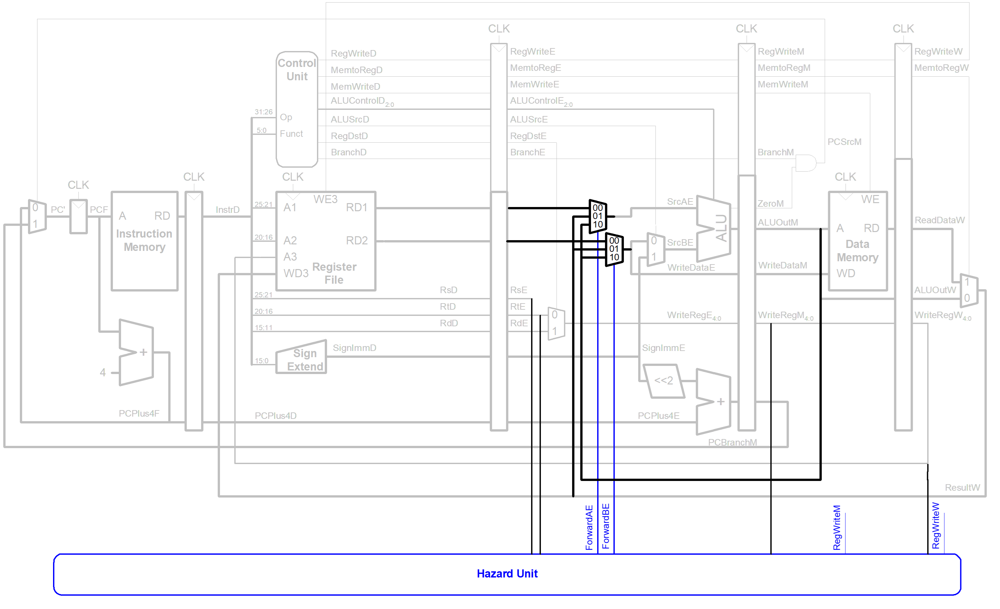

    但需要注意的时并非所有情况下都可以使用数据前递。例如如下所示：
    ```asm
    lw $s0, 40($s0)
    and $t0, $s0, $s1
    ```
    其图形化表示如下所示：

    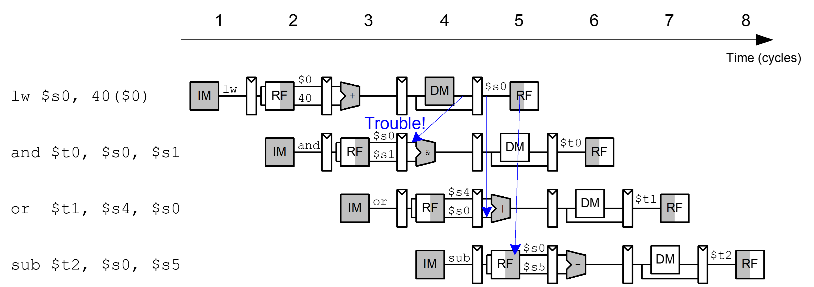

    此时 `lw` 指令直到 MEM 阶段结束才完成数据读取，其数据有效。

    如果强行进行数据前递，则必然增加关键路径长度，违反基本设计原则。因此对于类似情况，应当选择停顿以解决。

基于以上论述，停顿与前递完整电路如下图所示：

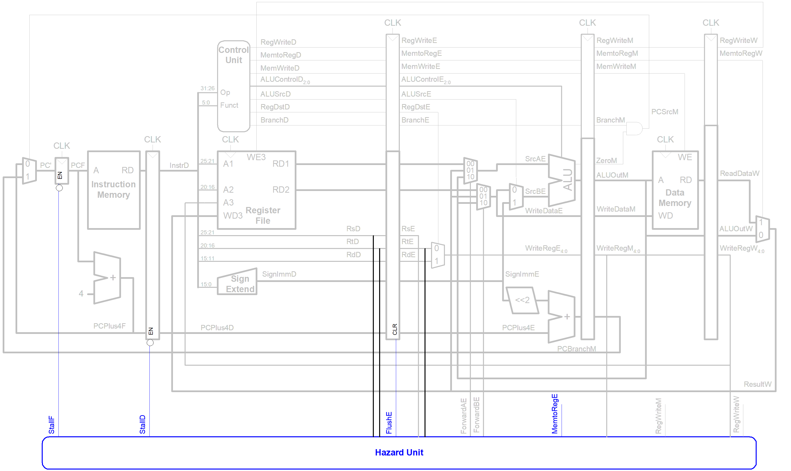

因此当 `lw` 指令引起停顿时：
- StallD与StallIF被置高，使IF/ID流水线寄存器的值保留。
- FlushE置高，清空ID/EXE流水线寄存器，从而引入一个气泡。

##### [3] 控制冒险
如果考虑控制流指令如指令 `j` 与指令 `beq`，会发现程序并不总是顺序执行的。事实上，我们应当考虑如何判断当前所取的指令是否为控制流指令。

###### 1) 分支预测
以 `beq` 为例：
- 条件分支直到流水线第四阶段才完成解析。
- 在分支解析之前，PC会先获取分支后的指令。这即分支预测简单示例：
    - 总是预测应当选取下一条顺序指令执行。
    - 这一预测策略称为“始终预测为不跳转”预测策略
    - 如果分支被执行，则清除（无效化）“未执行路径”的指令
- 分支预测错误代价
    - 当分支预测错误时，流水线中需要被清除的指令的数量。
    - 优化方法：如果能够更早地确定分支是否发生，就可以减少需要清除的指令数量，这一方法称为**提前分支判定**。

具体图例如下图所示，其分支预测错误代价为3条指令：
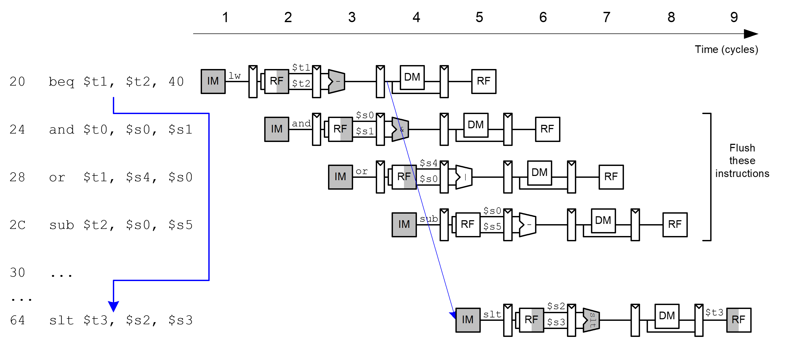

为减少分支预测错误代价，以下为流水线提前分支预测电路图：
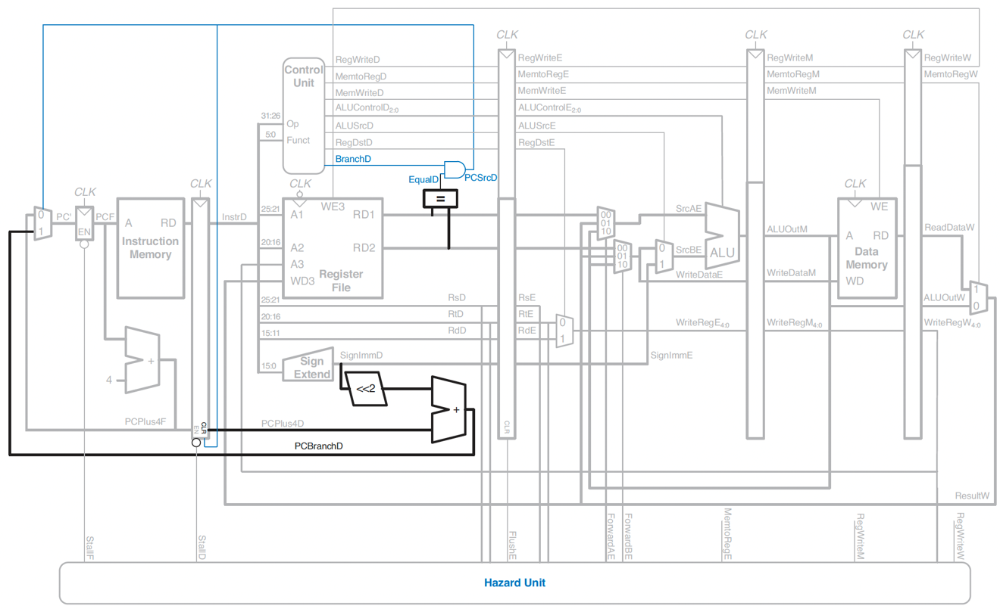

通过这一电路设计，其分支预测错误代价为1条指令。

这一电路设计优势在于减少分支预测错误代价，进而减小CPI (cycles per instruction)。然而其代价是潜在增大了时钟周期，且增加额外硬件，且大概率无法被其他指令复用。

此外，为保证运算寄存器值的正确性，应当考虑前文所述数据冒险，进行数据前递或停顿，具体电路如下所示。

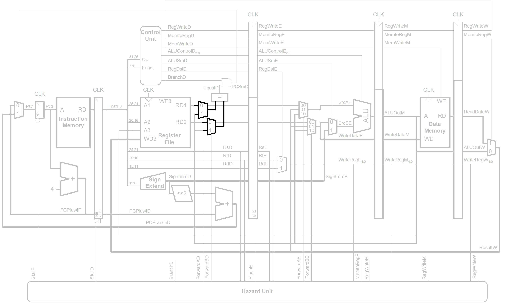

因此，综合以上所有因素，完整电路图如下图所示：

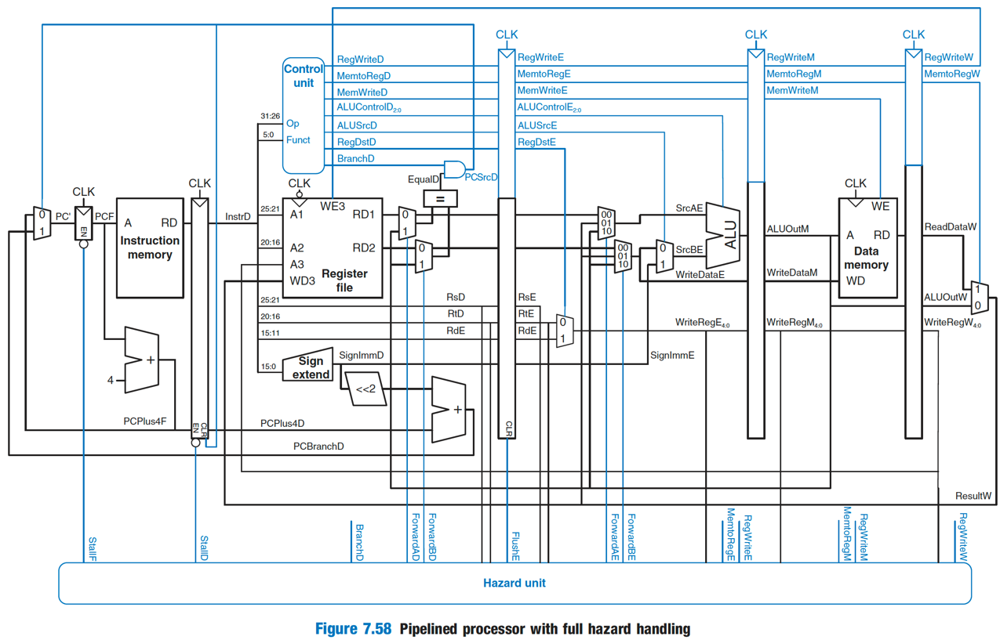

###### 2) 更智能的分支预测
可以进行猜测分支是否会被执行，主要基于以下两种方案：
- 通常会选择向后分支（循环会迭代多次）
- 记录分支是否曾被选择的历史信息可以提高预测的准确性

#### (10) 多周期处理
在流水线执行阶段，并非所有指令耗时相同的系统是可行的，因为可以通过将指令分发到多个不同的功能单元。

通过这种方式，可以在前一条长延迟指令完成执行之前，让独立指令在其他功能单元上开始执行。

然而这一行为带来如何仲裁结果写入的问题。例如，对于长延迟指令如乘法指令，假设需要四个时钟周期完成，在这一指令执行期间执行下一条指令，假设为加法指令，假设仅仅需要一个时钟周期，则加法指令执行完成，将结果写回寄存器堆时，乘法指令并未完成，此时违反冯诺依曼模型顺序指令的语义，应当针对类似情况做出额外设计。

这一原则需要严格遵守的核心原因是异常处理机制的存在。

### 13. 异常与中断
异常与中断本质上都是程序执行中的意外中断。

对于程序内部执行问题称为**异常**，例如溢出引发的异常。而发生外部突发事件需要处理器进行处理，这些称为**中断**。

二者触发机制不同，但都需要停止当前程序的运行，并将架构状态保存以确保数据不会丢失。最后需要转移状态或切换到其他控制流程，进行异常/中断处理。

二者处理时机也有所不同。异常在被检测到且确认时非推测性时处理，而中断则可以在方便的时候处理，具体何时处理取决于中断优先级。

且异常是在进程上下文中处理的，所以可以使用try-catch捕获异常，并修复异常处理中的特殊情况。而中断处理的上下文是整个系统，主要由操作系统处理。

#### (1) 精确异常/中断
为遵循冯诺依曼模型顺序语义，当异常与中断准备被处理时，由PC、内存和寄存器组成的架构状态必须保持一致或精确。

因此，当某条指令引发异常时，程序顺序中所有先前的指令都必须完全执行完毕（retired）。而后续指令不应该被retired，也就是不能更新架构状态。

退休 (retire / commit) 指完成执行并更新架构状态。

#### (2) 检测与处理流水线异常
当最旧的指令准备退休并被检测出引发了异常时，控制逻辑将完成：
1. 确保架构状态精确
2. 清空流水线中所有后续指令
3. 按照ISA规定保存PC与寄存器
4. 控制逻辑将取指引擎重定向到相应的异常或中断处理例程

由此可以看出，采用精确异常一方面源于冯诺依曼模型规定，另一方面是为方便定位异常发生位置，便于软件调试。此外，这一架构可以轻松实现异常恢复、重启进程。

### 14. 确保精确异常/中断
为了确保精确异常/中断，在多周期处理的流水线中，应当防止前文所述问题的出现。问题解决方案由以下几种：
1. 使每次EXE阶段占用周期数相同
    这确实解决了问题，但显然这会导致快速指令和最慢的指令耗时相同。
2. 重排序缓冲区

#### (1) 重排序缓冲区 (reorder buffer)
其核心理念是乱序执行完整指令，但在将结果更新到架构状态前重新排序。

在硬件层面，其通过环形队列实现。

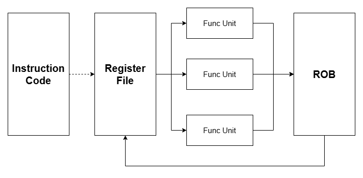

- 当指令被解码时，会在重排序缓冲区中预留下一个顺序条目。
- 当指令执行完毕，它会将结果写入重排序缓冲区对应条目。
- 当某条指令时重排序缓冲区中最老的指令时，且它已无异常地完成执行，控制逻辑就会将该指令结果从ROB移入寄存器堆。

数据在ROB中存储格式如下图所示。


因此为实现ROB，需要以下条件：
- 所有必要信息来正确地将指令按顺序重新排序。
- 如果指令能无异常退休，则就在它成为机器种最旧指令时，用指令结果更新架构状态。
- 如果指令退休前需要处理异常或终端，就精确处理异常中断。

然而后续指令需要重排序缓冲区值的情况未被考虑在内。显然可以选择停顿流水线，但更好的选择显然是直接从ROB种读取数值。

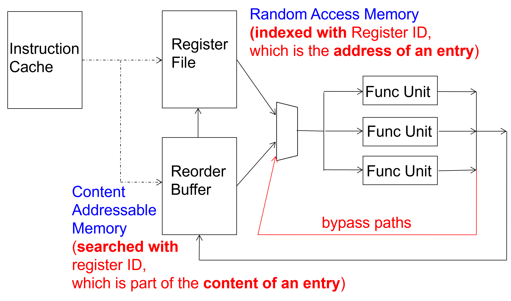

寄存器堆是通过寄存器ID进行索引的，该ID就是条目的地址，实际对应硬件为RAM。此处假设RAM采用记分牌机制。

ROB组织结构不同，是按照程序顺序排列的指令序列，实际对应硬件为内容可寻址存储器。它需要寄存器ID进行**搜寻**，而寄存器ID则是作为条目**内容**的一部分。

因此当处理冒险，查找ROB时，都需要和目标寄存器ID字段进行比较器匹配，且必须确保条目与数值有效，并且是这条指令前对该寄存器的**最新定义**。基于此进而可以实现寄存器重命名。

#### (2) 简化ROB
显然ROB访问极其消耗硬件资源，需要进行简化，因此引入定向访问。
- 首先访问寄存器堆
    - 如果寄存器无效，则寄存器中会存储ROB的ID，该缓冲项包含或将包含该寄存器的值。
    - **寄存器与重排序缓冲区条目的映射**：当有正在执行的指令正在写入该寄存器时，寄存器文件会将该寄存器映射到重排序缓冲区的一个条目上。因此寄存器堆文件应当包含tag，其中tag在寄存器值无效时存储对应缓存块ID。
- 其次访问ROB

#### (3) 寄存器通过重排序缓冲区重命名
Output和anti dependence并非真正的依赖，他们之所以存在源于ISA中寄存器ID的不足。

其解决方案是将寄存器ID重命名为ROB条目，该条目将保存寄存器值，最终生成该寄存器的位置。
- 寄存器ID -> ROB条目ID
- 架构寄存器ID -> 物理寄存器ID
- 完成重命名后，使用重排序缓冲区条目ID来引用寄存器。

#### (4) Traddeoff
1. 优势：
   - 在概念上简单，便于支持精确的异常处理;
   - 可消除虚假依赖;
2. 劣势：
    - 需要访问重排序缓冲区才能获取尚未写入寄存器文件的结果;
    - 增加硬件复杂度

### 15. 乱序执行（动态指令调度）
考察下列指令：
```asm
MUL $3, $1, $2
ADD $3, $3, $1
ADD $4, $6, $7
MUL $5, $6, $8
ADD $7, $9, $9
```
由于源寄存器不可用，所以加法指令无法派发而产生停顿。然而这也导致后续独立指令也无法派发。

#### (1) 避免调度停顿
为避免调度停顿，采用乱序派发方式进行。参考数据流结构，实际实现乱序派发方式即在控制流机器内部构建数据流引擎。

此外，可以在编译阶段将指令重新排序，或进行数值预测，或采用细粒度多线程，从而避免停顿发生。

#### (2) 乱序执行 (OoO)
乱序执行核心思想在于将未就绪的指令从独立指令路径中移开，本质上是增加硬件缓冲区。

在等待区，指令会持续检测源数值的状态，当指令所有源数据值有效时，会触发给执行单元。

这样做最大的好处是能容忍延迟，当某条指令耗时较长时，并不会导致流水线停滞，独立指令可以继续执行并完成。

#### (3) 乱序执行条件
1. 确保遵守正确的数据值语义，即数值使用者必须与生产者建立关联。
    - 寄存器重命名：寄存器ID将被替换为ROB ID或**保留站条目ID**。
2. 设置指令缓冲区直到他们准备好执行。
    - 通过保留站实现
3. 当指令被缓冲时，它们需要跟踪源数值的准备状态。
    - 产生数值的指令在数值生成时广播一个标签或寄存器名称。
    - 等待该标签的指令会将其源标签与广播标签进行比对，当标签匹配，则源数值变为就绪状态。
4. 当一条指令所有源数值准备就绪时，需要将指令分派到功能单元 (**FU**)。
    - 当所有源准备就绪，指令被唤醒。
    - 当多条指令被唤醒，需要选择一条指令送入FU。

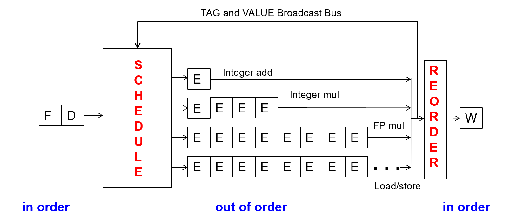

OoO有以下两个关键部分：
- 保留站RS（即调度窗口）
    - 包含有效位，tag以及value
- ROB

在上述过程中，广播标签，捕获数据，唤醒指令显然会成为关键路径。应当尝试使用流水线与预测技术加以缩短。

#### (4) 精确异常处理的乱序执行
使用重排序缓冲区在指令提交到架构状态前进行重排序。

指令完成执行时会更新寄存器别名表（**前端寄存器堆**），该寄存器堆中包含寄存器有效位，寄存器Tag，以及寄存器值。当指令退休时，它会更新另一个架构寄存器堆。**换言之，架构寄存器堆总是按照程序顺序更新。**

发生异常时，将清空流水线，将架构寄存器堆复制到前端寄存器堆中。

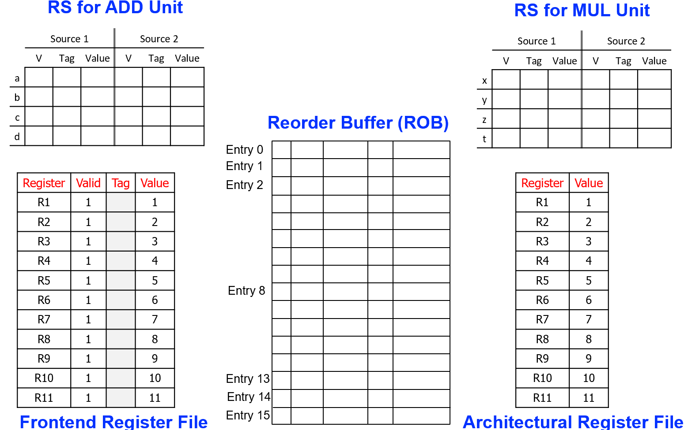

然而上述寄存器堆中显然Value被大量复制，结构规模相对较大，较为浪费空间。因此可以选择将数值整合到物理寄存器堆中，进行value集中管理，其他部分保存对应指针。

因此具有精确异常的现代乱序执行架构采用以下架构：
- ROB以支持指令按序提交。
- 采用单一物理寄存器堆存储所有寄存器
    - 包括推测寄存器和架构寄存器
    - 整型和浮点型寄存器仍然保持分离
- 两个寄存器映射表存储指向物理寄存器堆的指针
    - 前端寄存器映射表：重命名
    - 架构寄存器映射表：维护架构状态或精确状态
- 保留站寄存器
    - 保留站寄存器不再存储具体数值，而是物理寄存器ID
    - 广播传输目标物理寄存器ID

#### (5) 乱序执行内存存储与取出
寄存器与内存有以下根本性区别：
- 寄存器依赖是静态可知的，但对于内存操作需要执行指令才能获取地址，因此无法预知指令所指向的内存地址。
- 寄存器状态所占空间极小，而内存状态所占空间大。
- 寄存器状态对于其他线程/处理器不可见，而内存状态在线程/处理器间共享。

##### [1] 内存依赖处理
在乱序执行机器上运行指令时，还必须正确处理内存依赖关系。

由于内存地址直到加载/存储指令执行时才能确定，因此会带来以下问题：
- 内存地址难以重命名。
- 判断加载和存储操作的依赖关系必须在它们部分执行后进行。
- 当一条 **加载/存储** 指令地址准备就绪时，可能存在地址未知的更 **老/新** 的 **存储/加载** 指令在系统中。

对于加载指令地址就绪时，存在更老的存储指令地址未知，这一问题称为**未知地址**问题。

为解决这一问题，采用的策略是如果加载指令依赖于任何未知地址的存储指令，可以用更复杂的预测其进行预测。

##### [2] 存储与加载间数据前递
对于加载指令，如果其依赖于存储指令，则需要进行依赖判断，当依赖存在时则需要进行前递。为此需要特殊结构，称为 **加载队列（LQ）** 与 **存储队列（SQ）**。

当加载指令得到其地址时，搜索SQ判断是否存在依赖的存储操作。当存储指令得到其地址时，搜索LQ查看是否有依赖它的指令。

因此当存储指令完成执行时，它会将其地址与数据写入SQ条目中。

当后续加载指令产生地址时，它将：
- 用其地址搜索SQ
- 使用地址访问内存
- 从写入该地址的最早的较旧指令中获取值（该指令来自 ROB 或内存）

上述过程需要额外逻辑称为**存储到加载转发逻辑**。需要注意的是，由于存储与加载指令都有大小范围，因此比较过程应该比较范围是否有重叠，这显然使比较逻辑更加复杂。

#### (6) 乱序执行优劣
- 优点
    - 延迟容忍度：允许独立指令在存在高延迟操作的情况下执行并完成
    - 不规则并行：动态查找并利用程序中的并行操作
- 缺点
    - 高复杂度
    - 更多的硬件资源

### 16. 超标量执行
N路超标量指每个周期能获取、解码、执行和提交N条指令。因此需要由**硬件**来执行并发获取指令间的依赖检查。

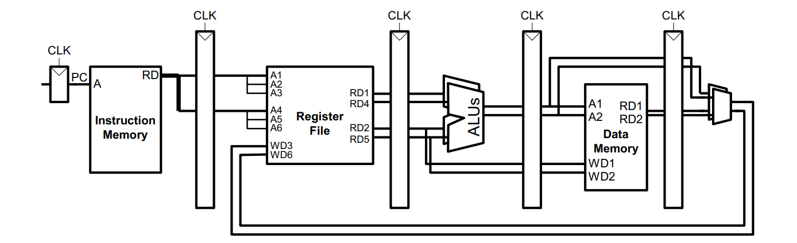

对于超标量执行，其对于冒险的处理与标量处理基本相同。

超标量处理提供了更高的吞吐量与IPC。但由于需要对并发指令进行依赖检查而导致硬件复杂度上升。且在超标量架构中，寄存器重命名会变得更加复杂。最终导致形成关键路径，导致时钟周期变长。

### 17. 分支预测
分支预测核心思想是为了处理系统中的控制依赖问题。

#### (1) 细颗粒度多线程
为解决分支控制问题，一种思路是每个时钟周期都从不同且相互独立的线程获取指令，确保同一线程的指令不会同时在流水线中执行。

因此硬件具有多线程上下文（每个线程都有独立的程序计数器和寄存器组）。线程间彼此独立。在同一线程中，直到前一个分支指令完成之前，不会获取下一条指令。

采用这一策略无需处理线程内的控制和数据依赖关系，且可以实现多线程级吞吐量。但单线程性能可能受到影响，且需要额外逻辑来维护线程上下文。

#### (2) 分支预测
分支预测核心思想时预测下一条取指地址，以便能在下一周期使用。

因此分支预测需要在取指阶段预测三个要素：
1. 判断当前取指是否为分支指令
2. 确定分支方向（主要为条件分支）
3. 预测分支目标地址

观察发现目标地址在动态实例间保持不变。因此可以存储之前实例的目标地址，并通过PC进行访问，即分支目标缓冲器（BTB）。

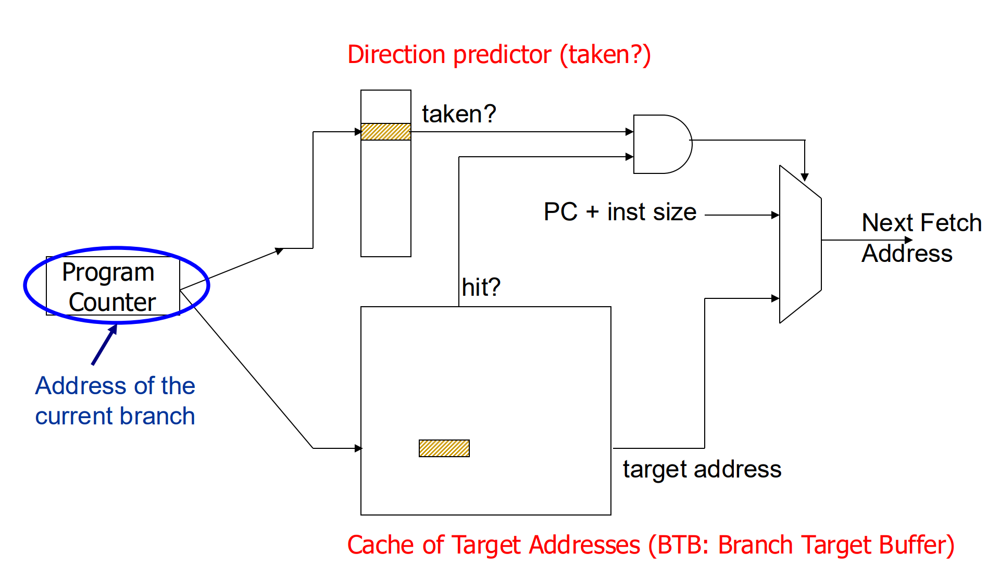

#### (3) 静态分支预测
静态分支预测通过编译时进行预测。

1. 假设分支不发生
    此类分支预测总是预测程序按顺序执行，但准确率较低。

2. 假设分支总是发生
    与假设分支不发生相反，总是预测分支法案生跳转，在条件分支中，正确率相对于总是假设不发生有所提高。不存在跳转方向预测。

3. 向后分支发生，向前分支不发生 (BTFN)
    由于向后跳转往往出现在循环中，因此向后跳转总是预测发生，其他的则总是预测不发生。

4. **Profile-based**
    这一方案核心思路是编译器通过性能分析来确定每个分支的可能方向，并将该方向编码为分支指令格式中的提示位。
    - 好处是可以针对每隔分支单独设置，当性能分析真实反映代码实际执行情况时具有高准确性。
    - 缺陷是需要分支指令格式中包含提示位，且预测准确度取决于输入集代表性。

5. Program-based
    其核心是运用基于程序分析的启发式方法，由编译器静态预测分支方向。例如，总是预测小于等于0分支不会执行，因为这在多数程序中往往代表错误值。或者对于循环，总是预测进入循环的分支会被执行。

6. Programmer-based
    程序员在编写代码时，需要预判分支是否被执行。

所有技术都可以结合使用。为了满足动态特性，可以选择动态编译器持续重编译代码，可以让静态预测更具动态性，但显然会带来额外的性能开销。

#### (4) 动态分支预测
其本质时根据硬件在运行时动态收集的信息预测分支行为。

其优势在于：
1. 可以根据分支执行历史进行预测。
2. 可以适应分支行为的动态变化。
3. 可以完全不需要静态分析。

其劣势在于:
1. 复杂性增加

##### [1] Last Time Predictor
其基本思路是：让分支采取和上次执行时相同的方向。

对于循环分支的最后一次和第一次迭代总会预测错误，其正确率为$\frac{N-2}{N}$。因此这一策略对于大迭代次数循环分支非常有利。

但显而易见的是，如果分支总是于上次行为相反，则这一预测方法就会失效，如：
```
TNTNTNTNTN
```
其预测准确率将会变为0%。

这一策略的实现可以选择将方向预测器于BTB结合，即BTB中额外存储上一次分支指令是否跳转。

##### [2] Two-Bit Counter Based Prediction
传统预测器会过快地在执行和不执行之间切换，即使某个分支多数情况下都是执行或不执行的。

因此未预测器添加**滞后性**，这样预测结果不会因为单个不同结果就改变。因此可以为执行或不执行各设置两个状态，而不是各一个状态。

每个分支关联一个两位计数器，多出的以为提供了滞后性，强预测不会因为单个不同结果就改变。

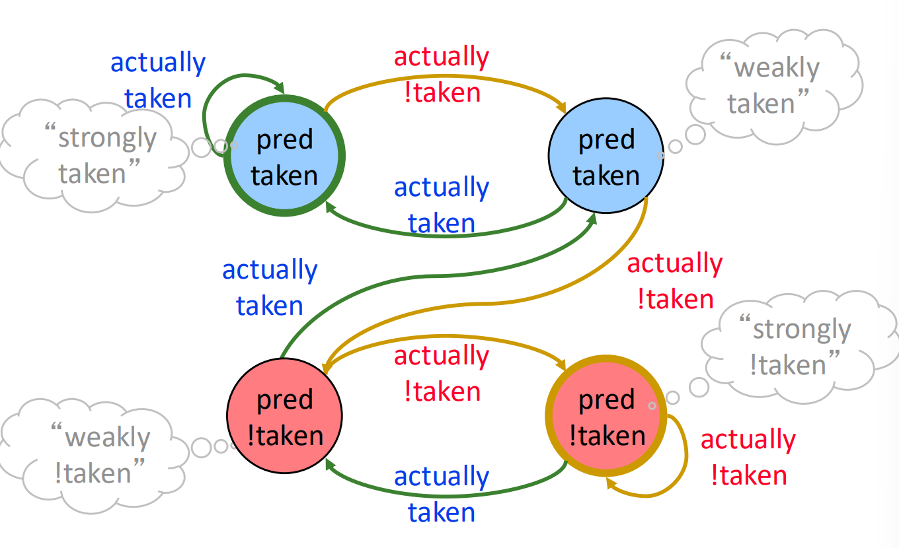

因此强预测不会因为单个不同结果而改变。

因此，对于循环，假设其初始为弱预测执行，则其正确率为$\frac{N-1}{N}$。对于分支总是于上次行为相反，其正确率有所增加，如：
```
TNTNTNTNTN
```
其正确率增加至50%。

##### [3] Two-level Prediction (二级分支预测)
1. 分支结果可以与其他分支结果相关联，这一现象被称为全局分支相关性。
2. 分支结果可能与同一分支历史结果相关，而不仅仅是上一次分支结果，这也被称为局部分支相关性。

###### 1) 全局分支相关性
当执行一系列分支时会产生结果，而最近执行的分支结果，会与下一个分支的结果相关联。如：
```C
if (cond1)
...
if (cond1 && cond2)
```
或是
```C
branchY: if (cond1) a = 2;
branchX: if (a == 0)
```

为汇总全局分支结果信息，可以通过位向量进行信息压缩，称之为**全局历史寄存器**。它通过0和1记录所有分支的跳转历史轨迹。

全局历史分支预测实现：
1. 追踪全局分支的执行历史记录 -> 全局历史寄存器 (GHR)
2. 使用GHR作为索引查表，表中记录了近期每个GHR值对应执行结果（表中仍可采用2位计数器以提供滞后性）

通过使用两层历史信息，即全局历史寄存器加上GHR的历史记录，从而达到二级分支预测。

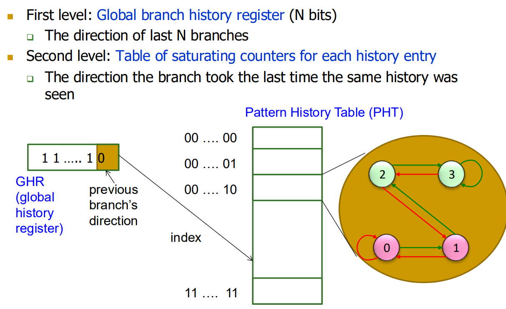

为进一步提升预测准确性，可以在预测中添加更多上下文信息。

运用这一准则的由 G-share 预测器。其将GHR与分支PC进行哈希运算，如异或操作，并用结果索引方向预测器，即分支历史表。

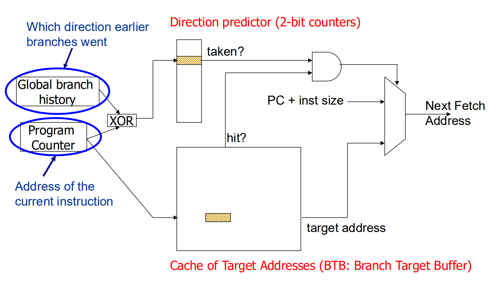

###### 2) 局部分支相关性
其核心是每隔分支都有独立的记录，该历史寄存器编码了该特定分支最近n次的分支方向。这是针对**单个分支的历史寄存器**，而不是收集所有分支的全局历史寄存器。这一寄存器称为局部历史或局部分支寄存器。

它使用两级历史记录：
1. 每个分支独立的历史寄存器
2. 该历史寄存器对应的历史记录

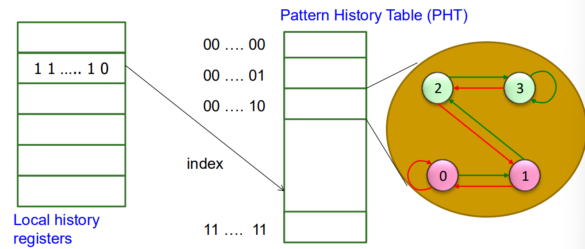

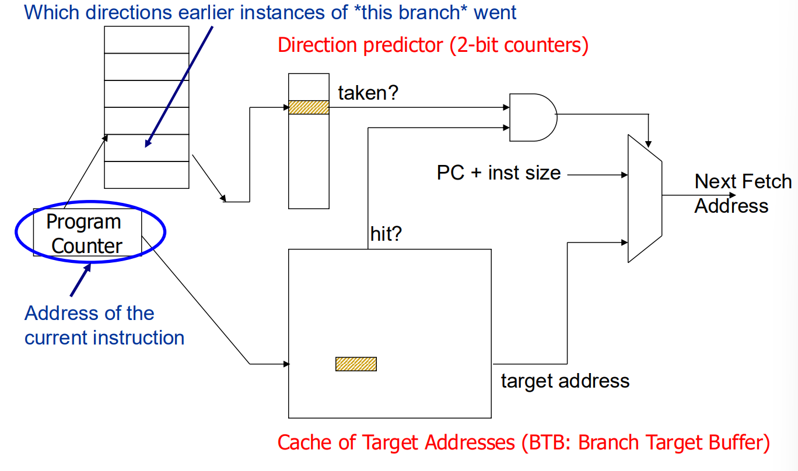

##### [4] Hybrid Branch Predictors
观察发行不同分支间存在很大的异质性，如有些分支使用局部历史预测更为准确，有些则在全局历史下预测更为准确，而有些简单 two-bit counter 就足够，然而对于一部分，single bit即可完成目标。**因此当存在异质性时，本质上应该采用异构硬件。**

因此其核心思想是使用多种预测器并选择最合适的进行预测。

这一方式可以带来更高的准确性，且能减少预测器的预热时间。

##### [5] Loop branch detector and predictor
本质为检测循环分支的预测器。当迭代次数可以预测时，可以将其从其他预测器中过滤出来。

其基本原理为检测循环分支，即向后跳转的分支，并记录这一向后分支执行时执行次数。对于下一次看到这一分支，重新开始计数，当达到上一次执行次数时，预测停止迭代。

这对于迭代次数少且可预测的循环循环效果好，且这类程序出现频率高，因此值得专门进行优化。

##### [6] Biased Branches and Branch Filtering
由于观察到许多分支存在方向偏差，如99%会执行的分支，**而这些分支会通过干扰分支预测表与历史寄存器污染分支预测结构**。

因此需要通过某种放肆检测这类偏置分支，如通过编译器或在硬件层面监控分支指令，并将它们过滤。

##### [7] Perceptron Branch Predictor 
其核心思想是使用感知器来学习分支历史记录、寄存器位与分支结果之间的关联。感知器是单层网络结构。

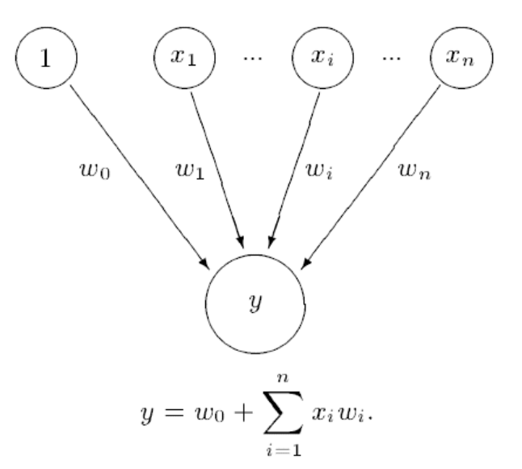

一个感知器学习一个具有 N 个输入的目标布尔函数，每一个分支与一个感知器相连。一个感知器中包含一系列权重$w_i$，每一个权重与一位GHR相关联，表明这一位与分支方向关联度。对于正相关，为 `large positive + weight`，对于负相关，为 `large negative - weight`。

通过将GHR的位翻译为 `1(T)` 与 `-1(NT)`，并将GHR与权重点乘，当结果大于1时，预测分支跳转。

##### [7] TAGE
TAGE 核心思想是利用多级历史长度。不同分支需要不同长度历史记录以提高预测准确性，因此可以建立多个模式历史表，通过不同长度的全局历史寄存器进行索引，并智能地将模式历史表条目分配给不同分支。

##### [8] 分支预测置信度评估
其核心思想在于评估预测结果是否可能正确。

### 18. VLIW架构
VLIW (Very Long Instruction Word) 不同于超标量执行，其通过 **软件（编译器）** 将独立的指令打包成一个超长指令字，以便同时获取和执行。硬件会同时读取并执行该指令字中的指令。

因此在VLIW模型中，无需对同时获取的指令进行硬件依赖性检查。

#### (1) VLIW Lock-Step Execution
如果VLIW指令中的任何操作发生停顿，所有并发操作都会停顿。

对于真正的VLIW机器：
- 编译器处理所有依赖相关停顿
- 硬件不进行依赖性检查
- 对于可变停顿操作与内存停顿

#### (2) VLIW 权衡
1. 优势
    - 无需动态调度硬件，因此硬件更加简单
    - VLIW 指令内部无需依赖检查，因此支持多指令发射的简单硬件 + 无需重命名
    - 从不同功能单元读取数据后，无需对指令进行对齐/分配，因此硬件简单
2. 劣势
    - 编译器需要每周期寻找N独立指令，如果无法找到，则在VLIW指令中插入NOPS。
    - 当执行宽度 (N)、指令延迟或功能单元发生变化时，需要重新编译
    - 步调一致的执行会导致独立操作陷入停滞

由于以上原因，VLIW不是当今主流架构与解决方案，但其对于编译器优化有巨大推动作用。

### 19. 脉动阵列架构
脉动阵列构成了一种执行模型，实现了脉动计算，且与冯诺依曼模型与数据流模型均有所不同。

脉动阵列作为专用加速器，主要用于卷积、矩阵向量计算等加速。

其核心在于将单个处理单元（PE）替换为一个规则排列的处理单元阵列，并精心设计各处理单元之间的数据流动，使其共同对一段输入数据进行转换，然后将其输出到内存中。

其好处在于可以最大限度地利用从内存中读取的单个数据元素进行计算。

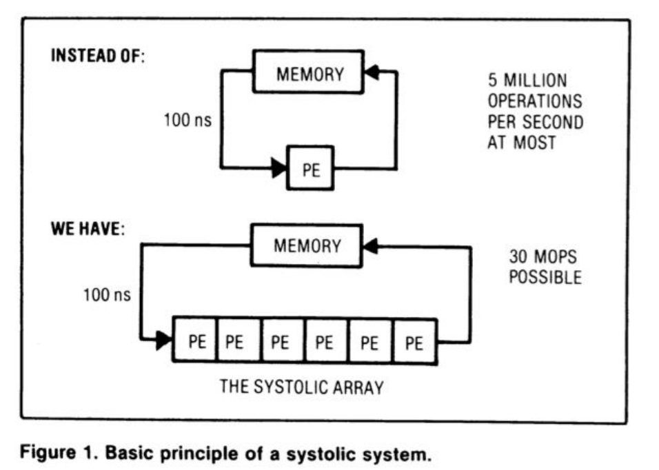

显而易见的是，其与流水线均将单个PE替换为一个规则排列的处理单元阵列，并精心设计各处理单元之间的数据流动，但不同点在于：
1. PE进行相同计算，是独立的。
2. 数组结构可以是非线性与多维的。
3. PE连接可以是多方向的（且速度不同）。
4. PE可以拥有本地内存并执行内核。

以卷积为例，脉动阵列加速方式如下所示：

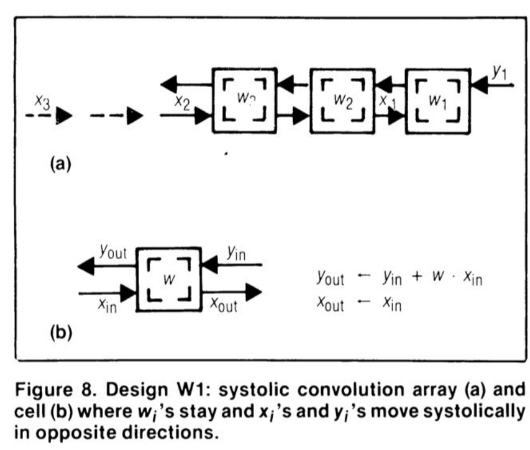

对于二维，以矩阵乘法为例，其加速方式如图所示：

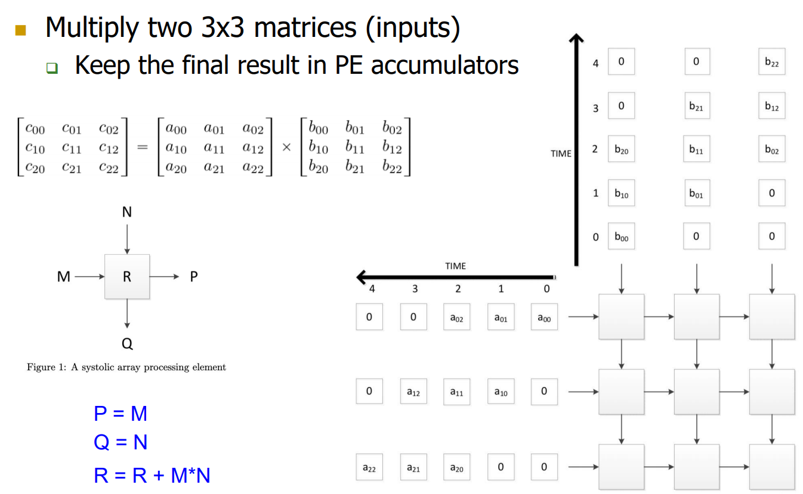

需要注意的是脉动阵列显然并不具有普遍适用性。

进一步来说，每个处理单元（PE）都可以拥有自己的数据存储器和指令存储器，用于存储部分临时结果与常量，从而实现流处理和流水线并行。

其优势在于：
1. 作为专用架构，具有更高的效率。
2. 能够多次利用每隔数据项，减少重复获取数据的需要，更高效利用内存带宽。
3. 更为出色的并发性和规整的设计结构。

然而采用这一设计器缺陷在于：
1. 不擅长处理不规则并行性。
2. 由于器为特殊目的进行设计，因此不具有普遍适用性。
3. 问题不匹配时难以编程。

## 五、并行处理器
### 1. Amdahl's Law
- f: Parallelizable fraction of a program
- N: Number of processors
$$Speedup = \frac{1}{1-f+\frac{f}{N}}$$

**因此，最大加速比受串行部分限制，即串行瓶颈。**
### 2. SIMD架构
- SISD：单指令流处理单数据流架构
- SIMD：单指令流处理多数据流架构
    - 阵列处理器
    - 向量机
- MISD：多指令流处理单数据流架构
    - 最接近架构：脉动阵列架构
- MIMD：多指令流处理多数据流架构
    - 多处理器
    - 多线程处理器

#### (1) SIMD处理范式
并发性源于对不同数据集执行相同的操作，如向量间点乘或加减。

SIMD处理范式在于单条指令操作多个数据元素。为实现这一指令，可通过配置多个处理单元与执行单元，本质上是在时间或空间上对不同数据元素进行操作。

因此可以认为SMID具有**时间空间二元性**：
- 阵列处理器：单条指令在同一时间不同空间 (PEs) 同时操作多个数据元素。
- 向量机：单条指令采用连续时间步进以流水线方式运作，使用相同空间 (PEs)。

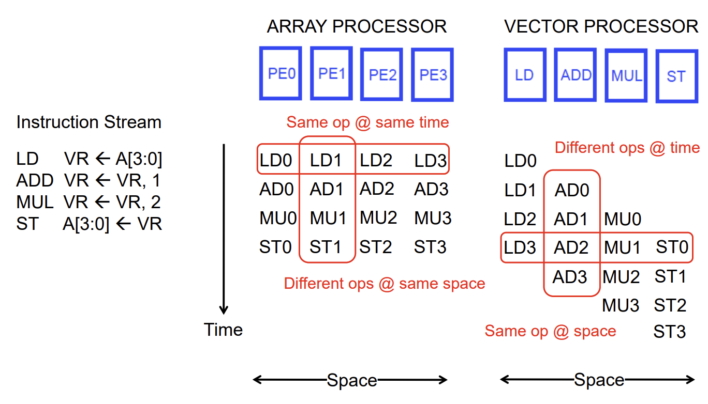

#### (2) 向量数据寄存器
每个向量数据寄存器可以存储N个M位数值元素。
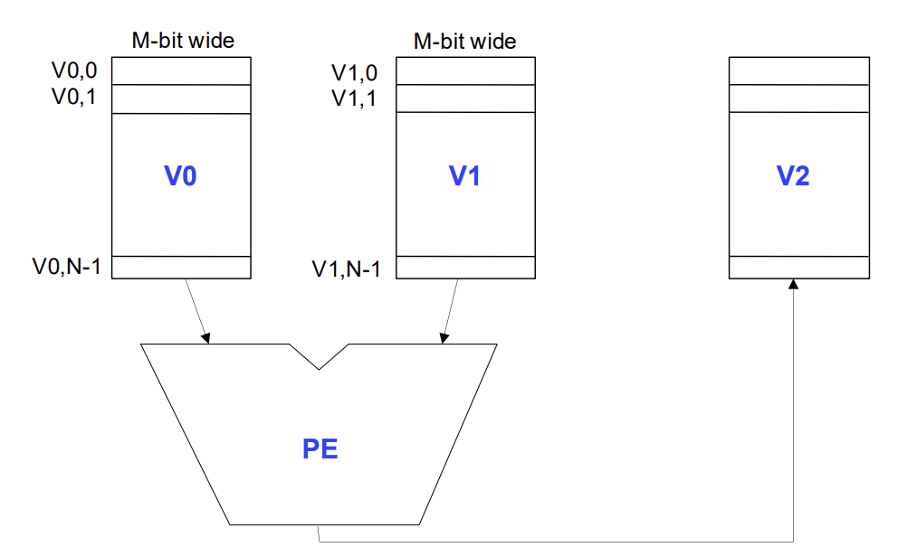

#### (3) 向量机
向量机的指令集专门针对向量而非标量或单个数据进行运算。其具备以下特性：
- 支持向量加载与存储操作 -> 向量数据寄存器
- 对不同长度向量进行操作 -> 向量长度寄存器 (VLEN)
- 向量的各个分量可能在内存中分开放置 -> 向量步长寄存器 (VSTR)
    - 步长 (stride)：程序访问内存元素时的间隔距离

向量指令会在连续周期内对每个元素进行运算，**向量功能单元采用流水线设计**，每个流水线阶段处理不同的数据元素。

向量指令支持更深度的流水线，因为向量内部不存在依赖问题，向量内部也不存在控制流，且步长已知，是的向量元素的计算寻址变得简单。

因此向量机具有以下优势：
1. 向量内部不存在依赖
2. 每条指令可执行大量运算
3. 无需显式编写循环
4. 内存访问模式高度规律

然而需要注意的是，只有当并行运算具有规律性时向量机才适用。此外，**内存带宽很容易成为瓶颈**，特别是当计算与内存操作的平衡未被维持时，或数据没有恰当地映射到内存库时。

##### [1] 向量控制寄存器
1. VLEN
2. VSTR
3. 向量掩码寄存器 (VMASK)

VLEN：
- 存储向量长度
- VLEN最大值为存储向量寄存器中存储的元素最大数量

VSTR：
- 存储从内存中提取向量元素的步长

VMASK：
- 表明对向量中哪些元素进行运算
- 由向量测试指令确定

##### [2] 向量功能单元
通过深度流水线执行元素操作，从而得到更快时钟周期。由于向量元素独立性，深度流水线控制逻辑较为简单。

##### [3] 向量加载与存储
如果我们能每周期启动加载一个元素，则可以在连续的周期中加载元素，这意味着需要维持每个周期处理一个元素的吞吐量。

然而由于实际内存的访问时间超过1个时钟周期，一种解决方案是增加更多端口，或是将数据存储在不同bank中。

内存被划分为多个bank，每个bank均可独立访问；各bank共享地址总线和数据总线（以减少内存芯片的引脚数量）。每个时钟周期可启动并完成一次bank访问。若所有 N 次访问均指向不同的bank，则可同时处理 N 次访问。

向量内存计算遵循：
```
Next address = Previous address + Stride
```
所以有如下向量内存系统：

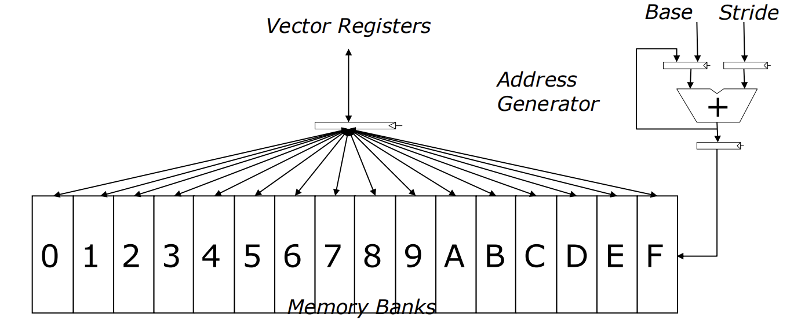

因此如果步长为 1，且连续元素在各个bank之间交错分布，并且bank数量不少于bank访问延迟，那么可以实现每周期 1 个元素的持续吞吐率。

只要访问步长与bank数量**互质**，且存储体数量足够多，能够覆盖依次存储体访问延迟，则可以维持每周期访问1个元素吞吐率。**其中互质保证了每个bank都会被轮流使用，优化吞吐率。**

#### (4) 向量链
向量链指可以从一个向量功能单元向另一个向量功能单元转发数据。通过向量链计数，可以提高代码性能。

#### (5) 向量流挖掘 & 分散收集操作 & 循环中条件操作
当数据元素数量大于单个向量寄存器容量时，通过拆分循环，让每次迭代处理一个向量寄存器容量的元素。这称之为向量流挖掘。

对于对向量进行非顺序内存访问，则通过间接寻址来组合打包元素到向量寄存器，这称之为分散收集操作。这对于处理稀疏向量或矩阵十分有用，因为其中可能包含大量零值。

对于循环中的条件操作，可以通过掩码操作进行实现，这也称之为**谓词执行**。

为实现掩码向量指令，一种简单的实现方式是，执行所有运算，根据掩码值关闭结果写回。另一方案是采用密集时间实现方案，先扫描掩码向量，只对非零掩码元素执行运算。

#### (6) 解耦执行器
其核心思想是通过两条独立指令流将操作访问/内存访问与执行计算解耦，二者通过ISA可见队列通信。

通过这一思想，执行流可以超前于访问流运行，反之亦然。其本质上实现了有限的乱序执行能力。

然而，在解耦访问执行中需要编译器支持来划分程序并管理队列。且在分支指令的处理时，需要保持访问处理器与执行处理器的同步。此外产生了多重指令流问题，因为解耦执行器本质上需要生成两个指令流，但可以通过单一指令流动态拆分实现多处理器并行处理。

##### [1] 循环展开
由于分支处理的困难性，许多编译器采用循环展开来消除分支。循环展开的思路就是复制循环体，在单次迭代中进行多次操作。
```C
for (int i = 0; i < N; i++){
    A[i] = A[i] + B[i];
}
```
将上述循环展开为：
```C
for (int i = 0; i < N; i+=4){
    A[i] = A[i] + B[i];
    A[i + 1] = A[i + 1] + B[i + 1];
    A[i + 2] = A[i + 2] + B[i + 2];
    A[i + 3] = A[i + 3] + B[i + 3];
}
```

通过循环展开可以降低循环维护的开销，并扩大基本bank。然而当迭代次数不是展开因子的整数倍时，需要额外代码进行检测。

#### (7) 矩阵存储
矩阵存储主要分为行优先 (Row major) 与列优先 (Column major)：
- **行优先**：同一行中的连续元素在内存中以连续的方式排列（即位于连续的内存地址上）。
- **列优先**：同一列中的连续元素在内存中以连续的方式排列（即位于连续的内存地址上）。

因此，在访问行与列时，需要调整步长。

#### (8) 矩阵乘法存储体冲突
对于矩阵乘法，假设都采用行优先存储，不妨假设矩阵A为4x6矩阵，矩阵B为6x10矩阵。

则在矩阵A中，其步长为1，而在矩阵B中，其步长为10，可能不与bank数量互质，从而产生冲突。因此不同步长可能导致bank冲突。

为缓解存储体冲突，往往有以下方案：
- 更多banks
- 增加bank端口数量
- 优化数据布局匹配访问模式
- 改进地址到存储体的映射算法
    - 随机映射：获取地址后通过一个确定性函数进行随机化映射，将地址分配到不同bank。

#### (9) 向量指令执行
现代GPU往往不是采取单一阵列处理或是向量机，而往往是二者的结合，如下图所示：

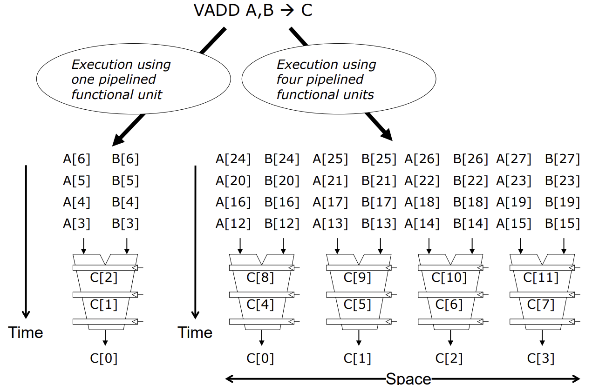

向量机/SIMD擅长利用规律性的数据级并行性。然而，重点在于代码可向量化程度。无法以数据并行方式执行的操作会成为性能瓶颈。

#### (10) 现代指令集架构中SIMD操作
##### [1] SIMD指令集扩展
这类指令的形式有限，引入的主要目的是图形处理需求。这类指令主要执行短算术运算，也称为打包算术。

例如同时执行4个8位加法运算，可以通过将ALU分区实现。关键在于确保分区后进位不会再4个8位运算单元之间传递。

##### [2] MMX指令
其本质是一条指令能同时操作多个数据元素。

MMX指令没有VLEN寄存器，步长始终固定为1，Opcode决定数据类型：
- 8 8-bit bytes
- 4 16-bit words
- 2 32-bit doublewords
- 1 64-bit quadword

在x86 ISA中，MMX进一步拓展，具体如下图所示：
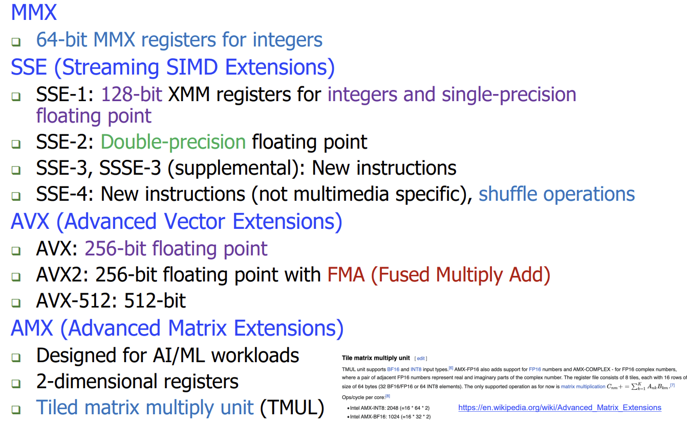

### 3. GPU架构
GPU的指令流水线运作方式类似于SIMD流水线，但是编程不使用SIMD指令集，而是通过线程实现。

#### (1) GPU编程模型与硬件执行模型
编程模型指代程序员编写代码的方式，而硬件执行模型指底层硬件执行代码的方式。因此执行模型可以与编程模型有巨大区别。

GPU本质上是一个底层SIMD处理器，也包含部分MIMD组件，并且通过**线程**进行编程。但其编程模型是SPMD，即单程序多数据流。

以下代码为例：
```c
for(int i = 0; i < N; i++)
    C[i] = A[i] + B[i];
```

在多线程中，程序员或编译器会为每次迭代生成一个新的线程，每个线程完成相同的工作，但处理不同的数据。这一模型称为**单程序多数据 (SPMD)**。

每个线程都有自己的上下文环境，即拥有独立的寄存器组，可以单独被处理、重启和执行。

**一组执行相同指令的线程在硬件层面被动态分组为一个线程束 (warp)/波前 (wavefront)**。同一warp通常共享一个程序计数器（PC），因此在未发生分支分化时，各线程同步执行同一条指令；若 warp 内线程因条件分支进入不同路径，硬件会通过活跃掩码选择部分线程执行当前PC对应的指令，并在之后进行重汇合。

本质上warp是由硬件形成的SIMD操作。

#### (2) SIMD与SIMT执行模型
SIMD是严格的单指令流多数据流，每条指令都指定多数据输入。

而SIMT则是多个标量指令流并行执行，即线程被动态分组为warp，重点在于指定线程数量。

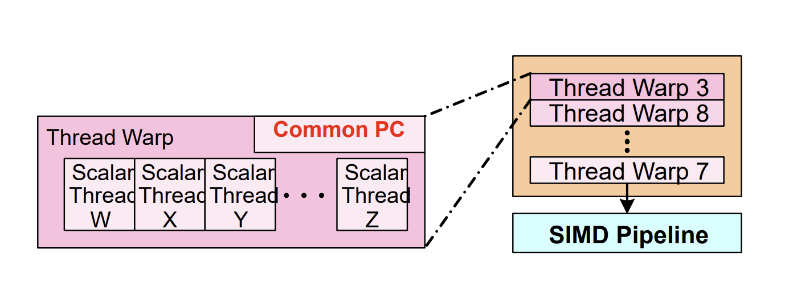

下图为GPU高级架构，着色器核心 (Shader Core) 即为warps。任何时刻，GPU选择一个warp，通过PC获取指令后解码，并执行分发到多个不同的流水线上，这些流水线执行相同操作，即SIMD部分，最后将结果写回。此后线程束回到正在执行的线程束池中，之后可以再次调度。硬件调度器与GPU工作就是选择接下来执行的线程束。
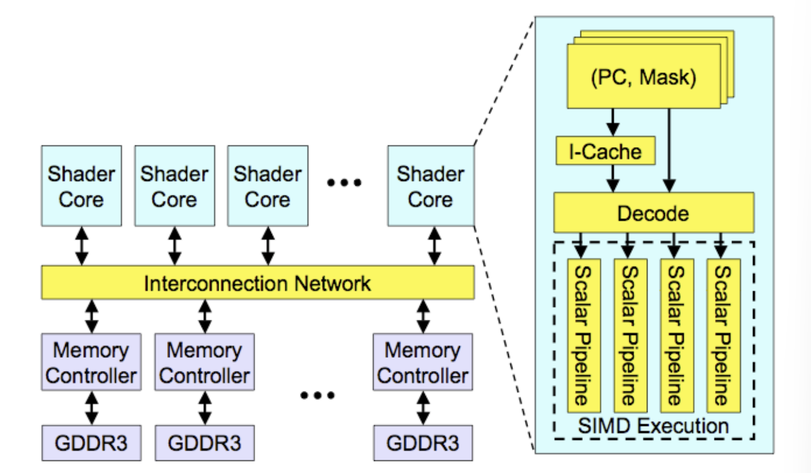

#### (3) 延迟隐藏
GPU采用细颗粒度多线程 (FGMT)。且所有线程的寄存器值都保存在寄存器堆中，因此将会需要大寄存器堆。
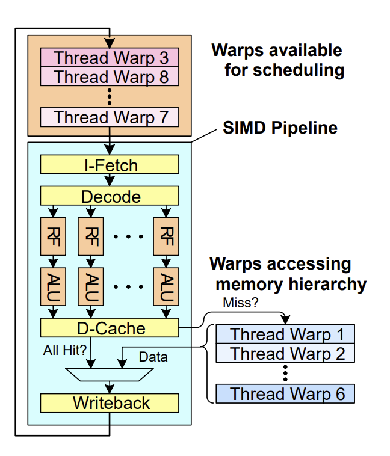

由于采用FGMT，因此实现简单流水线，且具备极好的延迟容忍度，无需分支预测等功能。

#### (4) SIMT内存访问
对于同一指令不同线程，可以使用线程ID来索引和访问不同数据元素，为此需要将数据分配到不同线程中。

为了获得最佳性能，内存还需要足够带宽，从而实现每个周期的元素吞吐量与计算单元吞吐量相匹配。

#### (5) 基于warp的SIMD与传统SIMD
传统SIMD只包含单一线程，且顺序执行，采用同步锁步操作模式。编程模型本质上是SIMD，软件需要知晓向量长度。ISA包含向量/SIMD指令。

基于warp的SIMD具有线程概念，多个标量线程被硬件组织成warp后，以SIMD/SIMT的方式共同执行同一条指令。但编程模型为SPMD。每个线程都可以被完全独立处理，且软件不需要知道向量长度。ISA是标量的，无需改变底层ISA。

#### (6) GPU/SIMT中控制流问题
每个线程都可以包含条件控制流指令，线程可以执行不同的控制流路径。

当wrap内分支到不同执行路径时，发生**分支分歧**。为此GPU会创建一个动态掩码，并让同一个warp依次执行各条路径，其中掩码的值取决于分支判断的结果。执行某条路径时，只有该路径对应mask中为 `1` 的线程参与执行，其余线程被屏蔽。GPU内部有硬件，可以检测路径的合并点，然后GPU会动态地将创建的两个warp合并为单个warp。

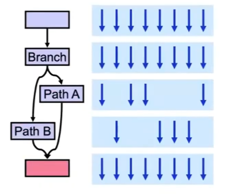

显然这一处理会导致SIMD利用率下降。其中，SIMD利用率指执行有效操作的SIMD通道比例。

#### (7) 动态warp形成/合并
通过动态合并执行相同指令的线程，即分支发散后，处于相同程序计数器位置的线程，可以提高SIMD利用率。

因此可以从等待中的warps组成新的warps。本质上说，只要每个执行路径都有足够多的线程分支，就能创建出完整的新线程束。需要注意的时只有当通道不冲突时才能进行合并操作。这是因为不同通道拥有各自独立的寄存器组分区，一个通道每个时钟周期只能有一个线程访问寄存器堆。

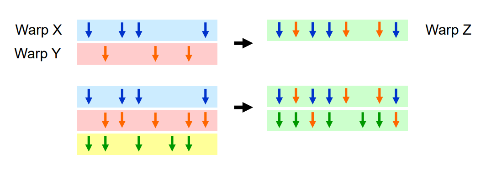

## 六、层次化存储
### 1. 物理内存系统
理想内存具有如下性质：
1. 零访问延迟
2. 无限容量
3. 零成本
4. 无限带宽
5. 零能耗

然而现实内存必然有所取舍，无法实现理想化内存。实际存储数据采用如下方式：
1. 触发器
    - 响应时间快；成本极高
2. SRAM
    - 响应时间相对快；成本较高
3. DRAM
    - 响应时间较慢；**读取操作和电荷泄露会破坏数据，需要刷新**；需要特殊工艺生产；成本较低
4. 其他存储技术 (flash memory, SSD, tape)
    - 响应时间慢；具有非易失性；成本低

#### (1) 存储阵列
为高效存储大量数据，采用阵列结构存储数据，并引入地址选择逻辑，以及读取电路。

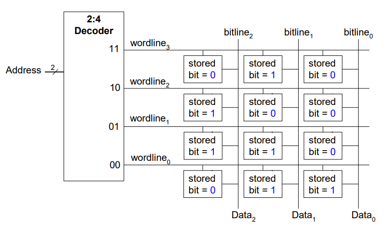

#### (2) SRAM与DRAM实际电路
SRAM常见为6T SRAM，电路结构如下：
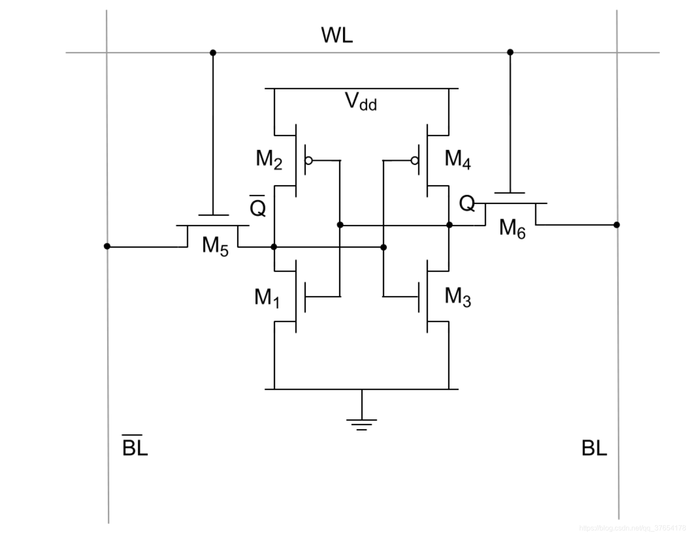

DRAM常见有1T1C DRAM，电路结构如下：
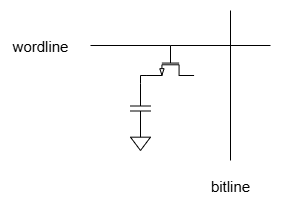

#### (3) 交错存取
为在不显著降低速度的情况下扩大存储容量，可以选择将内存分割为更小的阵列，然后将这些阵列互连。

此外，为降低内存阵列访问延迟，并实现并行多路访问，将单一大型阵列划分为多个独立访问的存储体 (bank)，这些存储体可以在同一周期或连续周期内进行操作。

然而以上操作的关键在于将数据映射到不同的存储体。

#### (4) 通用内存结构
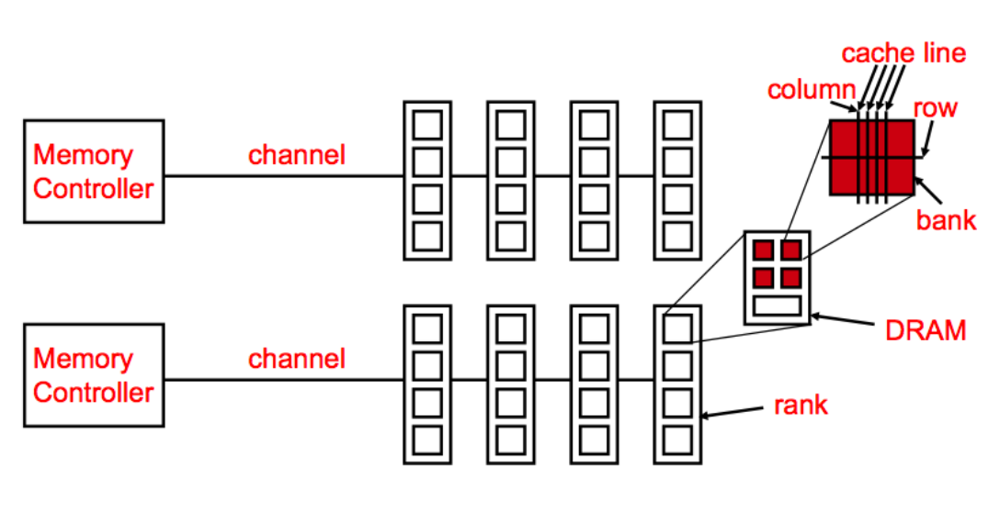

#### (5) DRAM子系统结构
DRAM子系统由高至低依次为：
1. 通道 (channel)：连接多个内存模块
2. 双列直插式模块 (DIMM)：内存模块，由多个rank组成
3. rank：一组存储芯片的集合
    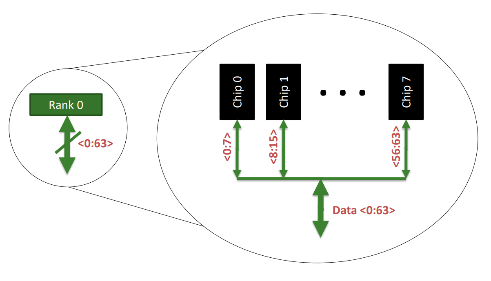
4. chip
5. bank
6. row/column

DRAM 访问时需要先激活目标行，将该行的数据读入行缓冲区；随后再根据列地址从行缓冲区中选择所需数据。如果后续访问仍落在当前已打开的同一行，则发生 row buffer hit，可以直接从行缓冲区读取，访问延迟较低。若访问不同的行，则需要先关闭当前行并激活新行，延迟较高。

### 2. 内存层次结构 (The Memory Hierarchy)
由于理想内存各项需求完全相互矛盾：容量越大速度越慢，速度越快成本越高，带宽越高成本越贵。

内存分级架构的理念是：采用多级内存或存储架构，随着层级离处理器越来越远，容量逐渐增大，速度逐渐变慢，并通过特定机制，尽可能确保处理器所需数据都保存在高速层级中。

### 3. Cache基础与操作
Cache可以被视为任何能够记忆、使用或生成数据的结构，以避免需要从头开始重新生成或获取数据。

Cache在计算机结构中，是自动管理的内存结构，也可以通过程序进行管理。

#### (1) 局域性原理
**时间局域性**：程序倾向于在同一个时间窗口内多次访问相同的内存位置。

**空间局域性**：程序倾向于引用在特定时间段内地址空间相邻的内存位置。

#### (2) 缓存 (Cache) 基础
利用时间局域性，通过将最近访问的数据自动存储在快速存储器中，从而优化访问时间。这一快速存储器成为硬件缓存(cache)。

空间局域性原理类似，将彼此相邻的地址数据自动存入cache中，从而优化访问时间。

为实现空间局域性利用，将内存逻辑划分为等大小的区块，成为**缓存块**，并一次性将整个访问块提取到cache中。

**缓存块**为缓存中的存储单元，内存被逻辑划分为可以映射到缓存中潜在位置的块。

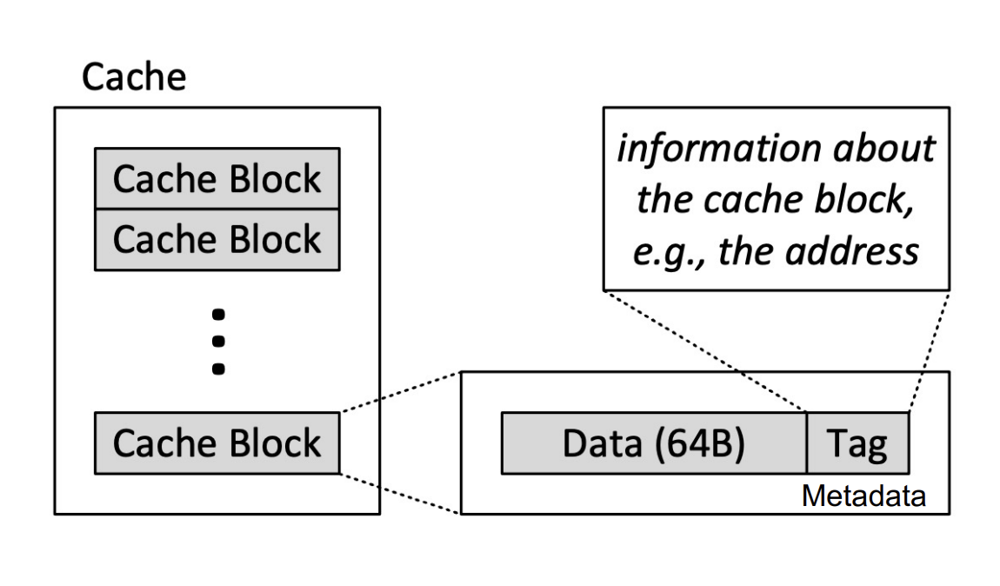

在引用时，如果在缓存中找到数据，则直接使用缓存数据而无需访问内存，这称为**缓存命中 (hit)**。如果缓存中未找到数据，则需要从更低层级的存储中将数据加载到缓存中，这称为**缓存丢失 (miss)**。缓存丢失时，由于缓存容量有限，可能需要清空某些区域。

#### (3) Cache逻辑结构
对于cache，一个关键问题是如何将主内存地址空间的块映射到缓存中的块。

##### [1] 全相联映射
在全相联映射中，基本上每个区块都可以映射到缓存中的任意缓存块。

##### [2] 直接映射
每个区块根据其地址，在缓存中只能对应一个固定位置。根据区块地址，使用地址的一部分，将区块映射到缓存设计中的特定缓存块位置。

内存中两个映射到缓存相同索引位置的区块不能同时存在于缓存中。这导致当多个区块以交替方式访问，且映射到同一索引时，命中率为0%，称为 ==**冲突缺失**== 。

##### [3] 组相联映射
通过在缓存设计中设置多个组，使用地址的一部分，将地址索引到对应组，在组内可以自由选择将缓存块位置放在任意一处。

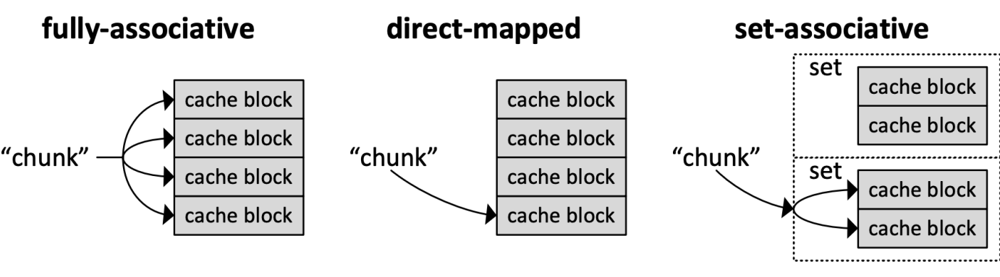

#### (4) 流水线设计中的缓存机制
实际设计中，cache必须与流水线紧密集成。对于高频流水线，为保证快速访问，无法使用大容量cache，但理想情况下需要大容量cache，因此引入cache层次结构。

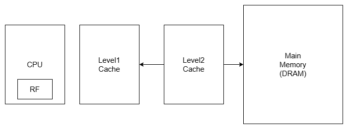

#### (5) 层次延迟分析
假设现有一个给定的存储层次$i$，其**固有访问时间**为$t_i$。它还有一个**感知访问时间**$T_i$，且时间长于$t_i$。

因为每次访问cache，当缓存命中时，延迟为$t_i$，当缓存丢失时，则需要进入下一级cache。从而增加延迟时间。从上层看来，第$i$级存储的平均访问代价称为感知访问时间$T_i$。它不仅包括该级本身的访问时间$t_i$，还包括在该级缺失时继续访问下一级所带来的额外延迟。

因此在查找地址时，会有：
- 命中（概率为$h_i$），则访问时间为 $t_i$。
- 丢失（概率为$m_i$），则访问时间为 $t_i+T_{i+1}$。
- $h_i+m_i=1$

因此对于第$i$级感知访问时间，有如下关系：
$$T_i=h_i \cdot t_i+m_i\cdot (t_i+T_{i+1})=t_i+m_i\cdot T_{i+1}$$

#### (6) Cache基础硬件设计
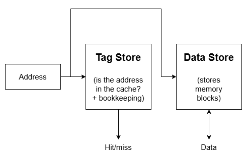
##### [1] 缓存分块与寻址
每个块地址都会映射到缓存中的一个潜在位置，该位置由地址中的**索引位**决定，这些索引位用于定位标记存储和数据存储。

以主存为256 bytes，cache为64 bytes，缓存块为8 bytes为例，此时内存地址可做如下划分。
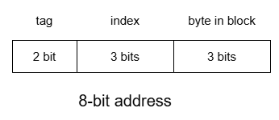

cache访问时：
1. 使用地址中的索引位访问标签和数据存储
2. 检查标签存储中的有效位，确保条目有效
3. 比较地址中的标记位于标记存储区中的标记

如果存储的标记有效，且与块的标记匹配，则缓存命中。

##### [2] Set Associativity
由于直接映射存在冲突缺失问题，所以考虑允许索引相同的块映射到多个缓存位置，即多路组相联。以下以2路组相联为例。

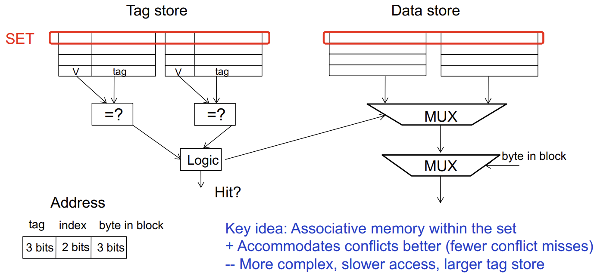


在极端情况下，可以使用全组相联缓存，数据块可以存放在缓存的任意位置。
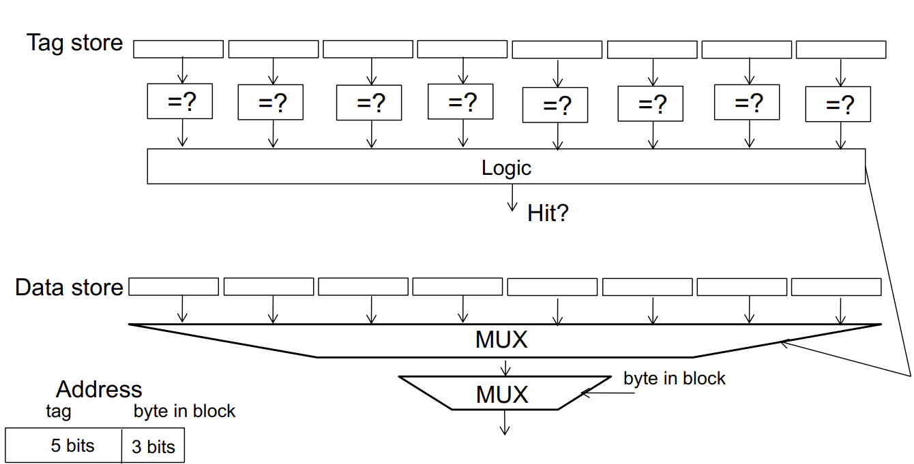

相联度决定了多少个块能映射到相同索引或集合，更高的关联度会导致更高的命中率，但也会导致cache访问时间变慢，且增加硬件开销。此外高关联度的回报会递减。

##### [3] Insertion, promotion, eviction (replacement)
- **插入策略 (Insertion)** ：决定新缓存块的初始优先级，即新数据块应该插入什么位置以及是否应该插入缓存块。
- **优先级提升策略 (Promotion)** ：决定缓存命中后优先级变化，即是否以及如何调整块优先级。
- **淘汰与替换策略 (Eviction/Replacement)** ：决定缓存未命中时优先级变化，即具体要淘汰哪个块，如何调整优先级。

**淘汰与替换策略**：
- 首先，优先替换无效块。
- 对于所有块都有效情况，则需要指定替换策略。
    - 随机替换策略
    - FIFO策略
    - 最近最少使用策略 (LRU)
    - 非最近使用策略
    - 使用频率最低策略
    - 重新获取成本最低策略
    - 混合替换策略

**LRU实现**：
LRU核心思想在于淘汰最近最少被访问的块，因此需要跟踪块的访问顺序。以2路组相联为例，其实现LRU算法最少需要1 bit。而对于4路组相联，由于共有$4!=24$种可能性，因此需要5 bits进行编码。

大多数现代处理器不会再高度组相联中实现真正的LRU。这是因为LRU本身实现复杂，且也只是对局部性预测的一种近似。

实际实现中往往采用LRU近似算法，如非MRU算法，只需记录最近使用情况。或采用分层LRU架构，通过建立层级结构，将其分块位更小的子集，在每个子集内部采用LRU算法。此外还有牺牲者-下一牺牲者替换策略，这一策略核心位确保不会错误置换最近使用过的数据块。

#### (7) 写入操作
##### [1] 写直达与写回
为在cache中实现存储操作，涉及向下级cache写入数据操作，存在两种处理方式：
- 写直达 (write through)：进行写操作时，同时更新其他层级的存储。
- 写回 (write back)：在缓存块被替换时进行更新。

在写回缓存中，可以在逐出前合并对同一数据块的多次写入，从而显著节省各级缓存之间的带宽，并降低能耗。但需要在标签存储中设置标记（脏位）为表示数据块已被修改。

对于写直达缓存，其设计更为简单，且所有缓存层级都能保持最新且一致。但其会消耗更多带宽，且无法合并写入操作。

##### [2] 写入缺失
在写入时，可能存在**写入缺失 (write miss)** 情况发生，则需要选择进行写入缺失分配或不进行写入缺失分配。

写入缺失分配：当发生写缺失时，cache 会访问下一级存储，取回包含目标地址的整个 cache block，并将其分配到本级 cache 中，然后在本级 cache 中完成写操作。

因此可以将写入缺失分配与写回策略结合使用，合并多次写入操作。且写缺失可以类似读缺失处理。但这需要传输整个缓存块。

不进行写入缺失分配：当发生写缺失时，cache 不会将目标 cache block 调入本级 cache，而是将写请求直接发送到下一级存储，由下一级存储更新对应数据。

采用不进行写入缺失分配，当写入块空间局域性较低时，可以节省缓存空间。

#### (8) 子块/扇区缓存
其核心在于将块划分为子块（或称扇区），并为每个子块单独设置有效位和脏位。在一次写请求时只分配一个子块或部分子块。

通过子块，在操作时无需传输整个块的的数据，只需验证并更新子块即可。同时也让传输子块到缓存有更大灵活性（缓存块无需完全位于缓存中）。

然而采用子块设计会导致设计复杂，且引入更多有效位与脏位，且由于不加载整个块而是加载部分子块，可能无法充分发挥空间局域性。

#### (9) 指令缓存与数据缓存
指令与数据动态共享缓存空间，可以提升整体缓存利用率，避免静态划分缓存空间可能导致的资源超配。但这会导致指令和数据相互基站空间，即二者均无保证的专用空间。且指令和数据在流水线中的不同位置被访问，动态共享无法实现快速访问。

由于流水线技术导致的快速访问问题，在L1 cache中，指令缓存与数据缓存一般采用分离设计。但在其他级别缓存则几乎时统一的。

### 4. 多级缓存设计管理
#### (1) L1 cache
L1 cache受周期时间与流水线结构影响，必须能够快速访问，因此L1 cache通常容量相对较小，同时采用高速晶体管和快速SRAM，以确保低延迟。且L1 cache中，标签存储与数据存储通常并行访问。

#### (2) L2 cache
L2 cache决策需要平衡命中率与访问延迟，因此通常采用大容量高关联缓存，标签存储与数据存储可串行访问。

#### (3) 更高级别缓存
对于更高级别和更大缓存，由于缓存容量问题，访问能耗是更重要的问题。标签存储与数据存储通常串行访问。

#### (4) 缓存层级的串行访问与并行访问
并行访问：在访问上一级缓存的同时，并行访问下一级缓存，本质为预取机制。并行访问下，若上一级未命中，则可以更快获取数据，但若上一级命中，则会产生对下一级不必要的访问。

串行访问：只有上一级缓存未命中时，才会访问下一级缓存。串行访问下，若上一级未命中，数据访问速度较慢，但若上一级命中，则完全不会浪费资源访问下一级。且下一级缓存接收到的访问请求也与上一级不同。

### 5. 缓存性能
#### (1) 缓存容量
缓存容量指总数据容量，不包括标签存储。更大的缓存能更好地利用时间局部性，但到达某个临界点后，命中率提升较小。

工作集指在特定时间段内工作负载访问的全部数据集。临界点即工作集大小，此时整个工作负载的数据都能较好适配缓存容量。

对于容量过大的缓存，则会导致运行速度缓慢；缓存过小则无法利用空间局部性，有用数据被频繁替换。
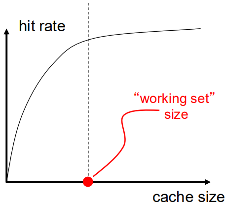

#### (2) 缓存块大小
块大小就是与标签相关联的数据量。块大小不一定要是内存与缓存层级之间传输的最小数据单元，如子块等。

当块过小是，无妨充分利用空间局域性，且标签开销更大。但当块过大，会导致缓存中块数目减少，无法充分利用空间局域性，且会挤占缓存空间、带宽等资源。

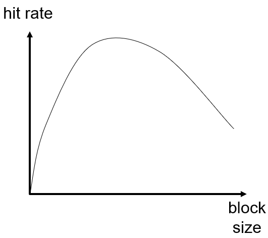

#### (3) 关联度
关联度表示同一个索引中可以包含块的数量。关联度越高，缓存未命中率越低，但会增加命中延迟与面积开销。而关联度越低，冲突增多，但访问时间反而缩短。

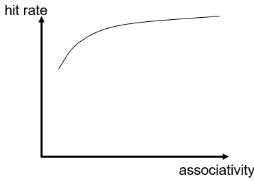

需要说明的是，关联度并非必须满足某些硬性条件，如用于缓存索引等，因此无需人为限制它为二的幂次方。理论上缓存关联度可以设为任意数值。

#### (4) 缓存缺失类型
##### [1] 强制性缺失 (Compulsory miss)
对某个地址（块）的首次访问总是会导致缺失，成为强制性缺失。除非有其他机制如预取机制，否则无法避免这种缺失。

##### [2] 容量性缺失 (Capacity miss)
容量性缺失指因为缓存容量不够大而产生的缺失，定义为即使采用全相联缓存，使用相同容量的最优替换策略也会发生的缺失。

软件层面，可以通过重构重写程序，从而更好利用有限缓存容量。硬件层面，通过实施更优的替换策略与放置策略，从而更有效地利用有限的缓存容量。

##### [3] 冲突性缺失 (Conflict miss)
冲突性缺失指介于以上二者之间的所有情况。

缓解冲突性缺失最简单的方式就是增加关联度，但关联度提升同时也会导致功耗问题。

#### (5) 提升缓存性能
缓存性能提升主要有以下三个目标：
1. 降低丢失率：
  
2. 减少丢失延迟或丢失开销

3. 降低命中延迟或命中开销

需要注意的是，如果被替换掉的区块重新读取成本较高，降低缺失率可能会导致性能下降。

### 6. 内存级并行 (MLP)
内存级并行（MLP）是指并行生成并处理多个内存访问的操作。

传统cache管理策略试图减少缓存未命中次数，其隐含假设是：减少未命中次数可减少与内存相关的停顿时间。

但事实并非如此。消除一次孤立丢失对性能影响，比消除一次并行丢失更大。消除一次高延迟的丢失对性能的提升，可能比消除一次低延迟的丢失更大。

因此，基于MLP，一种淘汰与替换策略是优先替换可并行或低延迟cache块，保留孤立执行或高延迟cache块，虽然可能增加丢失次数，但能够有效提升性能。

### 7. 预取技术
预取技术本质上是在程序实际需要数据前预先获取数据，从而一定程度缓解强制性冲突。

现代系统中，预取通常是通过缓存行粒度或缓存块粒度进行的。

预取技术本身是一种可以同时降低缺失率与缺失延迟的技术。预取可以通过硬件或编译器实现。

对于内存预取技术，预测错误本身不会影响程序正确性，因此无需恢复状态。

但是预测错误会对带宽造成浪费，且浪费实际存储空间。如果存入缓存，反而可能驱逐潜在有用缓存数据，导致缓存污染。

此外，预取过于超前，可能导致数据在真正需要时已经失效；同样，如果预取太晚，则无法完全掩盖数据访问延迟。因此需要确定预取时效性，这一评估指标为**时效性矩阵**。

预取数据地址以及预取数据存放的缓存位置也应当考虑在内。此外还应当考虑预取器放置位置，其观察位置与代码越远，则可以观测请求越少。预取器观察到的访问模式越完整，则预测可能更加准确，同时覆盖范围更广。但同时预取器需要监控所有访问请求，会使得预取器本身设计更加复杂。

对于预取器实现，有多种方式：
1. 软件预取
    - ISA包含某些预取指令，通过使用预取指令显式预取信息。
    - 通常在访问模式规律时效果较好
2. 硬件预取
    - 硬件控内存访问情况
    - 记录、查找并学习地址跨度/模式/相关性
    - 自动生成预取地址
3. 基于执行的预取
    - 存在线程为主程序预取数据
    - 可以由软件或硬件生成

预取器的性能指标主要有：准确率、覆盖率以及及时性。同时还有二级指标，如带宽消耗与缓存污染。

### 8. 缓存中的多核问题
在多核或多线程系统中，缓存效率尤其重要。内存带宽是稀缺资源，且缓存空间也是核心/线程间的有限资源。

#### (1) 缓存私有/共享
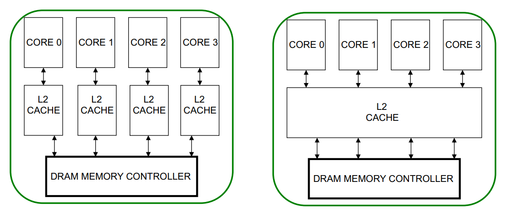

**私有缓存**专属于单个核心，共享数据块可能存在于多个缓存中。**共享缓存**则由多个核心共享。

共享资源允许多个硬件上下文共享硬件资源，而不是专用于某个硬件上下文。其优势在于可以提高利用率与效率，从而提高吞吐量与效率。且可以通过多线程共享数据，降低通信延迟。此外，这与内存编程模型兼容。

然而资源共享会导致共享资源的争用，进而导致性能下降。此外，如果不加以控制资源共享，会导致性能隔离失效，出现分配不均或资源匮乏情况，降低服务质量。**因此共享资源的关键在于建立高效公平的分配机制。**

相较于私有缓存，共享缓存拥有更大有效容量；由于采用动态分区管理可用缓存空间，避免了静态分区导致的碎片问题，当一个核心没有利用某些空间，另一个核心可以使用；更容易维护缓存一致性。

然而，共享缓存相较私有缓存，其访问速度更慢；核心会因为互相驱逐数据块而产生缺失；由于这种共享机制，确保每个核心都能获得最低限度的服务或公平性较为困难。

#### (2) 缓存一致性
并行程序中的线程通过共享内存进行通信。这一模型下，每次读取操作都应获取任意处理器最后写入的值。

由此产生核心问题是：当多个处理器缓存同一个块时，如何确保它们看到的该缓存块状态一致。

**基于广播的缓存一致性**：处理器或缓存向所有其他处理器广播其写入或更新缓存块的操作，其他持有该数据块的处理器或缓存，要么使其本地副本失效，要么同步更新。

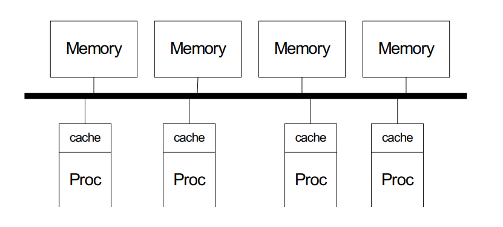

**基于目录的缓存一致性**：通过中央目录记录每个缓存块存储在哪些缓存中。每个缓存在操作缓存块前都会查询该目录，以确保数据的一致性。

对于内存中每个缓存块，需要在目录中存储p+1个比特位，p为系统中处理器数量。每个缓存对应一个比特位，以及一个独占位。当独占位置位时表示该缓存拥有该块的唯一副本，无需通知其他缓存即可直接更新。

读取时，缓存向目录发送消息，目录在该数据块的目录条目中设置缓存位，并将数据块提供给缓存。

写入时，目录会确保使该数据块在所有设置的缓存中失效，并在目录条目中设置缓存的位。

独占位使得缓存能静默更新独占块而无需通知目录。
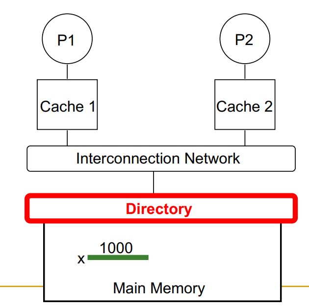

### 9. 虚拟内存
虚拟内存的核心思想在于让每个程序在物理内存有限的情况下，仍能拥有一个庞大的地址空间，从而程序员无需担心物理内存管理问题。在底层，硬件与操作系统协同工作，自动个管理物理内存空间。

#### (1) 基本机制
程序中每条指令生成的地址都是一个虚拟地址，因此需要一种地址转换机制，将程序中使用的虚拟地址映射到对应的物理地址。

系统首先将虚拟地址空间与物理地址空间划分为固定大小的块，虚拟地址称为**页**，物理地址称为**帧**。进行映射时，以页为单位进行操作。

大多数现代系统会在程序首次引用虚拟地址时进行映射，采用多级粒度，并且存在表专门存储虚拟地址到物理地址的映射关系。当内存满载时，需要置换某些页面。

#### (2) 虚拟页与物理帧
虚拟页可以映射到物理帧或磁盘上某个位置。当访问某个虚拟页时，如果不位于内存而是位于磁盘上时，需要将物理帧从磁盘调入物理内存，并调整映射关系。这称为**按需分页**。

内存可以视为磁盘中存储页的缓存。在现代系统中，它基本上是全相联缓存，可以将虚拟页映射到主存中任何空闲的物理帧。

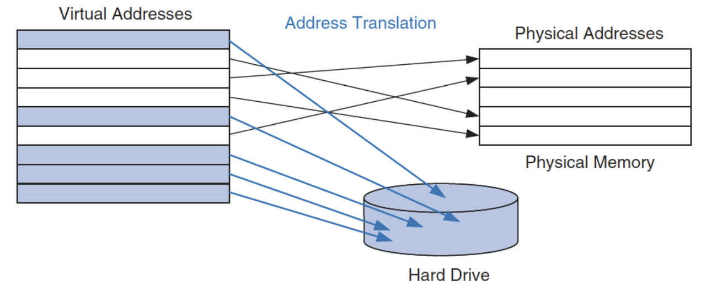

#### (3) 页表
**页表**是存储虚拟页与物理帧映射关系的表。每个页表条目都有：
1. **有效位**：虚拟页是否位于物理内存中。有效位无效时，从硬盘中读取数据。
2. **物理页号(PPN)**：虚拟页在物理内存中的位置。

页表过大往往是虚拟内存中问题之一。对于64-bit虚拟地址，40-bit物理地址，假设页容量为4KB=$2^{12}$ bytes，则页表大小将为$2^{52}\ entries \times ~4\ bytes\approx2^{54}\ bytes$，且这只是一个进程使用的页表空间。

因此往往采用多层分级页表，以分层方式组织页表，使得只有页表部分内容被分配在内存中。

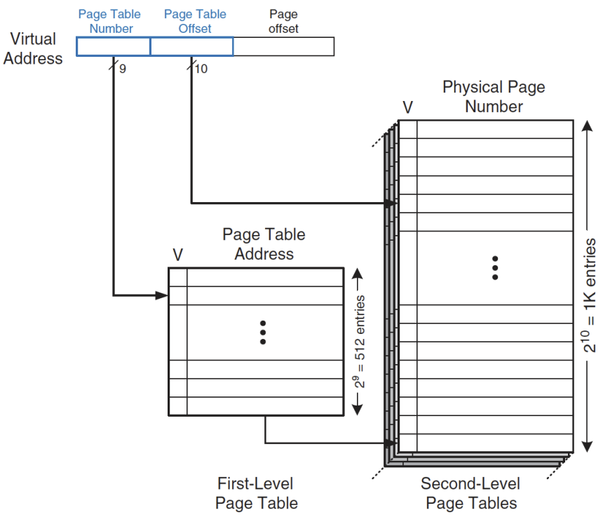

#### (4) 地址转换机制
为支持地址和内存转换，需要硬件与操作系统协同支持。页表存储在内存中，由操作系统软件负责：
- 填充页表内容，并决定替换物理内存中哪些内容
- 在上下文切换时更改页表基址寄存器
- 处理缺页异常并确保正确的映射关系。

页大小由ISA规定，本质上是一种约定。因此，页表为每个虚拟页都包含一个条目，称为**页表项(PTE)**，定义为内存中虚拟页面的标签存储条目，包含以下几位：
1. 有效位，用来表示页表项是否有效，或该虚拟页是否已经在物理内存中
2. 标签位(PFN)，用来支持地址翻译
3. 需要一定位支持替换策略
4. 脏位，用来支持类似写回缓存机制
5. 保护位，用来实现访问控制和保护

缺页异常是指虚拟内存未映射到物理内存，分为Minor Fault与Major Fault两类。

**主缺页 (Major Page Fault)** 指页不在物理内存而位于磁盘中的情况。此时，PTE表明虚拟页不在内存中，访问此类页面会触发页面错误异常，并调用操作系统异常处理程序，将数据从磁盘加载到内存中。

处理器为处理主缺页，通知IO控制器，DMA开始执行从磁盘到内存的读取操作。DMA完成传输后，控制器发出完成信号，操作系统恢复被挂起的进程。

**页替换算法**为解决如果物理内存已满，在发生页面故障时应替换哪个物理帧的算法。现代系统采用最近最少使用策略的近似算法，优先淘汰最近最少被使用的数据。

其中一种近似算法为时钟算法。其核心思路是维护一个内存物理帧的循环链表，在列表中保留一个指针，指向最后检查过的帧。当访问物理帧时，设置参考位R。当需要替换一个帧时，应替换循环列表中第一个参考位（R）未设置的帧，并从指针（hand）开始按顺时针方向遍历该循环列表。在遍历过程中，清除已检查帧的 R位。这一算法只能捕获非常优先历史信息，即内存页最近使用情况。

#### (5) 内存保护
对于多个并行运行的程序和进程，每个进程都有自己的页表，都可以使用完整的虚拟内存。进程只能访问其页表中映射的物理页，无法覆盖其他进程的内存，这位进程间提供了保护与隔离，并实现了按页的访问控制机制。

##### [1] 页面级访问控制
不是所有进程都能访问所有页面。其实现思路是将存储访问控制信息按页存储在进程的页表中，因此要在地址转换的同时实施访问控制。可以通过拓展权限位来拓展PTE。每次访问和触发缺页中断都会检查这些位，如果触发则产生异常。

#### (6) 内存管理单元 (MMU)
每次指令取指或加载/存储操作都需要至少两次内存访问：
1. 一个用于地址转换（页表读取）
2. 一个用于通过物理地址（经过转换后）访问数据

然而，为执行指令提取或加载/存储操作而进行两次内存访问，会极大程度导致性能下降，如果使用多级页表，需要逐级跳转，则需要更多次内存访问。

因此，使用一种能够缓存页表项并减少查找页面表所需的内存访问次数的硬件结构，即内存管理单元MMU。MMU负责处理地址转换请求，并包含三个关键组件：
1. 转译后备缓冲器(TLB)，用以缓存最近使用的虚拟到物理地址转换记录
2. 页表遍历缓存，可快速访问多级页表的中间层 
3. 硬件页表遍历器，依次访问页表的不同层级以获取所需的页表项

TLB的核心思想是将PTE缓存到处理器硬件结构中，以加速地址转换。然而TLB容量有限，无法容纳所有可能的PTEs，必然存在丢失问题，因此需要访问内存以查找所需的页表条目，在硬件层面称为页表遍历。
